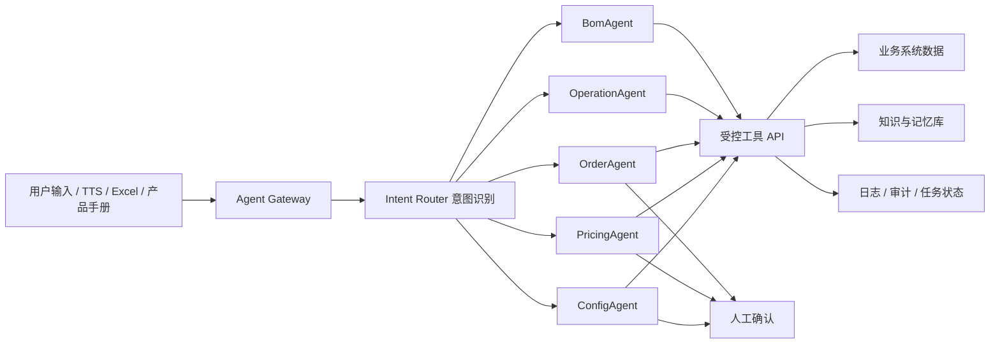

# 业务 Agent 体系设计

> 目标：把 AI 作为业务系统的受控助手，而不是一个无边界聊天机器人。Agent 负责采集、整理、生成草稿、解释、校验和预览；正式数据、正式价格、正式发布仍由业务系统和人工确认控制。
> 价格中心专项设计见：[价格中心设计.md](./价格中心设计.md)。

## 0. 当前 base-boot 项目落地口径

Agent 是后置增强能力，不是配置中心 MVP 的前置条件。当前项目已经有登录、权限、菜单、i18n、审计、OSS、前后端基础结构，Agent 落地时必须服从这些边界：

| 项目能力 | Agent 落地要求 |
| --- | --- |
| 登录和权限 | Agent 工具调用必须使用当前登录用户、租户和权限，不绕过 Sa-Token |
| 业务 API | Agent 只能通过受控后端 API 创建草稿、查询资料、打开预览，不直接写库 |
| 审计日志 | 每个任务、节点输出、用户确认、保存动作都要记录业务日志 |
| i18n | Agent 页面文案仍走现有 `i18n/locales/en_US.json`；不要混用 i18n 翻译脚本作为运行时 Agent |
| 前端风格 | 前端过程流和预览区按 `admin-ui` 现有组件风格实现 |
| 发布/审批 | Agent 只能生成草稿、缺口和建议，正式发布继续走产品审核发布 |
| 安全开关 | 第一版应有功能开关、超时、熔断、人工确认和降级到普通表单录入 |

所以第一阶段仍然先做人工配置中心和确定性规则求值器。Agent 只有在业务数据结构稳定后再接入，避免把未定型规则自动放大。

另外，Agent 面向的是共享产品能力中心，不是订单系统私有助手。它可以帮助维护产品基础信息、配置草稿、组件绑定、资料缺口、价格草稿和发布测试建议；订单助手、ERP/MES 助手后续只能消费发布版本和订单快照，不能绕过产品中心直接修改正式产品能力。

## 1. 设计结论

业务 Agent 不应该做成一个“什么都能问”的大助手，而应该做成：

```text
1 个 Agent Gateway / 调度层
+ N 个专业业务 Agent
+ 一组受控工具 API
+ 一套知识与记忆沉淀体系
+ 一套日志、权限、熔断、人工确认机制
```

第一期建议先做 **配置中心助手 ConfigAgent**。原因是配置中心是后面下单、报价、BOM、生产的地基。配置中心的数据稳定后，下单助手、价格助手、系统操作助手才有可靠的数据来源。

## 2. Agent 的定位

### 2.1 Agent 可以做什么

- 根据用户输入、产品手册、Excel、旧系统截图说明，生成配置草稿。
- 推荐相似产品、问题组模板、组件绑定、规则模板。
- 检查缺失字段和冲突项。
- 引导用户补充必要信息。
- 生成预览数据，让用户看到销售下单、价格、组件、规则的效果。
- 记录用户修正，把可复用结论沉淀成业务知识。

### 2.2 Agent 不应该做什么

- 不直接发布正式配置。
- 不直接修改正式价格表。
- 不绕过配置中心 API 写数据库。
- 不回答与当前业务无关的闲聊问题。
- 不把未经确认的 AI 推测写入正式业务数据。

一句话：**Agent 是录入助理、校验助理、解释助理，不是主数据系统本身。**

## 3. 未来 Agent 分工

| Agent | 主要职责 | 允许产物 | 禁止越权 |
| --- | --- | --- | --- |
| ConfigAgent 配置中心助手 | 建产品、选问题组、录选项、绑组件、生成规则草稿、发布前检查 | 配置草稿、缺口清单、预览数据 | 不直接发布正式版本 |
| PricingAgent 价格助手 | 解释价格、跑价格测试、发现漏价、生成价格建议 | 报价解释、价格异常清单、价格规则草稿 | 不直接改正式价格表 |
| OrderAgent 下单助手 | 采集客户需求、生成订单草稿、追问缺少尺寸/房间/面料 | 订单草稿、订单行、客户确认清单 | 不改配置中心 |
| OperationAgent 系统操作助手 | 引导 ERP 操作、解释字段、查找入口、整理操作步骤 | 操作建议、字段解释、查询结果 | 不执行高风险动作 |
| BomAgent 生产/BOM 助手 | 根据配置和订单生成物料需求、检查缺料和工艺风险 | BOM 预览、缺料清单、生产注意事项 | 不绕过生产确认 |

## 4. 总体架构



## 5. 知识来源

现在没有完整知识库也没关系。第一版可以把知识来源分成四类。

### 5.1 系统数据地基

这部分是最重要的，优先从系统数据库和配置中心数据抽取：

- 产品分类、产品系列、产品变体。
- 问题组、配置问题、选项。
- 组件/物料、面料、电机、轨道、配件。
- 价格矩阵、加价项、用量模型。
- 动态规则、禁止组合、尺寸限制。
- 已发布配置版本和历史订单样例。

这类数据应该走结构化查询，不应该每次全部塞给大模型。

### 5.2 总结型知识

由设计文档、旧系统截图、人工分析沉淀：

- 字段是什么意思。
- 字段给谁用。
- 字段影响下单、价格、BOM、生产还是权限。
- 旧系统字段如何映射到新架构。
- 典型产品如何在当前项目中配置落地。

### 5.3 使用中沉淀的数据

Agent 每次被用户纠正后，不要把聊天记录原样长期保存，而要沉淀成结构化事实：

```text
用户修正：
“控制方式不是 Control/Motor Direction，而是拉珠、电机、无拉这些方式。”

沉淀事实：
control_method 表示产品控制方式，可选 motor / chain / cordless / manual。
Control/Motor Direction 表示控制位置或操作侧，可选 Left / Right。
```

### 5.4 当前业务系统设计和说明

- 产品配置中心设计文档。
- 配置中心 DM 文档。
- 产品手册。
- 旧系统界面截图说明。
- ERP 流程约束。
- 后续价格、下单、BOM 的专项设计文档。

## 6. 是否需要向量数据库

第一版不建议急着上向量数据库。

原因：

- 当前知识范围相对有限。
- 业务问题更依赖结构化数据和字段规则。
- 大量数据不适合每次送给模型。
- 关键词、同义词、字段字典、结构化查询已经能覆盖大部分需求。

第一版建议：

```text
结构化数据：走数据库/API 查询
文档知识：切块后做轻量全文检索
同义词：维护业务词典
用户修正：沉淀成结构化事实
```

以后当文档规模变大、语义检索明显成为瓶颈时，再考虑 pgvector、Chroma、Milvus 等向量检索方案。

## 7. 记忆体系

Agent 的记忆不要混成一团，建议分四层。

| 记忆类型 | 内容 | 生命周期 | 用途 |
| --- | --- | --- | --- |
| Static Knowledge 固定知识 | 设计文档、字段说明、产品手册摘要 | 长期 | 回答字段含义、流程说明 |
| Structured Memory 结构化资产 | 产品、问题组、组件、价格、规则 | 长期 | 生成草稿、推荐模板 |
| Session Memory 会话记忆 | 当前正在建什么产品、已确认什么、缺什么 | 当前任务 | 多轮追问和补齐 |
| Distilled Memory 沉淀记忆 | 用户纠正后的业务事实、常见缺口、标准案例 | 长期 | 越用越准 |

沉淀记忆必须可审核、可回滚，不能让模型自己悄悄写入正式知识。

## 8. 意图识别与边界控制

Agent Gateway 的第一步是意图识别。

```text
用户输入
  -> 判断是否属于业务 Agent 范围
  -> 判断应该交给哪个 Agent
  -> 判断是否需要拒绝、转人工或降级
```

示例：

| 用户输入 | 处理方式 |
| --- | --- |
| “帮我建一个电动柔纱帘产品” | 进入 ConfigAgent |
| “这个产品为什么算出来这么贵” | 进入 PricingAgent |
| “客户要 10 个窗帘，帮我生成订单草稿” | 进入 OrderAgent |
| “这个字段什么意思” | 进入 OperationAgent 或 ConfigAgent 解释节点 |
| “讲个笑话” | 拒绝，提示该助手只处理业务任务 |

无关问题要直接挡住，避免 token 被闲聊消耗。

## 9. ConfigAgent 节点流程

配置中心助手建议使用固定节点，不要一条 prompt 跑到底。

```text
IntentNode 意图识别
  -> RetrieveNode 检索系统数据和文档
  -> ExtractNode 抽取产品、问题、选项、规则
  -> NormalizeNode 标准化类目、编码、中英文、同义词
  -> RecommendNode 推荐相似产品、问题组、组件、规则模板
  -> ValidateNode 检查缺失字段和冲突
  -> AskNode 只追问必要问题
  -> DraftNode 生成配置草稿
  -> PreviewNode 生成预览数据
  -> SaveNode 保存草稿
```

每个节点输入输出都应该是 JSON，方便排查和重放。

## 10. ConfigAgent 输入输出示例

用户输入：

```text
我要建一个电动柔纱帘，L 罩壳，面料有 108 个颜色，宽度超过 2.4 米要高扭矩电机。
```

Agent 中间草稿：

```json
{
  "agent": "ConfigAgent",
  "intent": "create_config_draft",
  "product": {
    "category": "窗帘",
    "series": "柔纱帘",
    "structure": "L Cassette",
    "controlMethod": "motor"
  },
  "recommendedQuestionGroups": [
    "公共尺寸问题组",
    "安装方式问题组",
    "Motor 控制问题组",
    "Zebra 面料/颜色问题组",
    "L Cassette 结构问题组"
  ],
  "rulesDraft": [
    {
      "condition": "width_cm > 240 AND fabric_weight_gsm > ?",
      "action": "USE_HIGH_TORQUE_MOTOR",
      "status": "missing_params"
    }
  ],
  "missingFields": [
    "fabric_weight_gsm",
    "high_torque_motor_model",
    "high_torque_price_delta"
  ],
  "nextQuestions": [
    "柔纱帘面料克重是多少？",
    "高扭矩电机型号是哪一个？",
    "高扭矩电机是否需要加价？"
  ]
}
```

## 11. 工具权限设计

每个 Agent 只能调用自己的工具集合。

| 工具 | ConfigAgent | PricingAgent | OrderAgent |
| --- | --- | --- | --- |
| 查询产品/问题组/组件 | 允许 | 允许 | 允许 |
| 创建配置草稿 | 允许 | 禁止 | 禁止 |
| 发布配置版本 | 禁止，必须人工 | 禁止 | 禁止 |
| 价格测试 | 允许调用测试 | 允许 | 允许调用测试 |
| 修改正式价格表 | 禁止 | 禁止，必须人工 | 禁止 |
| 创建订单草稿 | 禁止 | 禁止 | 允许 |
| 提交正式订单 | 禁止 | 禁止 | 必须人工确认 |

高风险动作必须有人工确认。

## 12. 流式输出体验

前端建议做成“左侧过程流 + 右侧预览”。

左侧显示 Agent 正在做什么：

```text
正在识别产品资料...
已识别：柔纱帘 / L Cassette / 电动
找到 3 个相似产品
推荐 5 个问题组
发现 4 个缺失项
等待用户补充：面料克重、高扭矩电机型号
```

右侧动态预览：

```text
产品基础
问题组
选项列表
组件绑定
规则结果
价格测试
销售下单预览
```

接口可以使用 SSE：

```text
POST /agent/tasks
GET /agent/tasks/{taskId}/events
GET /agent/tasks/{taskId}/preview
POST /agent/tasks/{taskId}/confirm
```

## 13. Hook、日志和审计

必须记录 Agent 每一步为什么这么做。

建议日志字段：

```text
task_id
agent_name
user_id
user_input
detected_intent
node_name
retrieved_docs
used_product_data
prompt_version
model_output
validation_errors
missing_fields
user_confirmations
final_draft_id
token_usage
latency_ms
fallback_reason
```

还要记录人工修改：

```text
AI 生成了什么
人工改了什么
最终确认了什么
哪些修改应该沉淀成知识
```

这些日志后面就是优化 Agent 的依据。

## 14. 熔断与降级

Agent 必须保守。

| 场景 | 处理方式 |
| --- | --- |
| 意图不明确 | 只问一个澄清问题 |
| 不是业务范围 | 拒绝并提示可处理范围 |
| 置信度低 | 不生成草稿，先让用户选择产品/类目 |
| 缺价格关键字段 | 只生成配置草稿，不生成正式报价 |
| 规则冲突 | 标记 BLOCKER，进入人工确认 |
| 模型超时 | 降级为普通表单录入 |
| token 超限 | 只处理当前节点，不带完整历史 |
| 连续追问 3 次仍不清楚 | 生成缺口清单，交给人工补资料 |

## 15. 自己写还是使用 LangGraph

建议第一版先自己写轻量节点编排，但按 LangGraph 的思想设计。

### 15.1 第一版自己写的理由

- 当前流程边界清楚。
- 需要严格控制权限和保存动作。
- 需要省 token。
- 需要方便接配置中心现有 API。
- 节点数量有限，自己写更轻。

### 15.2 什么时候考虑 LangGraph

- 多 Agent 协作变复杂。
- 需要复杂流程回跳。
- 需要长期状态图。
- 需要更强的人机协同编排。
- 需要可视化调试节点执行路径。

第一版可以定义类似结构：

```python
class AgentContext:
    task_id: str
    user_id: str
    intent: str
    session_state: dict
    retrieved_context: list
    draft: dict
    missing_fields: list
    validation_errors: list


class AgentNode:
    name: str

    def run(self, context: AgentContext) -> AgentContext:
        return context
```

后面如果复杂，再迁移到 LangGraph。

## 16. 第一版 MVP

第一版只做 ConfigAgent，目标是让操作员快速生成配置中心草稿。

MVP 能力：

1. 识别配置中心相关意图。
2. 从文字、Excel、产品手册摘要生成配置草稿。
3. 推荐相似产品和问题组模板。
4. 自动列出缺失项和冲突项。
5. 流式展示处理过程。
6. 打开配置预览界面。
7. 人工确认后保存草稿。

MVP 不做：

- 不自动发布正式配置。
- 不自动修改正式价格。
- 不处理闲聊。
- 不直接创建正式订单。
- 不把聊天记录原样作为长期知识。

## 17. 价格助手待讨论

价格相关已经拆成独立价格中心，专项设计见：[价格中心设计.md](./价格中心设计.md)。PricingAgent 的边界先按价格中心设计收敛：

- PricingAgent 可以解释价格、跑测试、发现漏价。
- PricingAgent 可以生成价格规则草稿。
- PricingAgent 不能直接修改正式价格表。
- 正式价格必须有来源、版本和人工确认。
- 价格测试应该能说明每一项金额来自哪里。

PricingAgent 第一版应该围绕这些能力：

```text
解释报价明细
从销售 Excel 生成价格草稿
发现缺价、超限、异常价格
跑典型尺寸价格测试
提示销售还缺哪些字段
把人工纠错沉淀成结构化价格知识
```

折扣、客户等级、促销活动、自动发布正式价格先不放第一版。

## 18. 推荐落地顺序

```text
阶段 1：配置中心数据和文档整理
阶段 2：ConfigAgent 节点流程和草稿生成
阶段 3：流式过程 + 预览界面
阶段 4：日志、熔断、人工确认
阶段 5：沉淀记忆和相似产品继承
阶段 6：PricingAgent 专项设计
阶段 7：OrderAgent / OperationAgent / BomAgent
```

## 19. 核心原则

```text
数据主权在业务系统
Agent 只生成草稿和建议
正式发布必须人工确认
知识沉淀要结构化、可审核、可回滚
每个 Agent 只做自己的业务
每个工具调用都要有权限边界
每个任务都要能查日志、能重放、能降级
```
