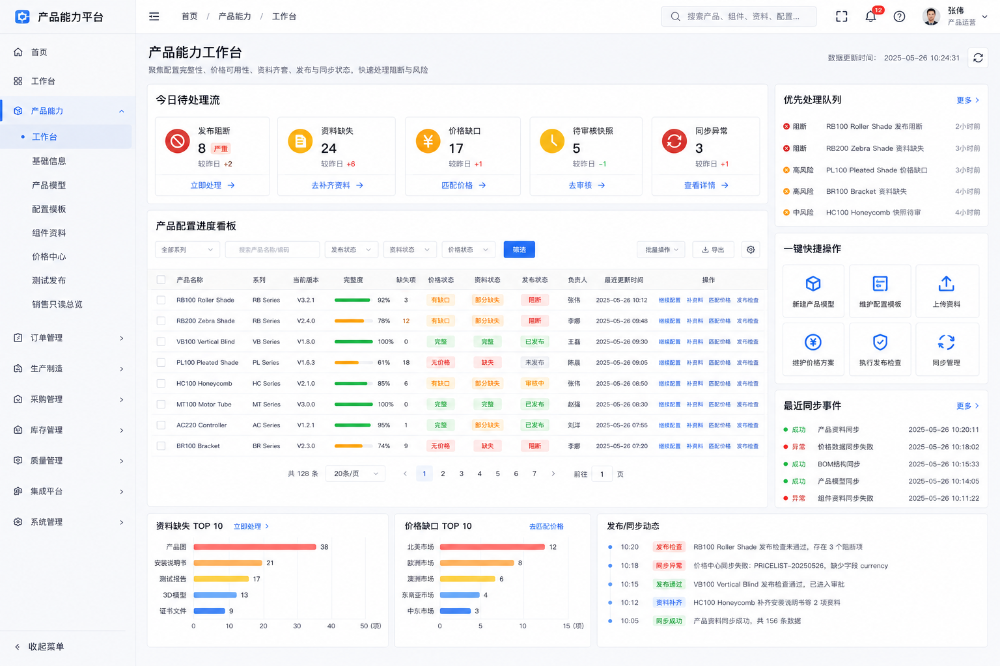
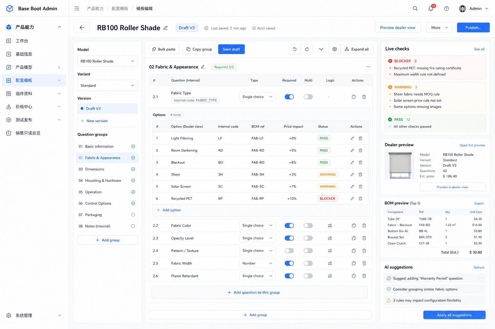
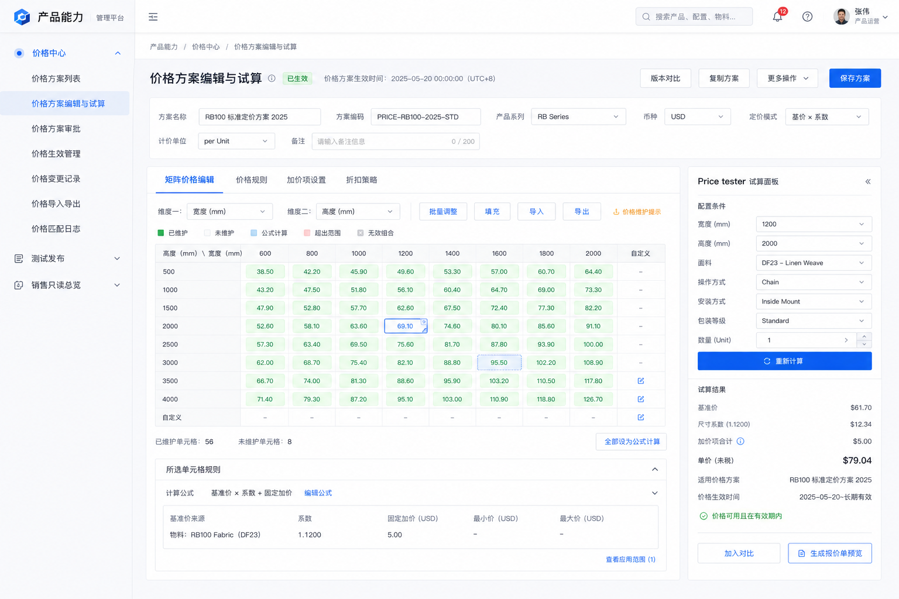
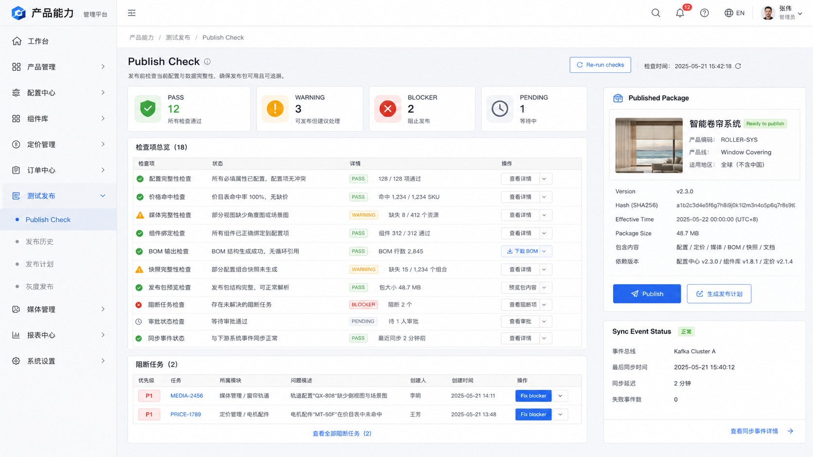
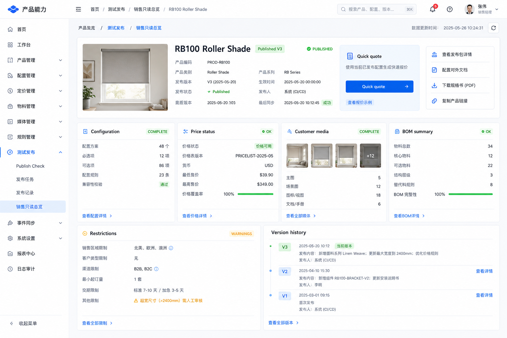

# 产品能力界面设计稿

生成日期：2026-06-05

关联设计：

- [共享产品能力中心开发入口.md](./共享产品能力中心开发入口.md)
- [配置中心功能拆分清单.md](./配置中心功能拆分清单.md)
- [共享产品能力中心数据库设计草案.md](./共享产品能力中心数据库设计草案.md)
- [共享产品能力中心API与后端实现约束.md](./共享产品能力中心API与后端实现约束.md)
- [产品配置中心设计.md](./产品配置中心设计.md)
- [价格中心设计.md](./价格中心设计.md)
- [../项目配置和代码风格/fullstack-code-standards.md](../项目配置和代码风格/fullstack-code-standards.md)

> 本文是界面设计稿和交互说明，不是正式前端实现。正式实现时必须进入 `admin-ui` 现有布局、系统菜单、权限、请求、i18n、Element Plus 和 UTC 工具体系。  
> 不做独立应用，不重做侧边栏、顶栏、登录态、标签栏和菜单框架。
> 已补充 H5 静态视觉参考页，当前整体完成度约 78%-82%。H5 只作为像素级还原参考和交互结构参考，不作为生产代码、不作为独立应用、不直接引入外部 CDN。
> 普通 grid/list 页面和特殊自定义页面的边界以 [fullstack-code-standards.md](../项目配置和代码风格/fullstack-code-standards.md) 为准；效果图只能作为内容区布局参考。

## 0. 是否已经可以开始设计

可以开始。

现在已经具备界面设计所需的关键输入：

| 输入 | 当前状态 |
| --- | --- |
| 功能范围 | [配置中心功能拆分清单.md](./配置中心功能拆分清单.md) 已覆盖基础信息、配置、价格、发布、快照、缺口、AI |
| 菜单骨架 | 按现有后台两级菜单组织为 `基础资料`、`配置与价格`、`发布与应用` 三组，不再强行命名为“产品中心” |
| 数据边界 | [共享产品能力中心数据库设计草案.md](./共享产品能力中心数据库设计草案.md) 已明确源数据、发布包、快照、read model、outbox |
| API 和后端边界 | [共享产品能力中心API与后端实现约束.md](./共享产品能力中心API与后端实现约束.md) 已补充接口分组、响应形态、Java 分层和代码生成器基线 |
| 项目风格 | `admin-ui` 已有 dashboard、Element Plus、管理端布局、卡片、表格、抽屉、分页风格 |

仍需后续细化但不阻塞设计的内容：

| 待细化 | 处理方式 |
| --- | --- |
| 具体 Vue 页面组件拆分 | 界面稿确认后再进入实现设计 |
| 接口字段和 VO/BO | 基于数据库草案和页面状态继续设计 |
| 规则 JSON schema | 配置编辑器实现前单独细化 |
| 价格矩阵录入格式 | 价格中心原型里先按批量粘贴 + 测试反馈设计 |

## 1. 设计目标

这套界面不是给用户“维护表”的，而是帮助用户快速把复杂产品上线。

核心体验目标：

| 目标 | 设计处理 |
| --- | --- |
| 录入多而杂 | 用工作台收敛任务，用三栏编辑页减少页面跳转 |
| 不知道下一步做什么 | 所有产品都有完成度、缺口、发布状态和下一步动作 |
| 不想在很多菜单里找 | 首页展示待处理缺口、最近草稿、即将发布、价格缺失 |
| 不想重复录入 | 支持批量粘贴答案、复制问题组、组件/资料快速绑定 |
| 害怕发布出错 | 发布页做闸门式检查，BLOCKER、WARNING、PASS 一眼看懂 |
| 查询不能慢 | 页面优先读取发布包、read model、快照，不实时 join 很多编辑表 |

## 2. 视觉方向

参考当前 `admin-ui` 首页，但不照搬代码生成器列表页。

视觉关键词：

- 清爽、克制、信息密度高。
- 白底、浅蓝顶层氛围、清晰边框、轻阴影。
- 重要状态用明确颜色：蓝色进行中，绿色通过，橙色警告，红色阻断。
- 大面积减少装饰，把空间留给输入、检查和预览。

落地原则：

| 项目 | 说明 |
| --- | --- |
| 布局 | 保持现有后台侧边栏和顶部栏；复杂页面只在内容区做自定义布局 |
| 控件 | 正式实现优先 Element Plus：表格、抽屉、分段按钮、步骤、标签、上传、分页 |
| 图标 | 正式实现使用 Element Plus 图标或项目已有 SvgIcon |
| 文案 | 正式实现新增可见文案只写 `i18n/locales/en_US.json` |
| 圆角 | 面板不超过当前项目风格，保持 8-14px 范围 |
| 移动端 | 后台主流程以桌面端为主，平板只做可用适配 |

### 2.1 效果图先行

自定义布局页面先走效果图流程：

```text
imagegen 效果图
  -> 评审布局和视觉方向
  -> 固化页面结构和交互细节
  -> 再还原到 admin-ui 的 Vue / Element Plus 页面
```

需要先出效果图的页面：

| 页面 | 原因 |
| --- | --- |
| 工作台 | 需要平衡数据密度、缺口任务和快捷操作 |
| 配置模板录入工作台 | 三栏编辑、预览、检查、BOM 信息复杂 |
| 价格中心工作台 | 价格项、矩阵、测试过程需要同屏表达 |
| 测试发布 | 闸门式检查和发布包预览需要清晰视觉层级 |
| 销售只读总览 | 面向销售快速理解，不适合普通 CRUD |

不需要先出效果图的页面：

| 页面 | 处理 |
| --- | --- |
| 产品分类、物料管理、辅材管理 | 直接沿用现有 grid/list + 搜索 + toolbar + 表格 + 抽屉 |
| 资料资产、资料绑定 | 列表沿用 grid/list，绑定和详情用抽屉，图片预览等短操作可用小弹窗 |
| 产品模型、销售变体、问题组模板 | 直接沿用现有 grid/list + 状态标签 + 引用检查 |
| 审核审批、缺口待办、发布包、同步日志、导入中心 | 直接沿用现有 grid/list；详情、处理、预览默认用抽屉，短确认用小弹窗 |

### 2.2 当前效果图

已生成的效果图：

| 页面 | 效果图 | 状态 |
| --- | --- | --- |
| 工作台 |  | 主参考 |
| 配置模板录入工作台 |  | 主参考 |
| 价格编辑与测试 |  | 主参考 |
| 发布检查闸门 |  | 主参考 |
| 销售只读总览 |  | 主参考 |

旧版工作台和旧版价格页效果图仅保留为备选，不作为第一版还原主依据。

配置模板录入工作台已用新版 H5 静态页替换第一版结构参考，PNG 效果图继续保留为视觉氛围参考；正式还原时以 `view1_template_editor.html` 的折叠分组、三栏关系和录入流程为主。

销售只读总览已用新版 H5 静态页替换第一版结构参考，PNG 效果图继续保留为视觉氛围参考；正式还原时以 `view4_sales_readonly_view.html` 的产品发布头卡、Quick quote、四类摘要卡、限制条件和版本历史为主。

主视觉效果图已经覆盖第一版需要自定义设计的 5 个页面。下一步不再补大图，重点转为：

- 从效果图反推 Vue 页面布局结构。
- 补充快捷操作和便捷性交互。
- 明确哪些区域用 Element Plus 原生组件还原，哪些区域需要自定义组件。
- 把图里不符合当前二级菜单习惯的部分收敛回现有 `sys_menu` 结构。

### 2.2.1 H5 静态视觉参考

`product-ability-ui-mockups/` 下已补充 5 个 H5 静态页面，作为效果图之后的高保真结构参考。当前整体完成度按 78%-82% 评估：页面信息密度、布局比例、状态表达和主要工作流已经成型，但仍需要按当前项目框架、组件和权限体系重构。

| H5 文件 | 对应页面 | 完成度判断 | 可保留的大方向 | 需要收敛或调整 |
| --- | --- | --- | --- | --- |
| `view5_capability_workbench.html` | 工作台 | 75% | 今日待处理流、产品配置进度看板、优先处理队列、快捷操作、同步事件的组合方向可保留 | 独立“产品能力”面包屑和壳层要收敛到 `发布与应用 / 工作台`；卡片数量和右侧栏宽度按 1366 / 1440 可视区微调 |
| `view1_template_editor.html` | 配置模板录入工作台 | 86%-88% | 新版结构可作为第一版主参考：左侧模型/版本/问题组，中间问题和答案编辑，右侧 live checks / dealer preview / BOM / AI suggestions 的三栏结构、折叠分组和长数据录入节奏可保留 | H5 中的独立壳层、Tailwind CDN、无效 class、inline JS 演示和静态样例数据不进生产；右侧 AI suggestions 只作为 P1 入口，不阻塞 P0；长列表需要 Vue 状态、懒加载、分区折叠或虚拟滚动 |
| `view2_pricing_tester.html` | 价格中心工作台 | 82% | 价格方案表单、矩阵编辑、右侧 price tester、试算结果和生成报价预览方向很好，是第一版主参考 | 矩阵宽度要适配 Element Plus 表格和横向滚动；右侧试算面板在窄屏可改为 sticky 抽屉或可折叠侧栏 |
| `view3_publish_check.html` | 测试发布 | 80% | PASS / WARNING / BLOCKER / PENDING 统计卡、检查项表、阻断任务、发布包和同步状态组合方向可保留 | 右侧 Published Package 中的产品图应走真实资料资产或 image2 资产；发布、生成计划、查看详情必须挂按钮权限 |
| `view4_sales_readonly_view.html` | 销售只读总览 | 84%-86% | 新版结构可作为第一版主参考：产品发布头卡、Quick quote 报价摘要、查看发布包/销售文档/下载规格/复制链接快捷操作、配置/价格/资料/BOM 四类摘要卡、限制条件和版本历史方向可保留 | H5 中的 Tailwind CDN、Unsplash 外链图片、独立顶部面包屑、静态样例数据不进生产；商品图和媒体缩略图必须换成真实资料资产或 image2 临时资产；Quick quote 必须接后端价格引擎；正式菜单归属为 `发布与应用 / 销售只读总览` |

H5 参考使用规则：

- H5 的布局、视觉层级、信息密度、状态颜色和快捷操作是第一版还原依据。
- H5 的外部依赖不能进入生产：`tailwindcss.com`、Google Fonts、FontAwesome CDN 都要替换为项目内 CSS、Element Plus 图标或 `SvgIcon`。
- H5 中的外链图片不能进入生产，例如 Unsplash 演示图只能表达素材比例和位置；正式页面必须优先读取资料资产，缺失时才用 `image2-ui-skill` 生成临时资产并标注替换策略。
- H5 中出现的非项目 class 或无效 Tailwind class 不能照抄，例如 `text-slate-450`、`text-slate-405`、`h-4.5` 等必须重新落成项目 SCSS / 设计变量。
- H5 中的演示脚本、`alert()`、内联状态切换只说明交互意图，正式实现必须改成 Vue 组件状态、接口数据、loading / skeleton / empty / error 状态。
- H5 的独立 Layout、侧边栏、顶栏、面包屑只作视觉占位，正式页面必须使用当前 `admin-ui` 的 Layout、Sidebar、Navbar、TagsView 和动态菜单。
- H5 中为了展示效果写死的数据只作为样例，正式页面全部走 API、i18n、UTC、权限和字典。
- 为了用户操作的可视化和便捷性，允许调整局部布局，例如侧栏可折叠、右侧面板改抽屉、表格增加 sticky header、矩阵增加横向滚动；但页面主结构、核心信息层级和关键工作流不能改变。
- 为提升工作台、价格矩阵、发布闸门等页面的可视化效果，可以使用当前前端已有的 `echarts`，按 `echarts/core` 模式按需引入并封装为领域组件；图表只展示后端结果和趋势，不承担最终报价、发布、审核判定。
- 像素级还原以 1440 / 1536 / 1920 桌面宽度为主，1366 允许做密度调整；不得为了像素对齐牺牲可用性和当前项目规范。

### 2.3 设计技能流转

这个思路是合理的，但要明确每个 Skill 的边界，避免后续页面越做越偏。

推荐流程：

```text
现有 admin-ui 典型页面 / 首页截图
  -> visual-replica 复刻和分析现有风格
  -> 输出 index.html、design-style-spec.md、design-tokens.json
  -> 从效果图中拆解页面元素、状态、图标语义、布局比例
  -> image2-ui-skill 对 H5 / PNG 参考做像素级拆解和资产计划
  -> frontend-design 按风格锁定文件实现 Vue / Element Plus 页面
  -> design-taste-frontend 做反模板化审查和视觉细节优化
  -> 浏览器截图复核、i18n / UTC / 权限 / 菜单集成检查
```

职责分工：

| Skill | 用途 | 产出 | 边界 |
| --- | --- | --- | --- |
| `visual-replica` | 复刻/分析现有后台页面，把当前项目视觉沉淀成风格真值 | `index.html`、`design-style-spec.md`、`design-tokens.json` | 只负责风格锁定，不批量扩展页面 |
| `image2-ui-skill` | 将 PNG 效果图和 H5 静态页拆成可还原的 Vue 结构、代码渲染区域、image2 资产区域和验收截图清单 | 页面拆解表、资产计划、image2 prompt、透明图/缩略图验收、截图对比要求 | 只有真实通过项目认可的 image2 入口生成并渲染后的文件，才能称为 image2 资产；文字、表格、按钮、表单仍必须用代码渲染 |
| `frontend-design` | 在风格真值约束下实现页面，还原效果图里的信息结构和交互 | Vue 页面、组件拆分、样式实现 | 必须落入 `admin-ui` 现有布局、i18n、权限、UTC 工具 |
| `design-taste-frontend` | 做反模板化检查，避免页面变成普通后台模板 | 视觉审查清单、局部优化建议 | 该 Skill 不适合直接设计 dashboard / data table，只用于审查和关键细节优化 |

风格锁定文件建议放到：

```text
docs/产品配置中心/ui-style-lock/
  -> index.html
  -> design-style-spec.md
  -> design-tokens.json
```

后续开发约束：

- 效果图只作为视觉和布局参考，不直接把截图当生产图片素材。
- H5 静态页作为像素级还原参考，不直接复制 HTML、Tailwind class、外部字体、CDN 图标和写死数据。
- `配置中心原型.html`、`config-center-prototype-data.js` 和 `config-center-prototype/` 保留为数据样例、业务关系和复杂度参考，不作为视觉风格参考。
- 图标优先使用项目现有 `SvgIcon`、Element Plus 图标或已有图标体系，不手工切 SVG 路径。
- 从效果图中抽出的“元素”主要是组件语义：状态卡、待办队列、矩阵编辑器、右侧试算面板、发布检查表、只读摘要卡。
- 从 H5 中抽出的“像素参考”主要是布局比例、边距密度、字体层级、状态色、卡片阴影、表格行高和右侧面板关系；不要求复制独立壳层。
- 新页面必须继承 `visual-replica` 沉淀出的颜色、字号、间距、圆角、阴影和卡片语言。
- 不得因为使用 `frontend-design` 或 `design-taste-frontend` 而改掉当前后台框架的侧边栏、顶栏、面包屑、菜单层级和权限体系。
- 不得宣称已使用 image2 生成资产，除非已经通过项目认可的 image2 入口生成本地文件、完成透明度/尺寸检查，并在真实页面截图中验证渲染。

### 2.4 像素级还原策略

第一版目标不是把 H5 直接搬进项目，而是在当前 `admin-ui` 框架内达到“视觉方向像素级接近、业务操作更顺手”。

实现时按区域拆分：

| 区域 | 还原方式 | 说明 |
| --- | --- | --- |
| 页面标题、面包屑、按钮、表单、表格、tabs、标签、分页 | Vue + Element Plus + 项目 CSS | 文案、数据和交互必须可维护，不截图化 |
| 状态卡、待办队列、右侧试算面板、发布包卡、版本时间线 | Vue 组件 + SCSS | 保留 H5 的密度、颜色、阴影、层级和间距 |
| 产品图、场景图、媒体缩略图、复杂材质预览 | 真实资料资产优先；缺失时走 `image2-ui-skill` 生成临时资产 | 必须有资产路径、尺寸、用途和替换策略 |
| 图标 | Element Plus 图标 / 项目 `SvgIcon` | 不直接引 FontAwesome CDN |
| 大表格和价格矩阵 | Element Plus 表格或自定义矩阵组件 | 支持 sticky header、横向滚动、选中单元格、批量填充、键盘录入 |
| 右侧辅助面板 | 固定侧栏、可折叠侧栏或抽屉 | 1440 以上保留侧栏；1366 可折叠，避免主表格被压缩过度 |

允许调整的地方：

- 为适配现有顶部栏、侧边栏和 TagsView，H5 中的独立顶部标题高度、左侧菜单宽度可以调整。
- 为提高录入效率，价格矩阵、问题答案表、发布检查表可以增加 sticky header、列固定、横向滚动和键盘导航。
- 为避免 1366 宽度拥挤，右侧试算、BOM、AI 建议、同步状态可以折叠或进入抽屉。
- 为符合菜单规范，H5 中的“产品能力 / 配置中心 / 测试发布”等独立分组要映射回 `基础资料`、`配置与价格`、`发布与应用`。

不能改变的地方：

- 5 个自定义页的主信息架构不能改：工作台聚合、配置三栏、价格矩阵 + 试算、发布闸门、销售只读总览。
- PASS / WARNING / BLOCKER / PENDING 的视觉语义不能弱化。
- 工作台里的待处理流、快捷入口和同步事件不能消失。
- 配置模板页必须保留实时检查、经销商预览、BOM 预览的同屏反馈。
- 价格中心必须保留“编辑即试算”的右侧反馈闭环。
- 发布页必须保留发布包、阻断任务和同步状态的可追溯信息。

## 3. 菜单集成和信息架构

正式页面挂到现有 `sys_menu` 和动态路由体系中，菜单、按钮权限、路由、面包屑、TagsView 都复用当前后台框架。

当前结论调整为：**不再使用一个“产品能力”一级菜单承载全部功能**。这会让录入人员在一个大菜单里找太多入口，也容易把高频维护对象塞进页面 tab。正式菜单按三个一级菜单组织，每个一级菜单下面直接挂二级业务入口，仍然不设计三级菜单。

三个一级菜单是：

```text
基础资料
配置与价格
发布与应用
```

其中 `基础资料` 是产品配置域的“基础信息设置”菜单分组，包含产品分类、物料管理、辅材管理、资料资产、资料绑定、产品模型和销售变体，不是系统管理里的通用基础设置。

2026-06-07 文档纠偏：

- “最多两级菜单”指侧边栏层级最多两级，不是只能有一个一级菜单。
- 高频主数据和独立业务对象必须成为二级菜单，不能隐藏在页面 tabs 内。
- 页面内 tabs 只适合低频附属信息、详情抽屉、同一对象内局部切换；不适合承载用户每天要大量录入和搜索的主功能。
- 当前代码里的 `/product-center/base`、`/product-center/assets`、`/product-center/model` 可暂时作为兼容组合页或隐藏入口，但正式菜单不展示这些组合入口。
- 路由前缀仍可继续使用 `/product-center/*`，这是技术路径，不等于菜单显示名。

建议菜单：

```text
基础资料
  -> 产品分类
  -> 物料管理
  -> 辅材管理
  -> 资料资产
  -> 资料绑定
  -> 产品模型
  -> 销售变体

配置与价格
  -> 配置模板
  -> 问题组模板
  -> 价格中心
  -> 报价预览
  -> 导入中心

发布与应用
  -> 工作台
  -> 测试发布
  -> 审核审批
  -> 缺口待办
  -> 发布包
  -> 同步日志
  -> 销售只读总览
```

建议路由和组件落点：

| 一级菜单 | 二级菜单 | 路由建议 | 页面类型 | 组件建议 |
| --- | --- | --- | --- | --- |
| 基础资料 | 产品分类 | `/product-center/categories` | 标准 grid/tree-table | `ProductBaseInfoPage.vue` 指定 category |
| 基础资料 | 物料管理 | `/product-center/materials` | 标准 grid/list | `ProductBaseInfoPage.vue` 指定 material |
| 基础资料 | 辅材管理 | `/product-center/components` | 标准 grid/list | `ProductBaseInfoPage.vue` 指定 component |
| 基础资料 | 资料资产 | `/product-center/media-assets` | 标准 grid/list + 图片预览 | `ProductAssetPage.vue` 指定 asset |
| 基础资料 | 资料绑定 | `/product-center/media-bindings` | 标准 grid/list + 绑定抽屉 | `ProductAssetPage.vue` 指定 binding |
| 基础资料 | 产品模型 | `/product-center/models` | 标准 grid/list + 抽屉 | `ProductModelPage.vue` 指定 model |
| 基础资料 | 销售变体 | `/product-center/sales-variants` | 标准 grid/list + 抽屉 | `ProductModelPage.vue` 指定 variant |
| 配置与价格 | 配置模板 | `/product-center/template` | 自定义录入工作台 | `ConfigTemplateWorkbenchPage.vue` |
| 配置与价格 | 问题组模板 | `/product-center/question-groups` | 标准 grid/list + 版本抽屉 | 后续从配置模板页拆出 |
| 配置与价格 | 价格中心 | `/product-center/pricing` | 半自定义价格工作台 | `PricingWorkbenchPage.vue` |
| 配置与价格 | 报价预览 | `/product-center/quote-preview` | 独立轻量试算入口，复用价格/销售组件 | 后续基于销售只读和价格引擎实现，不计入 5 个主自定义页 |
| 配置与价格 | 导入中心 | `/product-center/import` | 标准 grid/list + 解析预览 | 导入批次、字段映射和行级问题 |
| 发布与应用 | 工作台 | `/product-center/workbench` | 自定义 dashboard | `ProductCenterWorkbenchPage.vue` |
| 发布与应用 | 测试发布 | `/product-center/publish` | 自定义发布闸门 | `PublishGatePage.vue` |
| 发布与应用 | 审核审批 | `/product-center/approvals` | 标准 grid/list + 审批抽屉 | 发布审批记录和操作入口 |
| 发布与应用 | 缺口待办 | `/product-center/gap-tasks` | 标准 grid/list | 缺口任务处理入口 |
| 发布与应用 | 发布包 | `/product-center/published-packages` | 标准 grid/list + 详情抽屉 | 不可变发布包查询 |
| 发布与应用 | 同步日志 | `/product-center/sync-outbox` | 标准 grid/list + 重试动作 | ORDER / ERP / MES 同步事件 |
| 发布与应用 | 销售只读总览 | `/product-center/sales-view` | 自定义只读总览 | `SalesReadOnlyPage.vue` |

按钮权限建议：

| 页面 | 权限示例 |
| --- | --- |
| 工作台 / 缺口待办 | `product:center:view`、`product:center:handle` |
| 基础资料 | `product:base:list`、`product:base:add`、`product:base:edit`、`product:base:remove`、`product:base:export` |
| 产品模型 / 销售变体 | `product:model:list`、`product:model:add`、`product:model:edit`、`product:model:publishCheck` |
| 配置模板 / 问题组模板 | `product:template:list`、`product:template:edit`、`product:template:rule`、`product:template:test` |
| 资料资产 / 资料绑定 | `product:asset:list`、`product:asset:upload`、`product:asset:bind` |
| 价格中心 / 报价预览 | `product:price:list`、`product:price:edit`、`product:price:test`、`product:price:publish` |
| 测试发布 / 审核审批 / 发布包 / 同步日志 | `product:publish:list`、`product:publish:check`、`product:publish:approve`、`product:publish:publish`、`product:publish:retrySync` |
| 销售只读总览 | `product:sales-view:list`、`product:sales-view:quote`、`product:sales-view:download` |
| 导入中心 | `product:import:list`、`product:import:query`、`product:import:add`、`product:import:edit`、`product:import:remove` |

菜单和页面职责：

| 一级菜单 | 主要用户 | 页面目标 |
| --- | --- | --- |
| 基础资料 | 产品运营、资料维护 | 高频基础资料独立录入、搜索、引用检查 |
| 配置与价格 | 产品运营、报价负责人 | 维护配置、问题组、价格、报价试算和批量导入 |
| 发布与应用 | 负责人、销售、系统管理员 | 处理缺口、审核发布、查看发布包、跟踪同步、销售只读消费 |

### 3.1 当前已实现页面 tabs 拆分审查

| 当前页面 | 当前承载方式 | 问题判断 | 正式处理 |
| --- | --- | --- | --- |
| `ProductBaseInfoPage.vue` | `category`、`material`、`component` 三个 tab | 都是高频主数据，不应作为同一菜单下 tab | 拆到“基础资料 / 产品分类、物料管理、辅材管理”三个二级菜单；组合页隐藏或仅兼容旧入口 |
| `ProductAssetPage.vue` | `asset`、`binding` 两个 tab | 资料资产和资料绑定是两个不同工作流 | 拆到“基础资料 / 资料资产、资料绑定”两个二级菜单 |
| `ProductModelPage.vue` | `model`、`variant` 两个 tab | 产品模型和销售变体都需要独立搜索、维护、授权 | 拆到“基础资料 / 产品模型、销售变体”两个二级菜单 |
| `ConfigTemplateWorkbenchPage.vue` | 模板、版本、问题组、问题、答案、规则、预览 tabs | 属于 5 个自定义页面之一，可保留局部 tabs，但问题组模板应有独立维护入口 | 保留配置录入工作台；新增“配置与价格 / 问题组模板”标准列表入口 |
| `PricingWorkbenchPage.vue` | 价格方案 + 版本/规则项 tabs + 试算器 | 价格中心是 5 个自定义页面之一，可保留同屏编辑；价格版本/规则项不单独挂一级菜单 | 保留“配置与价格 / 价格中心”；报价预览单独成菜单 |
| `PublishGatePage.vue` | 最新检查、检查结果、审批、发布包、同步日志 tabs | 审核、发布包、同步日志是独立跟踪对象，不能藏在测试发布 tab | 保留“发布与应用 / 测试发布”；拆出审核审批、发布包、同步日志二级菜单 |
| `SalesReadOnlyPage.vue` | 销售只读 + 发布包列表 | 属于 5 个自定义页面之一，但报价动作需要更清晰入口 | 保留“发布与应用 / 销售只读总览”；新增“配置与价格 / 报价预览” |

### 3.2 页面类型分层

不是所有页面都需要自定义 dashboard。能用现有 grid/list 的，优先复用现有页面范式。

| 页面 | 是否自定义 | 原因 |
| --- | --- | --- |
| 工作台 | 是 | 需要聚合缺口、草稿、发布状态、同步状态 |
| 配置模板 | 是 | 问题、答案、规则、组件、资料、预览需要三栏工作区 |
| 价格中心 | 是，列表区仍贴标准 grid | 价格测试器、矩阵编辑和命中明细需要同屏表达 |
| 测试发布 | 是 | 发布检查需要闸门式状态矩阵 |
| 销售只读总览 | 是 | 面向销售快速理解，不是维护表 |
| 其他维护页 | 否 | 产品分类、物料、组件、资料、模型、变体、问题组、导入、审核、缺口、发布包、同步日志都优先标准 grid/list + 抽屉 |

### 3.3 标准 Grid/List 页面规范

下面这些页面不需要先出 imagegen 效果图，优先按现有系统页面范式实现：

```text
app-container
  -> el-form inline 搜索
  -> el-row toolbar
  -> el-table / tree-table / image column
  -> pagination
  -> el-drawer 表单，短操作保留 el-dialog / ElMessageBox
```

仍然需要做页面级设计，但设计重点是字段、筛选、表格列、抽屉内容和操作权限，不是重新设计视觉。

| 菜单 | 页面 / 功能 | 页面形态 | 需要补的设计点 |
| --- | --- | --- | --- |
| 基础信息 | 产品分类 | tree-table / 左树右表 | 分类编码、双语名称、排序、停用前引用检查 |
| 基础信息 | 物料管理 | grid/list | 物料类型筛选、属性 JSON 展示、供应商、引用次数、详情抽屉 |
| 基础信息 | 辅材管理 | grid/list | 组件关联物料、默认数量、适用范围、组件图片、引用检查 |
| 基础信息 | 资料资产 | grid/list + 图片预览 | 复用 OSS，展示资料类型、语言、版本、客户可见、绑定次数 |
| 基础信息 | 资料绑定 | grid/list + 抽屉 | 绑定对象类型、对象编码、用途、是否发布必需、批量绑定入口 |
| 产品模型 | 产品模型列表 | grid/list | 分类、产品类型、状态、当前模板、当前价格方案、销售变体数量 |
| 产品模型 | 销售变体 | grid/list / 子表 | 销售渠道、默认配置模板、默认价格方案、是否可销售 |
| 产品模型 | 引用检查 | drawer | 被模板、价格、资料、发布包引用情况 |
| 组件 / 资料 | 图片批量绑定 | 抽屉为主，小弹窗只做图片预览 | 文件名编码匹配预览、冲突处理、失败原因 |
| 价格中心 | 价格方案列表 | grid/list | 币种、价格范围、当前版本、发布状态、生效时间 |
| 价格中心 | 价格规则项列表 | grid/list + drawer | 价格项类型、定价对象、条件摘要、优先级、启停用 |
| 缺口待办 | 缺口列表 | grid/list | 缺口类型、级别、目标对象、负责人、截止时间、处理状态 |
| 同步日志 | Outbox 事件 | grid/list | 事件类型、聚合对象、版本、同步状态、重试次数、错误摘要 |
| 发布包 | 发布包列表 | grid/list | 产品、销售变体、配置版本、价格版本、hash、生效时间 |

这些 grid/list 页面统一遵守：

- 搜索区默认不超过两行，复杂筛选放“更多筛选”。
- 操作按钮使用现有 toolbar 风格和权限指令。
- 新增、编辑、详情、绑定、引用检查、影响分析统一优先用右侧抽屉，不频繁跳页，不用大弹窗承载长表单。
- 删除、启停、审核通过/拒绝原因、密码重置、图片预览、批量粘贴预览等短操作可以使用小弹窗或 `ElMessageBox`。
- 抽屉底部操作区必须 sticky，避免长表单滚动后看不到保存、取消、审核按钮。
- 表格时间字段使用 `formatUtc()`。
- 状态字段使用标签或 `DictTag`，不硬编码显示文案。

P0 前置标准化要求：

| 范围 | 当前问题 | P0 要求 |
| --- | --- | --- |
| 代码生成器 Vue 模板 | 新增/编辑仍默认生成 `el-dialog` | 第一批产品能力页面开发前必须改为抽屉模板，或生成后立即替换为抽屉 |
| 系统用户、商家用户 | 字段多但仍使用大弹窗 | 全量改为右侧抽屉，导入和密码重置等短操作保留弹窗 |
| 菜单管理、角色管理 | 树、权限、路由、数据范围信息量大 | 全量改为右侧抽屉，作为新标准样例 |
| 参数配置、字典、岗位、部门、OSS 配置、公告 | 历史基础维护页仍是旧弹窗 | 全量改为右侧抽屉，和产品能力普通维护页保持一致 |
| 操作日志详情 | 详情仍是弹窗 | 改为详情抽屉 |

这些历史页面整改不是后续优化项，而是 P0 标准化基线。产品配置中心不能在旧弹窗标准未收敛的情况下继续复制旧模板。

### 3.4 需要先出效果图的自定义页面

这些页面需要先用 imagegen 出效果图，确认布局后再还原：

| 菜单 | 页面 | 效果图重点 |
| --- | --- | --- |
| 工作台 | 产品能力工作台 | KPI、缺口队列、进行中草稿、快捷动作、发布流水如何同屏 |
| 配置模板 | 配置录入工作台 | 左侧结构树、中间问题答案表、右侧检查/预览/BOM 的比例和信息密度 |
| 价格中心 | 价格编辑与测试 | 价格规则项、矩阵/公式编辑、测试器、命中明细如何组合 |
| 测试发布 | 发布检查闸门 | PASS/WARNING/BLOCKER/PENDING 的视觉层级和发布包预览 |
| 销售只读总览 | 已发布产品详情 | 销售快速理解配置、价格、资料、限制和版本变化 |

## 4. 核心页面设计

### 4.1 产品能力工作台

工作台是默认入口，不是普通指标首页。主参考效果图为 `workbench-effect-v2.png`。

#### 页面布局说明

| 区域 | 内容 |
| --- | --- |
| 页面顶部 | 标题、说明、数据更新时间、刷新按钮 |
| 今日待处理流 | 发布阻断、资料缺失、价格缺口、待审核快照、同步异常 |
| 产品配置进度看板 | 产品、系列、当前版本、完整度、缺失项、价格状态、资料状态、发布状态、负责人、最近更新时间、操作 |
| 右侧效率面板 | 优先处理队列、一键快捷操作、最近同步事件 |
| 底部分析区 | 资料缺失 TOP、价格缺口 TOP、发布/同步动态 |

#### 关键组件

| 组件 | 说明 | 实现建议 |
| --- | --- | --- |
| 待处理流卡片 | 展示数量、严重级别、较昨日变化、主动作 | 自定义轻卡片，状态色按语义固定 |
| 进度看板表格 | 高频处理入口，列表密度高于普通首页 | `el-table` + 自定义状态标签 + 进度条 |
| 优先处理队列 | BLOCKER 和高风险任务优先 | `el-scrollbar` + 紧凑列表 |
| 一键快捷操作 | 给用户少找菜单 | 图标按钮矩阵，按钮权限跟菜单权限绑定 |
| 同步事件列表 | 展示最近 outbox / 下游同步状态 | 时间线或紧凑列表 |

#### 快捷操作

- 点击待处理流卡片，自动筛选下方看板。
- 行内操作固定为：继续配置、补资料、匹配价格、发布检查。
- 优先处理队列点击后直接进入目标对象，不让用户再找菜单。
- 支持批量勾选后进入“批量处理”下拉：分配负责人、标记跟进、导出缺口。
- 同步异常可直接进入同步日志详情或触发重试权限按钮。

#### 还原注意事项

- 侧边栏和顶栏必须使用当前后台框架，不复刻图片里的独立导航。
- 菜单保持二级，不引入图中可能出现的三级业务树。
- 指标卡不要做成纯展示 KPI，每个卡片都必须有处理入口。
- 时间字段前端按 `formatUtc()` 展示，接口传输保持 UTC 语义。
- 页面数据优先读取 read model、缺口任务和 outbox 摘要，不在前端实时拼很多编辑表。

### 4.2 配置录入工作台

配置录入工作台是最核心的维护页面。主参考效果图为 `config-template-workbench-effect.png`。

#### 页面布局说明

```text
左侧：产品结构和版本
中间：问题 / 答案 / 规则录入
右侧：预览 / 缺口 / 发布检查 / AI建议
```

| 区域 | 内容 |
| --- | --- |
| 左侧结构栏 | 产品模型、销售变体、模板版本、问题组树、完成状态 |
| 中间编辑区 | 当前问题组的问题列表、答案选项、规则、组件/资料/价格影响 |
| 右侧检查区 | Live checks、Dealer preview、BOM preview、AI suggestions |
| 顶部动作区 | 保存草稿、复制问题组、批量粘贴、预览销售视图、发布 |

#### 关键组件

| 组件 | 说明 | 实现建议 |
| --- | --- | --- |
| 问题组树 | 展示分组完成度、是否有 blocker | 自定义树列表或 `el-menu` 风格列表 |
| 问题编辑表 | 展示问题编码、类型、必填、多选、逻辑、操作 | `el-table` + 行内编辑 |
| 答案选项子表 | 展示客户可见名、内部编码、BOM 引用、价格影响、状态 | 嵌套表格或展开行 |
| Live checks | 常驻展示 blocker / warning / pass | 状态分组卡片 |
| Dealer preview | 只读模拟销售/经销商看到的配置项 | 右侧预览卡 |
| BOM preview | 当前答案选择能带出的组件摘要 | 紧凑表格 |

#### 快捷操作

- 保存草稿不离开当前问题组。
- 支持复制问题组到当前模板或新版本。
- 批量粘贴答案先解析预览，再确认写入。
- 绑定组件/资料在右侧抽屉内完成，不跳新页面。
- 问题行支持快速复制、删除、启停用和拖拽排序。
- BLOCKER 在右侧常驻，点击可定位到对应问题或答案。

#### 还原注意事项

- 右侧信息不要堆太多卡片，正式实现建议用 tabs 或折叠面板承载检查、预览、BOM、AI。
- 大量编辑字段必须保留表格密度，不能做成一项一张卡。
- 客户可见中文名、英文名、内部编码、排序、状态等字段后续实现要走 i18n 和字段注释规范。
- AI 只做建议和草稿，不直接保存或发布。
- 快照预览必须来自后端 `evaluate/buildSnapshot` 结果，不由前端自行推导。

### 4.3 价格编辑与测试

价格编辑与测试不是普通价格表维护。主参考效果图为 `price-editing-test-effect-v2.png`。

#### 页面布局说明

| 区域 | 内容 |
| --- | --- |
| 顶部方案信息 | 方案名称、方案编码、产品系列、币种、定价模式、生效状态、生效时间 |
| 主编辑区 | 矩阵价格、价格规则、加价项设置、折扣策略 |
| 矩阵编辑器 | 宽度/高度等维度、单元格价格、公式计算、无效组合 |
| 右侧试算面板 | 配置条件、重新计算、价格结果、命中规则、生成报价预览 |
| 底部规则说明 | 当前单元格计算公式、适用范围、引用物料、固定加价 |

#### 关键组件

| 组件 | 说明 | 实现建议 |
| --- | --- | --- |
| 价格方案表单 | 承载方案元数据 | `el-form` + `el-select` + `el-date-picker` |
| 分段页签 | 矩阵价格、价格规则、加价项、折扣策略 | `el-tabs` 或 segmented control |
| 矩阵价格编辑器 | 类电子表格录入价格 | 自定义 table，单元格行内编辑 |
| 价格测试器 | 同屏试算并显示命中过程 | 右侧 sticky panel |
| 命中详情 | 展示基础价、系数、组件加价、折扣、最终价 | 紧凑明细列表 |

#### 快捷操作

- 矩阵支持批量填充、批量调整、导入、导出。
- 单元格点击后下方展示计算规则和适用范围。
- 右侧试算面板保留最近一次输入，用户改价格后可一键重新计算。
- 试算结果可加入对比，方便检查不同尺寸/面料/操作方式的差异。
- 发布价格前可查看影响产品、销售变体和配置模板。

#### 还原注意事项

- 图中的 `UTC+8` 只作为示例文案，正式实现按项目 UTC 规则：后端 UTC 存储，前端按浏览器本地时区展示。
- 左侧菜单必须收敛为当前二级菜单，不做价格中心内部三级树。
- 矩阵单元格数量可能很大，正式实现要考虑虚拟滚动或分页分段，避免一次渲染过多 DOM。
- 价格金额、币种、小数位必须以后端返回和币种规则为准，前端不猜默认精度。
- 试算结果必须调用后端价格引擎，不由前端复制规则计算最终价。

### 4.4 测试发布页面

测试发布页是发布闸门，不是审批表。主参考效果图为 `publish-check-gate-effect.png`。

#### 页面布局说明

| 区域 | 内容 |
| --- | --- |
| 顶部操作区 | 重新检查、检查时间、发布动作 |
| 检查概览 | PASS、WARNING、BLOCKER、PENDING 统计 |
| 检查项总览 | 配置完整性、价格命中、媒体完整性、组件绑定、BOM 输出、快照完整性、审批状态、同步状态 |
| 阻断任务 | 优先级、任务、所属模块、问题描述、创建人、创建时间、修复入口 |
| 右侧发布包预览 | 产品图、产品编码、产品线、适用地区、版本、hash、生效时间、包大小、包含内容 |
| 右侧同步状态 | 事件总线、最后同步时间、同步延迟、失败事件数 |

#### 关键组件

| 组件 | 说明 | 实现建议 |
| --- | --- | --- |
| 检查状态卡 | 快速区分可发布、需确认、禁止发布、待处理 | 自定义状态卡 |
| 检查项表格 | 每一项检查都能查看详情 | `el-table` + 状态标签 + 下拉操作 |
| 阻断任务表 | 发布前必须处理的任务 | `el-table` |
| 发布包预览 | 展示发布后共享能力包摘要 | 右侧固定卡片 |
| 同步状态卡 | 展示 outbox / 下游系统状态 | 紧凑描述列表 |

检查状态：

| 状态 | 处理 |
| --- | --- |
| PASS | 可发布 |
| WARNING | 可发布但要确认 |
| BLOCKER | 禁止发布，并生成缺口任务 |
| PENDING | 等待测试或人工处理 |

#### 快捷操作

- 一键重跑检查。
- BLOCKER 可直接转缺口任务。
- 检查项支持查看详情、下载 BOM、预览发布内容、查看审批。
- 阻断任务可直接进入修复入口。
- 发布按钮在存在 BLOCKER 时禁用，存在 WARNING 时要求二次确认。
- 发布成功后展示 outbox 写入和下游同步状态。

#### 还原注意事项

- 检查项和发布包摘要必须来自后端结果，前端只做状态呈现。
- hash、版本号、生效时间、发布范围要展示在发布前确认区域，避免误发。
- 时间仍按 `formatUtc()` 展示，不在文案里写死 `UTC+8`。
- 发布动作必须接入现有权限体系和审批/审核状态，不做纯前端假按钮。
- WARNING 可发布，BLOCKER 不可发布，这个语义必须在视觉和交互上保持一致。

### 4.5 销售只读总览

销售只读总览是销售和领导看的页面。主参考效果图为 `sales-readonly-overview-effect.png`。

#### 页面布局说明

| 区域 | 内容 |
| --- | --- |
| 顶部发布摘要 | 产品主图、产品名、发布版本、产品编码、产品类别、产品系列、生效时间、最后同步 |
| 快捷报价 | 使用当前已发布配置生成快速报价 |
| 快捷资料 | 查看发布包详情、对外文档、下载规格书、复制产品链接 |
| 能力摘要卡 | 配置完整性、价格状态、客户资料、BOM 摘要 |
| 销售限制 | 区域限制、客户类型、渠道、最小起订量、交期、特殊限制 |
| 版本历史 | 发布版本、发布时间、发布内容、发布人、查看详情 |

#### 关键组件

| 组件 | 说明 | 实现建议 |
| --- | --- | --- |
| 发布摘要头 | 给销售一眼确认当前产品是否可卖 | 自定义详情头 |
| 只读能力卡 | 配置、价格、资料、BOM 四类摘要 | 轻卡片 + 状态标签 |
| 快捷报价面板 | 快速进入报价测试或生成报价单预览 | 右侧操作卡 |
| 限制信息块 | 展示销售区域、渠道、客户类型、尺寸等限制 | 描述列表 |
| 版本历史 | 让销售知道最近改了什么 | 时间线 |

#### 快捷操作

- Quick quote：基于当前发布包进入报价入口。
- 查看配置详情：只读查看客户可见问题和答案。
- 查看价格详情：只读展示价格可用性和价格范围。
- 查看全部媒体：进入资料资产预览。
- 下载规格书：下载发布包中的客户可见 PDF。
- 复制产品链接：复制对内或对销售可访问链接。

#### 还原注意事项

- 页面必须只读，不出现新增、编辑、删除、保存草稿等维护动作。
- 读取 `pc_published_package` 或 read model，不实时 join 编辑态表。
- 对销售可见的字段必须由后端控制，前端不要把内部字段直接展示给销售角色。
- 图片和资料展示要体现客户可见性，内部资料不能混入客户资料区。
- 版本历史只展示发布差异摘要，详细 diff 可进入抽屉查看。

## 5. 效果图到 Vue 实现结构

这一章把 5 张自定义效果图反推成后续 `admin-ui` 可实现的页面结构。目标是让前端实现时不用再猜布局、组件边界和菜单关系。

### 5.1 现有框架接入规则

正式实现必须接入当前后台框架：

| 项目 | 当前项目依据 | 实现要求 |
| --- | --- | --- |
| 页面外壳 | 普通页面使用 `app-container`，首页使用自定义 `portal-dashboard` 风格 | 自定义页面仍只改内容区，不重做 Layout、Navbar、Sidebar、TagsView |
| 菜单渲染 | `SidebarItem.vue` 基于后端路由递归渲染 | 侧边栏最多两级：三个一级菜单 + 二级业务入口；图中出现的三级业务树改成页面内 panel / drawer |
| 动态路由 | `permission.ts` 的 `migratedViewModules` 显式映射后端 `component` | 新页面组件需要补充到 `migratedViewModules` |
| 权限按钮 | 现有页面使用 `v-hasPermi` | 快捷按钮、行内操作、发布动作都要挂权限码 |
| 时间处理 | 现有页面使用 `formatUtc()`、`withUtcDateRange()` | 所有时间展示和查询范围必须继续走 UTC 工具 |
| i18n | 页面文案通过 `t()` / `getMessage()` 读取 | 新增可见文案写 `i18n/locales/en_US.json`，不要硬编码中文或英文 |

建议新增页面组件落点：

```text
admin-ui/src/pages/product-center/
  -> workbench/ProductCenterWorkbenchPage.vue
  -> template/ConfigTemplateWorkbenchPage.vue
  -> pricing/PricingWorkbenchPage.vue
  -> publish/PublishGatePage.vue
  -> sales-view/SalesReadOnlyPage.vue
  -> components/
```

建议动态路由映射：

| 后端 component | Vue 页面 |
| --- | --- |
| `product-center/workbench` | `workbench/ProductCenterWorkbenchPage.vue` |
| `product-center/template` | `template/ConfigTemplateWorkbenchPage.vue` |
| `product-center/pricing` | `pricing/PricingWorkbenchPage.vue` |
| `product-center/publish` | `publish/PublishGatePage.vue` |
| `product-center/sales-view` | `sales-view/SalesReadOnlyPage.vue` |

### 5.2 菜单分组收敛

图里的“价格中心内部子菜单”“测试发布内部子菜单”等都不能直接照搬成侧边栏三级菜单。正式菜单统一收敛到三个一级菜单：

```text
基础资料
  产品分类 / 物料管理 / 辅材管理 / 资料资产 / 资料绑定 / 产品模型 / 销售变体

配置与价格
  配置模板 / 问题组模板 / 价格中心 / 报价预览 / 导入中心

发布与应用
  工作台 / 测试发布 / 审核审批 / 缺口待办 / 发布包 / 同步日志 / 销售只读总览
```

页面内部可以使用 tabs、分段控件、抽屉或右侧面板承载同一对象内的低频细节，但高频主功能必须进入菜单：

| 图中细分入口 | 正式承载方式 |
| --- | --- |
| 价格方案、价格版本、价格规则、价格测试 | `配置与价格 / 价格中心` 页面内承载，不进侧边栏三级菜单 |
| 报价试算入口 | `配置与价格 / 报价预览` 独立二级菜单，不藏在销售只读页 |
| Publish Check | `发布与应用 / 测试发布` 页面承载 |
| 审核审批 | `发布与应用 / 审核审批` 独立二级菜单 |
| 发布包 | `发布与应用 / 发布包` 独立二级菜单 |
| 同步日志 | `发布与应用 / 同步日志` 独立二级菜单 |
| 问题组模板库 | `配置与价格 / 问题组模板` 独立二级菜单 |
| 当前模板挂载的问题组 | `配置模板` 页面左侧结构栏或抽屉内处理，不再新增三级菜单 |
| 销售只读详情的资料、BOM、限制、版本 | 页面内卡片、抽屉、tabs，不进系统菜单 |

### 5.3 Element Plus 原生组件和自定义组件边界

优先复用 Element Plus 处理基础交互，只把真正有业务密度的区域做自定义组件。

实现原则：

- 路由页面 SFC 只负责页面编排、筛选条件、接口调用、权限动作和组件组合，不允许一个文件从头写到底。
- 先找项目已有公共组件和 Element Plus 能力；已有组件能满足 80% 场景时优先复用并小范围扩展，不重复造一个相似组件。
- 项目没有的业务密集区块再新增组件，优先放到 `admin-ui/src/pages/product-center/components/`；后续被系统管理、订单、ERP、MES 等多个模块复用时，再上提到公共组件目录。
- 状态卡、任务流、右侧检查面板、价格矩阵、试算器、发布包预览、销售摘要卡这类高密度区块必须组件化；普通表单字段、简单按钮组和一次性排版不强制拆分。
- 新组件必须继续遵守 i18n、UTC、权限、请求封装和 Element Plus 风格，不能把 H5 的静态 HTML、CDN class、写死文案直接搬进组件。

| 页面区域 | Element Plus 原生组件 | 需要自定义组件 |
| --- | --- | --- |
| 工作台 | `el-table`、`el-button`、`el-tag`、`el-progress`、`el-dropdown`、`el-scrollbar` | `TaskFlowCard`、`PriorityQueuePanel`、`QuickActionGrid`、`SyncEventTimeline` |
| 配置录入 | `el-form`、`el-table`、`el-switch`、`el-select`、`el-tabs`、`el-drawer`、`el-tooltip` | `QuestionGroupNavigator`、`QuestionOptionEditor`、`LiveCheckPanel`、`DealerPreviewPanel`、`BomPreviewPanel` |
| 价格编辑与测试 | `el-form`、`el-tabs`、`el-select`、`el-input-number`、`el-button`、`el-drawer` | `PriceMatrixEditor`、`PriceTesterPanel`、`PriceHitDetails`、`FormulaRuleSummary` |
| 测试发布 | `el-table`、`el-tag`、`el-descriptions`、`el-button`、`el-dropdown`、`el-popconfirm` | `PublishStatusCards`、`PublishPackagePreview`、`BlockerTaskTable`、`SyncStatusCard` |
| 销售只读总览 | `el-descriptions`、`el-card`、`el-image`、`el-timeline`、`el-button`、`el-tabs` | `PublishedProductHeader`、`ReadonlyAbilityCards`、`QuickQuotePanel`、`SalesRestrictionBlock` |

组件命名建议：

```text
components/
  -> ProductStatusTag.vue
  -> ProductCompletenessBar.vue
  -> TaskFlowCard.vue
  -> QuickActionGrid.vue
  -> ReadonlyMetricCard.vue
  -> LiveCheckPanel.vue
  -> PriceMatrixEditor.vue
  -> PriceTesterPanel.vue
  -> PublishPackagePreview.vue
```

### 5.4 5 个页面的 Vue 布局结构

#### 工作台

```text
ProductCapabilityWorkbenchPage.vue
  -> WorkbenchHeader
  -> TaskFlowCard[]                 今日待处理流
  -> main grid
       -> ProductProgressTable      产品配置进度看板
       -> aside
            -> PriorityQueuePanel
            -> QuickActionGrid
            -> RecentSyncEvents
  -> bottom grid
       -> GapTopChart
       -> PriceGapTopChart
       -> PublishTimeline
```

实现重点：

- `TaskFlowCard` 点击后更新 `ProductProgressTable` 的查询条件。
- `QuickActionGrid` 只展示当前用户有权限的按钮。
- `ProductProgressTable` 的行内动作要优先展示“下一步动作”，不要把所有操作塞进更多菜单。

#### 配置录入工作台

```text
ConfigTemplateWorkbenchPage.vue
  -> EditorHeader                 产品、版本、保存、预览、发布入口
  -> three-column layout
       -> QuestionGroupNavigator
       -> QuestionOptionEditor
       -> right panel
            -> LiveCheckPanel
            -> DealerPreviewPanel
            -> BomPreviewPanel
            -> AiSuggestionPanel
  -> BatchPasteDrawer
  -> ComponentBindingDrawer
  -> MediaBindingDrawer
```

实现重点：

- 左侧问题组只是页面内导航，不进入 `sys_menu`。
- 中间编辑区要保留表格形态，支持行内编辑和展开答案。
- 右侧面板用 tabs / collapse 控制高度，避免卡片堆叠过长。
- 批量粘贴、组件绑定、资料绑定都用抽屉，不跳页面。

#### 价格编辑与测试

```text
PricePlanEditorPage.vue
  -> PricePlanHeaderForm
  -> editor grid
       -> PriceRuleTabs
       -> PriceMatrixEditor
       -> PriceTesterPanel
  -> FormulaRuleSummary
  -> ImportPriceDialog
  -> PublishImpactDrawer
```

实现重点：

- `PriceMatrixEditor` 是核心自定义组件，支持单元格选中、批量填充、导入导出。
- `PriceTesterPanel` 固定在右侧，所有试算调用后端价格引擎。
- 大矩阵要提前预留虚拟滚动、横向滚动或分段加载策略。

#### 测试发布

```text
ProductPublishGatePage.vue
  -> PublishGateHeader
  -> PublishStatusCards
  -> publish grid
       -> CheckItemTable
       -> PublishPackagePreview
  -> BlockerTaskTable
  -> SyncStatusCard
  -> CheckDetailDrawer
  -> PublishConfirmDialog
```

实现重点：

- `PublishStatusCards` 的颜色语义固定：PASS 绿色、WARNING 橙色、BLOCKER 红色、PENDING 灰蓝。
- BLOCKER 存在时发布按钮禁用；WARNING 存在时发布前二次确认。
- 发布包 hash、版本、生效时间、包含内容必须在发布前可见。

#### 销售只读总览

```text
ProductSalesReadonlyPage.vue
  -> PublishedProductHeader
  -> right quick panel
       -> QuickQuotePanel
       -> SalesDocumentActions
  -> ReadonlyAbilityCards
  -> SalesRestrictionBlock
  -> VersionHistoryTimeline
  -> ReadonlyDetailDrawer
```

实现重点：

- 页面只读，不能出现新增、编辑、删除、保存草稿。
- 读取已发布包或 read model，不读编辑态草稿。
- 对销售可见字段由后端控制，前端只负责展示。

### 5.5 快捷操作和便捷性交互补充

| 场景 | 快捷交互 | 目标 |
| --- | --- | --- |
| 不知道先处理什么 | 工作台默认按 BLOCKER、价格缺口、资料缺失排序 | 降低用户判断成本 |
| 大量补资料 | 从工作台进入资料缺口时带入对象筛选 | 避免重新搜索产品或组件 |
| 大量答案录入 | 配置页支持批量粘贴、解析预览、错误行提示 | 减少逐行录入 |
| 配置和 BOM 关系 | 答案行直接显示组件绑定数量，右侧预览 BOM | 避免录完才发现少组件 |
| 价格维护 | 右侧常驻试算，价格改动后可立即重新计算 | 不切订单页面验证 |
| 发布阻断 | BLOCKER 可转缺口任务并定位修复入口 | 让发布页变成处理入口 |
| 销售查看 | 销售只读页提供报价、下载规格书、复制链接 | 让销售少进编辑菜单 |

### 5.6 还原顺序建议

第一轮实现不要同时铺开 5 个复杂页，建议按依赖顺序推进：

1. 先做工作台骨架和只读假数据接口对接，验证页面风格和导航集成。
2. 做配置录入工作台的三栏框架，不先做复杂规则，只跑通问题组、问题、答案编辑。
3. 做价格编辑与测试的矩阵壳和试算面板，先接后端测试接口。
4. 做测试发布页，接发布检查结果和阻断任务。
5. 做销售只读总览，读取发布包/read model。

每一步都要检查：

- 菜单是否仍是二级。
- 页面是否在现有 Layout / TagsView / Breadcrumb 中正常显示。
- 可见文案是否走 i18n。
- 时间是否走 `formatUtc()`。
- 按钮是否有 `v-hasPermi`。
- 图里用作视觉参考的文案是否已经替换成真实字段和 i18n key。

## 6. 减少录入负担的交互

| 场景 | 设计 |
| --- | --- |
| 新建产品 | 从产品模型向导开始，先选分类、销售变体、默认模板和价格方案 |
| 下拉选择 | 所有 `el-select` 默认支持模糊过滤；字典项少的用本地 `filterable`，物料/辅材/产品/问题组/价格方案等长列表用远程搜索或选择器 |
| 大量答案 | 支持从 Excel 复制粘贴，自动拆 code/name/value/sort |
| 批量绑定图片 | 按文件名中的编码匹配色卡、面料、组件 |
| 组件绑定 | 答案行内显示已绑定组件数量，右侧面板搜索绑定 |
| 价格测试 | 编辑价格时右侧常驻测试器 |
| 发布缺口 | 每个缺口都有负责人、目标对象、修复入口 |
| 重复问题组 | 支持复制问题组到新模板，再局部调整 |
| AI 辅助 | 只生成草稿、发现缺口、解释字段，不直接发布 |

## 7. 与数据库设计的对应关系

| 界面能力 | 主要读取/写入 |
| --- | --- |
| 工作台统计 | `pc_read_model`、`pc_gap_task`、`pc_product_sync_outbox` |
| 配置录入 | `pc_config_template_version`、`pc_config_question`、`pc_config_option`、`pc_config_rule` |
| 组件资料绑定 | `pc_component`、`pc_media_asset`、`pc_media_binding` |
| 价格编辑和测试 | `pc_price_plan_version`、`pc_price_rule_item` |
| 发布检查 | `pc_publish_check`、`pc_approval_record` |
| 发布后只读 | `pc_published_package` |
| 订单历史复原 | `order_product_snapshot` |

## 8. 第一版推荐优先级

第一版界面优先做：

1. 三个一级菜单和所有二级入口：基础资料、配置与价格、发布与应用。
2. 标准 grid/list 页面：产品分类、物料管理、辅材管理、资料资产、资料绑定、产品模型、销售变体、问题组模板、审核审批、缺口待办、发布包、同步日志、导入中心。
3. 工作台。
4. 配置录入工作台。
5. 价格中心的价格方案、规则项和测试器。
6. 报价预览。
7. 测试发布页。
8. 销售只读总览。

可以后置：

- 完整资料包自动导入和 AI 字段映射。
- 复杂影响分析图谱。
- AI 自动拆资料包。
- 多渠道单独发布策略。
- 独立移动端体验。

## 9. 实现注意事项

正式进入 `admin-ui` 实现时：

- 菜单必须通过现有 `sys_menu` / 动态路由集成，不做产品能力自己的侧边栏。
- 普通维护页优先用现有 `app-container + el-form + el-row toolbar + el-table + pagination + el-drawer`，短操作才使用小弹窗或 `ElMessageBox`。
- 只有工作台、配置录入、价格中心、发布检查、销售只读这些复杂页面使用自定义布局。
- 不新增硬编码可见文案，全部写入 `i18n/locales/en_US.json`。
- 时间展示使用 `formatUtc()`，提交绝对时间使用 `toUtcPayload()` 或现有 UTC 工具。
- 发布和订单快照必须调用后端 `evaluate/buildSnapshot`，前端只做预览。
- 产品能力核心数据按平台共享功能设计；技术落地时确认租户忽略表或平台租户策略。
- 不照搬 H5 原型样式；H5 原型只做业务复杂度参考。

## 10. 一句话设计定位

产品能力界面要像一个“产品上线控制台”，不是一组散落的 CRUD 页面：

```text
先看到问题
再快速补齐
边录边预览
发布前一屏检查
发布后稳定给订单、ERP、MES、AI 使用
```
