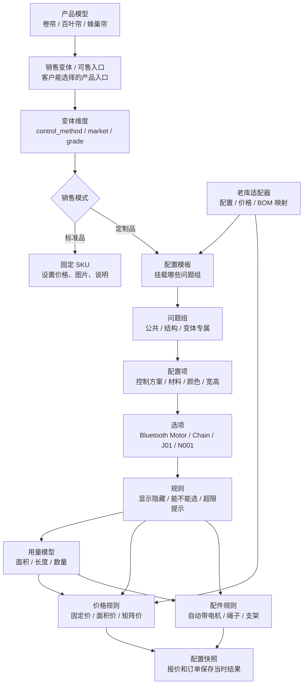

# 产品配置中心设计草案

生成日期：2026-06-04  
适用范围：SKYSPF / OFBiz 老系统重构，窗帘产品基础配置中心、报价、订单、生产。

> 本文是设计草案，不包含数据库 migration，不直接修改现有老库结构。  
> 老库数据只做只读抽样，文档中不包含数据库账号、密码或连接串。
> 配置中心业务可读版 DM 文档见：[配置中心DM.md](./配置中心DM.md)。  
> 本设计的依据说明见：[产品配置中心设计依据.md](./产品配置中心设计依据.md)。  
> 开发功能拆分清单见：[配置中心功能拆分清单.md](./配置中心功能拆分清单.md)。  
> API 与后台 Java 实现约束见：[共享产品能力中心API与后端实现约束.md](./共享产品能力中心API与后端实现约束.md)。  
> 价格中心专项设计见：[价格中心设计.md](./价格中心设计.md)。  
> 后续业务 Agent 体系设计见：[业务Agent体系设计.md](./业务Agent体系设计.md)。  
> 交互原型见：[config-center-prototype/index.html](./config-center-prototype/index.html)，配置录入工作台见：[config-center-prototype/config-center.html](./config-center-prototype/config-center.html)，兼容入口见：[配置中心原型.html](./配置中心原型.html)，原型数据见：[config-center-prototype-data.js](./config-center-prototype-data.js)。这些 H5 原型只用于业务评审和复杂度验证，不作为最终前端布局、样式和组件实现约束。

## 0. 当前 base-boot 项目落地口径

本文原始讨论偏“全新配置中心视角”。落到当前 `base-boot` 项目时，结论要调整为：

```text
业务能力不减少。
基础设施不重做。
新增部分只补产品配置、价格、组件/BOM、发布闭环和快照这些业务域能力。
```

更进一步，这套设计不应该只理解成“订单系统里的配置中心”。它实际是一组共享产品能力：

```text
产品域基础信息
  + 产品配置中心
  + 组件 / 物料 / 资料资产
  + 价格中心
  + 规则 / 用量 / BOM
  + 测试发布 / 快照
= 共享产品能力中心
```

订单系统只是第一个落地场景和第一个消费者。ERP、MES、报价、售后、客户门户、后续外部平台都可能消费这些发布后的产品能力。因此当前可以先寄居在订单系统代码库里，但设计上要按“未来可独立服务、可独立数据库、向订单同步发布数据”的边界来做。

核心判断：

| 能力 | 是否共享 | 说明 |
| --- | --- | --- |
| 产品分类、产品模型、销售变体 | 是 | 不属于订单私有数据，ERP/MES/报价都需要统一产品口径 |
| 物料、组件、资料资产 | 是 | 生产、采购、售后、销售说明都要复用 |
| 配置问题、答案、规则、用量、BOM | 是 | 决定产品能怎么卖、怎么生产，不应散落到订单系统 |
| 价格方案、价格版本、价格测试 | 是 | 报价和订单使用，后续也可能被客户门户或外部渠道使用 |
| 发布检查、缺口待办、影响分析 | 是 | 是产品能力上线治理，不是某张订单的流程 |
| 订单行、Room Name、Line Item、客户备注 | 否 | 这是订单系统自己的组织方式 |
| 订单配置/价格/BOM 快照 | 属于订单，但来源于共享能力 | 下单时锁定发布版本，后续配置中心更新不影响老订单 |

当前项目已经具备的能力，配置中心必须复用：

| 已有能力 | 当前项目位置/口径 | 配置中心落地方式 |
| --- | --- | --- |
| 登录、权限、角色、菜单 | 后端 Sa-Token、系统菜单/角色权限，前端动态路由和权限指令 | 新增菜单、按钮权限和接口权限，不另建权限体系 |
| 租户上下文 | `bocoo.tenant`、`LoginHelper.getTenantId()`、数据权限拦截 | 产品能力核心数据按平台共享主数据处理；技术上逐表确认租户忽略表或统一平台租户 |
| 字典/标准数据 | 系统字典、国家/币种/语言标准数据 | 状态、规则类型、销售模式、单位等优先走现有字典/标准数据，不硬编码 UI 文案 |
| OSS/文件管理 | `bocoo-common-oss`、系统 OSS 配置和文件管理 | 资料资产库复用现有上传、存储和访问能力，只新增业务绑定、版本、用途和发布检查 |
| 审计字段和操作日志 | BaseEntity/BaseVo、日志模块、前端请求层自动剥审计字段 | 新增表继续用现有审计口径，重要发布/审批/Agent 动作补业务日志 |
| i18n | 前端 `vue-i18n` + `i18n/locales/en_US.json` 单源，后端 JSON i18n | 新增页面和后端消息都走现有 i18n 流程；前端不新增硬编码可见文案 |
| UTC/时间 | 后端 `TimeUtils.utcNow()`、PG 会话 UTC、前端 `formatUtc()` | 版本发布时间、生效时间、审批时间、快照时间都按现有 UTC 规则 |
| 前端风格 | `admin-ui` 已有 Element Plus、页面布局、表格、抽屉、分页、请求封装 | 不按 H5 原型重做视觉；按现有管理端风格新增页面 |
| 后端结构 | Spring Boot 多模块、MyBatis-Plus、VO/BO/Mapper/Controller 习惯 | 新业务建议独立业务包/模块，接口、分页、导出、校验保持项目既有写法 |

因此，后续开发时要区分两类工作：

| 类型 | 处理方式 |
| --- | --- |
| 已有基础能力 | 复用和扩展配置，不重复造轮子 |
| 新业务域能力 | 新增产品配置中心、价格中心、组件/BOM、资料绑定、发布检查、快照和 Agent 草稿能力 |

前端实现边界：

- H5 原型只作为业务参考，不迁移其视觉样式。
- 正式页面放进 `admin-ui` 现有布局体系，使用现有 `request`、权限、路由、Pinia、i18n、Element Plus 组件。
- 可见文案只维护 `i18n/locales/en_US.json`，同步脚本生成前后端运行时 JSON。
- 页面优先复用现有列表、搜索、表单、抽屉、表格、分页、上传组件风格。

后端实现边界：

- 不修改 migration 文件，不直接修改生产配置。
- 第一阶段先做业务设计和应用层落地，不要求一次性迁移全部老库数据。
- 旧 OFBiz 数据通过适配器只读接入，价格矩阵优先包装旧表，不先重建 53 万行矩阵。
- 规则求值器、发布检查、快照保存是新增核心，不应散落在 Controller 或前端页面里。

### 0.1 当前寄居订单系统，未来独立服务

当前先放在订单系统代码库里是合理的，原因是订单要最先使用它，联调成本最低。但不要把它设计成订单系统私有模块。

推荐阶段：

```text
阶段 A：同仓同库，逻辑独立
  -> 在 base-boot 中实现，模块、包名、表前缀、接口边界独立

阶段 B：同仓或同服务，API 独立
  -> 订单、报价只通过配置能力 API / Service 调用，不直接拼规则和价格

阶段 C：独立服务 + 同步读模型
  -> 产品能力中心成为 source of truth，订单侧保存发布快照或同步副本

阶段 D：多系统消费
  -> ERP / MES / 报价 / 售后 / 客户门户通过 API、事件或同步表消费发布版本
```

拆分前必须保证两个原则：

- 共享产品能力中心是 source of truth。
- 订单系统保存自己的快照，不反向修改共享配置。

### 0.2 后端模块和菜单落点建议

共享产品能力中心不建议塞进 `bocoo-modules-system`。`system` 现在更像用户、角色、菜单、字典、OSS、租户申请等系统能力模块；产品基础、配置、价格、BOM、资料发布属于业务域，规模也明显更大。

落地建议：

| 方案 | 适用情况 | 评价 |
| --- | --- | --- |
| 新增 `bocoo-modules-product` 或 `bocoo-modules-product-center` | 产品基础、配置、价格、组件、资料、发布作为共享能力 | 推荐，边界清楚 |
| 复用 `bocoo-modules-dealer` | 只有经销商业务自己使用这些配置 | 不推荐作为默认，因为当前配置中心是平台级产品能力定义 |
| 放进 `bocoo-modules-system` | 只做少量系统配置 | 不适合，后期会污染系统模块 |

前端菜单建议按业务域挂到现有管理端：

```text
产品能力
  -> 基础信息
  -> 产品模型
  -> 配置模板
  -> 组件 / 资料
  -> 价格中心
  -> 测试发布
  -> 销售只读总览
```

实际是否新增 Maven module 属于架构调整，进入编码前需要单独给实施计划；本文只确定业务边界。

### 0.3 数据库边界和同步策略

这套共享能力未来适合单独数据库。当前不必一开始物理拆库，但要按可拆分方式设计：

| 当前阶段 | 建议 |
| --- | --- |
| 当前订单系统内落地 | 可以同库，但使用独立表前缀/独立业务模块，不和订单表强外键耦合 |
| 订单读取配置 | 通过后端 API/Service 获取发布版本和求值结果，不直接联表修改共享表 |
| 订单保存 | 保存 `templateVersionId`、配置快照、价格快照、BOM 快照、资料版本 |
| 后期拆服务 | 产品能力中心发布事件或同步只读 read model 到订单系统 |
| ERP/MES 消费 | 只读发布版本、BOM/用量/物料映射，不直接写产品能力核心表 |

不建议多个系统共享同一个可写数据库。未来拆分后，产品能力中心写自己库，订单、ERP、MES 通过 API、事件、同步表或快照消费。

同步边界建议：

```text
产品能力中心发布模板版本
  -> 生成发布包 PublishedProductPackage
  -> 同步到订单系统只读表 / read model
  -> 订单下单时引用发布包并生成订单快照
```

同步失败时，订单系统可以继续使用已同步的旧发布版本，但不能自动使用未同步的新版本。

缓存边界：Redis 不作为发布包、审核结果、订单快照、价格快照、BOM 快照的权威存储。第一版优先使用 PostgreSQL 宽表、快照表和 read model；后续如确有性能瓶颈，Redis 只能做可丢弃、可回源、可按版本失效的派生缓存，详细规则见 [共享产品能力中心API与后端实现约束.md](./共享产品能力中心API与后端实现约束.md)。

### 0.4 租户和数据归属

当前项目已启用租户能力，但产品能力中心第一版按平台共享主数据处理，业务上不做商户级配置复制。需要处理的是技术租户拦截，而不是把产品配置拆成多租户业务。

建议第一版按下面口径：

| 数据 | 默认归属 | 说明 |
| --- | --- | --- |
| 产品分类、产品模型、公共问题组、标准组件、标准资料 | 平台共享主数据 | 由平台产品运营维护，订单、ERP、MES 只读或引用 |
| 销售变体、配置模板发布版本 | 平台共享主数据 | 第一版不做商户私有模板复制 |
| 价格方案 | 平台共享主数据 | 第一版先做平台主价；商户价、客户价、促销价后续通过独立价格域扩展 |
| 配置草稿、缺口待办、测试用例 | 平台产品运营数据 | 记录创建人、负责人和处理人，但不按业务租户拆分 |
| 报价/订单快照 | 订单系统侧数据 | 快照锁定当时配置、价格、资料版本，跟随订单自己的归属和权限 |
| Agent 任务和日志 | 平台产品运营数据 | 第一版只辅助平台产品能力维护，不跨系统直接写订单/ERP/MES |

技术落地必须在下面两种方案中选一种，并在实施计划中逐表确认：

| 方案 | 说明 | 建议 |
| --- | --- | --- |
| 加入租户忽略表 | 产品能力核心表加入 `bocoo.tenant.ignore-tables`，业务查询不带 `tenant_id` | 推荐用于平台共享主数据 |
| 统一平台租户 | 表保留 `tenant_id`，统一写平台租户 ID | 适合需要继续复用 BaseEntity 和现有租户上下文的阶段 |

不要让租户拦截器误伤平台数据查询，也不要在第一版提前实现商户级配置复制。

### 0.5 UI i18n 和业务多语言边界

当前项目的 UI 文案 i18n 和产品业务多语言不是一件事：

| 类型 | 存放位置 | 示例 |
| --- | --- | --- |
| UI 文案 | `i18n/locales/en_US.json` 单源，脚本同步前后端运行时 JSON | 按钮、表格列、placeholder、toast、校验消息 |
| 产品业务名称 | 业务表字段 | `nameCn`、`nameEn`、`descriptionCn`、`descriptionEn` |
| 客户可见说明 | 资料资产 / HelpContent | 安装说明、测量说明、颜色说明、规则提示 |
| 订单快照显示名 | 快照 JSON | 保存当时中英文显示名和资料版本 |

不要把产品名、颜色名、面料名写成前端 i18n key；它们是业务数据，应该随配置模板版本和订单快照保存。

### 0.6 规则求值和接口权威边界

配置器求值必须以后端为准。前端可以为了交互体验做轻量预览，但不能成为最终判定来源。

第一版最小接口边界建议：

```text
查询草稿/发布模板
  -> 返回产品、变体、问题、答案、资料、价格引用

配置求值 evaluate
  -> 输入 templateVersionId + selectedOptions + dimensions
  -> 输出 visibleSlots + enabledOptions + validations + usage + price + bom + snapshotDraft

发布测试 runTest
  -> 重跑规则 schema、依赖环、价格命中、BOM 输出、快照完整性

生成快照 buildSnapshot
  -> 报价/订单保存前由后端生成最终 ConfigurationSnapshot / PriceSnapshot / BomSnapshot
```

报价、订单、发布审批不能信任前端本地计算结果；必须调用后端求值服务。

### 0.7 数据库和 SQL 边界

本文不新增 migration。后续真正落库时要遵守当前项目约束：

- PostgreSQL 是主数据库；不再补 MySQL 新 SQL。
- 时间字段按 UTC 语义，后端使用 `TimeUtils.utcNow()`，PG 会话保持 UTC。
- 新 SQL / 初始化脚本 / 表结构变更必须单独评审，不混在文档或原型调整里。
- 不修改生产配置，不把旧库连接串、账号或抽样凭据写进文档。
- 老 OFBiz 数据第一版通过只读适配器使用；全量迁移和数据清洗另起导入中心设计。

这份文档后续所有“第一版必须做”的意思都是：

```text
必须补齐这项业务能力；
不是要求重做当前项目已经实现的通用基础设施。
```

## 1. 本次会话核心结论

我们这次讨论的重点已经从“订单系统怎么做”转到了更底层的“产品配置中心怎么建”。

新的判断是：

```text
产品配置中心是基础层。
报价、订单、生产都是它的下游消费方。以后其他系统也统一从配置中心取产品数据。
```

如果配置中心没有设计好，后续所有模块都会变成补丁：

- 报价会依赖人工判断。
- 订单会保存一堆不可解析的文本。
- 生产无法稳定生成 BOM。
- 后期系统对接只能靠人工整理产品数据。
- 新产品导入还是会变成 Excel 人肉录入。

### 1.1 系统模块总览

第一版不是只做一个“配置中心页面”。为了避免后期越做越拧，必须先把几个中心的职责分开：

| 模块 | 主要作用 | 不负责什么 | 输出给谁 |
| --- | --- | --- | --- |
| 配置中心 | 管产品怎么配置、销售要问什么、答案怎么筛选、规则怎么判断、组件怎么带出、发布后怎么生成快照 | 不维护完整销售价格，不处理订单组合，不做采购/库存/财务执行 | 报价、订单、生产、售后 |
| 价格中心 | 管销售定价、价格版本、工艺价、矩阵价、固定组件价、运费、汇率、价格测试和审批 | 不定义产品问题，不维护采购成本，不改正式配置 | 报价、订单价格快照 |
| 资料资产库 | 管产品说明、问题帮助、答案说明、颜色/面料图、组件图、安装/测量说明、规则提示 | 不做新品研发立项，不替代售后系统 | 销售下单、客户确认、生产、售后 |
| 组件库 / 物料基础 | 管面料、电机、遥控、Hub、太阳能板、型材、辅料、标准品等可复用基础资料 | 不按单扣库存，不做采购审批 | 配置中心、BOM、价格中心、ERP |
| 订单 / 报价系统 | 管 Room Name、Line Item、订单行分组、客户备注、多通道遥控器分组、报价转订单 | 不定义产品结构，不直接修改配置模板 | 销售、客服、生产 |
| 生产 / ERP 后续系统 | 管生产任务、库存、采购、领料、成本、财务核算 | 不反向改配置规则 | 生产、采购、财务 |
| Agent 助手 | 生成草稿、解释字段、发现缺口、打开预览、跑测试建议 | 不直接发布正式配置或正式价格 | 配置员、销售、运营 |

核心原则：

```text
配置中心是产品能力定义。
价格中心是销售定价定义。
资料资产库是说明和图片定义。
组件库是可复用物料和配件定义。
订单系统是一张订单怎么组织。
ERP 是后期执行。
```

这里的“产品”不只包含定制窗帘，也包含不定制的标准产品：

```text
定制产品：卷帘、蜂巢帘、百叶帘等，需要尺寸、配置、规则、BOM。
标准产品：遥控器、太阳能板、充电器、配件包、色卡、样品、固定 SKU 成品。
半标准产品：固定 SKU，但可能有颜色、包装、服务等少量选项。
```

标准品不需要硬套复杂配置模板，但也应该进入配置中心，统一管理编码、价格方案引用、库存属性、图片、帮助说明、安装说明和订单快照。

参考 Hunter Douglas 的 DirectConnect 流程，它不是简单地“先选系列、再选控制方式、再选面料”，而是：

```text
先选产品模型
再加载配置模板
再按模板选择配置槽位
最后由系统生成价格、BOM、订单配置快照
```

核心原则：

```text
BOM 不应该让用户手工维护。
BOM 应该由配置结果自动生成。
```

## 2. 老系统现状摘要

从当前数据库只读抽样看，老系统已经有一些配置器雏形，但概念混在一起。

抽样统计：

| 表 | 行数 | 当前用途 |
| --- | ---: | --- |
| `PRODUCT` | 952 | 产品、组件、颜色、面料等混用 |
| `PRODUCT_CATEGORY` | 166 | 产品大类、系列、控制方式、外壳/valance 混用 |
| `PRODUCT_CONFIG_ITEM` | 48 | 配置项/问题 |
| `PRODUCT_CONFIG_OPTION` | 601 | 配置项选项 |
| `PRODUCT_CONFIG_PRODUCT` | 519 | 选项映射到产品，类似 BOM 或颜色实体映射 |
| `PRODUCT_CONFIG_CONFIG` | 7276 | 已保存配置组合 |
| `PRODUCT_SERIES_PRICE` | 530631 | 按产品大类、系列、控制方式、宽高维护价格矩阵 |

当前主要问题：

1. `PRODUCT_CATEGORY` 同时承担产品线、系列、控制系统、外壳类型等多种含义。
2. `PRODUCT` 同时承担销售产品、配件、颜色、面料、组件等多种含义。
3. `PRODUCT_CONFIG_ITEM / OPTION` 可以表达配置项，但缺少清晰的模板版本、规则、适用范围。
4. `PRODUCT_CONFIG_PRODUCT` 已经像 BOM 映射，但没有明确区分“颜色产品”“配件产品”“生产组件”。
5. `PRODUCT_SERIES_PRICE` 价格表量很大，但价格模型没有沉淀为可管理的规则版本。
6. 尺寸限制数据非常少，目前 `PRODUCT_MAX_DIMENSION_LIMIT` 只有少量规则，说明很多限制可能在人工、代码或 Excel 外部资料里。

## 3. 新配置中心目标

配置中心要解决五个问题：

1. **能标准化录入产品**
   后台人员可以不用写代码，按统一结构维护定制产品、标准产品、配件、样品。

2. **能支撑报价下单**
   前台/后台下单时，根据产品模板动态展示字段，自动校验、自动算价。

3. **能生成生产 BOM**
   根据配置结果生成电机、轨道、布料、支架、底杆、配件包等生产/采购组件。

4. **能让后续系统统一取数**
   每个产品模型、配置项、选项、组件、价格规则都有稳定编码。以后其他系统需要产品数据时，从配置中心取，不再到处拼字段。

5. **能沉淀产品说明和交付资料**
   图片、色卡、安装说明、测量说明、帮助提示、备注要成为配置数据，而不是散落在页面文案、Excel 或人工经验里。

最终目标流程：

```text
相似产品 / 产品蓝图 / 手工录入 / 批量粘贴
        ↓
生成配置中心草稿
        ↓
人工审核并补充规则
        ↓
测试配置、测试价格、测试 BOM
        ↓
发布配置模板版本
        ↓
报价、订单、生产使用该版本
```

### 3.1 当前项目中的配置中心主线：产品如何从资料变成可销售配置

原型第一屏已经调整为单独的“配置中心”模块，不再把“模拟下单”作为主线。另有独立的“配置录入工作台”页面，左边是产品列表，右边是可操作的问题和选项录入界面。它只用于业务评审：让 ERP 操作员按下面顺序看一个产品是否能被配置出来。正式开发时，页面要落在 `admin-ui` 既有管理端样式和组件体系内：

```text
产品分类树
  -> 一级分类
  -> 二级产品形态 / 系列
  -> 产品模型
  -> 销售变体 / 配置入口
  -> 组件库
  -> 问题组
  -> 配置问题 / 配置选项
  -> 业务规则
  -> 价格 / 用量
  -> 测试上线
  -> 发布后给报价、订单、生产使用
```

每一层要回答的问题：

| 配置层 | 业务问题 | 保存到新架构 |
| --- | --- | --- |
| 产品分类树 | 这属于哪类产品、哪种产品形态？分类树只做到二级。 | `ProductCategory` |
| 产品模型 | 同一类结构和通用配置逻辑是什么？ | `ProductModel` |
| 销售变体 / 配置入口 | 销售最终能选择哪个入口？它适用哪些维度，如电机、拉珠、标准、市场、等级？ | `SalesVariant / ConfigurableProduct` |
| 物料基础 | 这是可售成品、定制成品、布匹、型材、采购组件还是服务？ | `MaterialMaster / ProductNature` |
| 组件库 | 后面可能自动带出哪些电机、面料、底杆、太阳能板等组件？ | `ComponentCatalog` |
| 问题组 | 公共问题、结构问题、变体专属问题如何复用和挂载？ | `ConfigQuestionGroup / TemplateQuestionGroup` |
| 配置问题 | 配置员要维护哪些问题，顺序、必填、输入类型是什么？ | `ConfigQuestion` |
| 配置选项 | 每个问题有哪些答案，中文/英文名、编码、图片、适用范围是什么？ | `ConfigOption` |
| 业务规则 | 系统要自动判断什么？如必填、筛选答案、尺寸限制、自动带配件。 | `ConfigRule` |
| 价格 / 用量 | 价格按矩阵、面积、固定价还是用量算？用量给价格和 BOM 共用。 | `PriceMatrix / UsageModel` |
| 测试上线 | 能否用真实场景跑通问题、选项、价格、组件和快照？ | `ConfigTestCase / PublishedTemplate` |

界面架构要和领域边界保持一致：

| 界面区域 | 是否跟随当前产品 | 原因 |
| --- | --- | --- |
| Step 1 产品基础 | 是 | 当前产品自己的分类树、二级产品形态、产品模型、销售变体维度、模板版本、单位、状态 |
| 公共模块入口 | 否，只显示当前产品引用摘要 | 标准品、组件库、价格模型、规则库会被多个产品复用 |
| Step 5 配置问题 / 选项 | 是 | 当前产品自己的问题顺序、必填、答案范围、组件绑定 |
| Step 6 发布检查 | 是 | 检查当前产品模板是否能发布 |
| 标准品基础详情 | 公共模块 | 标准 SKU 可单独卖，也可被多个定制品引用 |
| 组件库详情 | 公共模块 | 面料、电机、型材、辅料不能复制到每个产品里 |
| 价格 / 用量详情 | 公共模块 | 价格矩阵、用量算法需要统一版本和适用范围 |
| 规则库详情 | 公共模块 | 显示、禁选、尺寸、电机能力等规则要统一管理 |

所以原型不应把 Step 2 到 Step 4 直接铺在产品录入页中间。产品页只放入口；真正维护时进入对应公共模块。

配置中心需要三个视图出口，但三者读取同一套配置数据，不是三套功能：

| 视图 | 使用者 | 目的 | 原型参考 |
| --- | --- | --- | --- |
| 录入视图 | 产品运营 / ERP 配置员 | 新增、编辑、绑定、测试、发布配置 | [config-center-prototype/config-center.html](./config-center-prototype/config-center.html) |
| 销售只读总览 | 销售 / 主管 / 新员工培训 | 看懂产品怎么卖、下单会问什么、系统自动做什么、有哪些限制 | [config-center-prototype/config-overview.html](./config-center-prototype/config-overview.html) |
| 下单模拟视图 | 销售 / 客服 / 测试 | 像客户一样选一遍，验证价格、规则、提示和快照 | [config-center-prototype/index.html](./config-center-prototype/index.html) |

正式页面不是把 H5 三个文件搬进系统，而是拆成现有管理端页面：

| 正式能力 | 建议落点 | 说明 |
| --- | --- | --- |
| 配置录入工作台 | 新增产品配置中心菜单 | 复用现有列表、表格、抽屉、上传、权限、i18n |
| 销售只读总览 | 新增只读页面或产品详情只读模式 | 从已发布配置自动生成，不给销售编辑入口 |
| 下单模拟/测试器 | 配置测试器页面 | 用于发布前测试，不替代正式报价/订单页面 |

销售只读总览不能做成录入页的 Tab。录入页回答“怎么设置”，销售总览回答“设置完以后业务怎么看”。只读总览从已发布配置自动生成，展示：

```text
产品身份：分类树、产品模型、销售变体、销售模式
下单问题：客户会看到哪些问题、哪些必填、每个问题做什么
自动动作：显示隐藏、必填、答案范围、自动带组件、尺寸/能力规则
价格和物料：基础价、选配加价、用量价格、组件绑定
发布检查：分类、变体、问题、答案、组件、价格是否完整
```

### 3.1.1 ProductCategory 分类树只做到二级

从 `产品手册.xls` 读取到的产品层级是：

| 原表层级 | 原表含义 | 新配置中心归属 |
| --- | --- | --- |
| 一级类目 | 分类，如卷帘、斑马、蜂巢帘、罗马帘 | `ProductCategory` 一级节点 |
| 二级类目 | 产品形态，如标准卷帘、上下开合蜂巢帘、日夜蜂巢帘 | `ProductCategory` 二级节点 |
| 三级类目 | 系统，如电动、无拉、拉珠、拉杆 | `SalesVariant.variantDimension` |
| 四级类目 | 罩壳，如罩壳、平轨、开放式、方罩插片 | 产品模型维度、结构问题组或配置问题 |
| 五级类目 | 面料特性，如遮光、遮阳、28、38、45 | 面料属性、配置问题或选项范围 |

所以新系统不要继续做无限分类树。分类树只负责管理产品大类和产品形态：

```text
ProductCategory
  卷帘
    -> 标准卷帘
  斑马帘
    -> 标准斑马帘
  蜂巢帘
    -> 标准蜂巢帘
    -> 上下开合蜂巢帘
    -> 日夜蜂巢帘
  罗马帘
    -> 标准罗马帘
```

实现上用一张树表即可：

```text
ProductCategory:
  id
  parentId
  level
  code
  nameCn
  nameEn
  sortOrder
  status
```

产品模型只选择二级类目：

```text
ProductModel.categoryId = 二级 ProductCategory.id
```

一级类目通过 `parentId` 查出。这样报表、权限、导航和筛选都能用分类树，但配置逻辑不会被分类树绑死。

老下单页面里的字段也要按性质拆开：

| 老页面字段 | 新系统归属 | 说明 |
| --- | --- | --- |
| 产品大类 | `ProductCategory` | 只用于分类、导航、筛选、报表 |
| 产品 | `ProductModel / SalesVariant` | 例如“无上轨卷帘 + 拉珠”应拆成产品模型和销售变体 |
| 控制系统 | `SalesVariant.variantDimension`，并进入订单快照 | 拉珠、电动、无拉、拉杆会决定问题组显示 |
| 安装方式、控制方向、铝材颜色、下杆类型 | `ConfigQuestion / ConfigOption` | 这是配置问题，不是分类 |
| 遥控器数量、遥控器编号、频率、电源、通道 | 电动销售变体专属问题组 | 控制系统不是电动时应隐藏或禁用 |
| 面料名称、样册编号、颜色、面料方向、面料位置 | `ComponentCatalog` 面料组件 + 面料属性 + 订单选择 | 面料是原材料/组件，不是产品分类 |
| 导入备注、备注 | 订单备注 / 生产备注 / 配置快照备注 | 配置中心最多定义字段，不解析订单组合逻辑 |

### 3.1.2 产品模型、销售变体和问题组

不要把“控制方式”做成一层写死的架构。控制方式只是第一版最常见的销售变体维度，未来还可能出现市场、产品等级、包装方式、快速发货、认证要求等维度。

推荐结构：

```text
产品分类树
  -> 二级产品形态 / 系列
    -> 产品模型
    -> 销售变体 / 配置入口
      -> 变体维度
      -> 挂载问题组
      -> 配置模板版本
```

例子：

```text
柔纱帘
  -> L Cassette Zebra Shades 产品模型
    -> Motor 销售变体
       variantDimension: control_method = motor
       挂载：公共问题组 + L Cassette结构问题组 + Motor控制问题组
    -> Chain 销售变体
       variantDimension: control_method = chain
       挂载：公共问题组 + L Cassette结构问题组 + Chain控制问题组
```

以后如果出现新的维度，不新增硬编码层，只新增数据：

```text
variantDimension: market = US
variantDimension: grade = premium
variantDimension: production_mode = quick_ship
variantDimension: package_type = project_bulk
```

判断标准：

- 如果它会决定“进入哪套问题组”，就作为销售变体维度。
- 如果它只是某个问题的答案，影响价格、组件、显示隐藏、禁用组合，就留在配置问题/选项里。
- 如果它处理一张订单里多个产品怎么分组、合并、备注解析，就不进入配置中心。

问题设置必须有分类，避免所有问题混成一张表：

| 问题分类 | 用途 |
| --- | --- |
| 公共问题组 | 宽、高、安装方式等多个变体共用的问题 |
| 销售变体专属问题组 | 电机方案、拉珠方案、未来市场/等级/包装专属问题 |
| 产品/结构专属问题组 | 罩壳、底杆、侧轨、卷布方向等结构相关问题 |
| 组件/配件问题组 | 太阳能板、伸缩杆、遥控器是否可选等产品能力 |
| 生产/包装问题组 | 生产和包装需要的结构化配置，不处理生产执行 |
| 提示/备注问题组 | 给下单页展示的客户提示，不解析订单组合逻辑 |

### 3.1.3 录入便捷性：10 分钟生成草稿

配置中心第一版不能只做“完整录入表单”。目标应该是：

```text
相似产品：10 分钟内生成可测试草稿
复杂新产品：30 分钟内生成第一版草稿
从 0 创新产品：允许更久，但必须支持克隆、问题组复用、批量小工具和分阶段补齐
```

要达到这个目标，必须把以下能力作为第一版核心功能：

| 能力 | 解决什么问题 | 第一版界面表现 |
| --- | --- | --- |
| 从相似产品克隆 | 不从空白产品开始 | 选择来源产品，复制基础、变体、问题组、规则引用、价格设置、组件绑定草稿 |
| 产品蓝图 | 同类产品快速起步 | 卷帘-电动、卷帘-拉珠、蜂巢帘-无拉、标准配件等蓝图 |
| 问题组模板 | 复用公共问题，不重复录 | 公共尺寸、安装方式、Motor 控制、Chain 控制、结构、面料等问题组 |
| 差异补录 | 只处理新产品和来源产品不同的部分 | 显示“只需要确认这几项差异” |
| 批量小工具 | 面料、颜色、组件不能逐个手录 | 支持粘贴列表、批量设置状态、批量绑定适用范围；完整资料包导入后置 |
| 自动匹配组件 | 避免答案逐个绑定组件 | 按编码、英文名、中文名、供应商编号匹配，失败项进入缺口清单 |
| 批量操作 | 处理 80+ 面料答案和颜色答案 | 批量设置适用分类、销售变体、启用状态、组件类型 |
| 发布缺口清单 | 不让配置员自己翻 Tab 找问题 | 统一列出缺中文名、缺组件、价格未命中、缺测试用例 |
| 差异对比 | 克隆后知道改了什么 | 当前草稿 vs 来源产品、问题组 v1 vs v2、批量粘贴结果 vs 已发布模板 |
| 销售说明自动生成 | 减少二次写说明书 | 发布后自动生成销售只读总览 |

问题组必须独立出来，并且逻辑上要版本化：

```text
QuestionGroup
  -> QuestionGroupVersion
  -> Questions
  -> Options / OptionScope
```

产品模板挂载问题组，而不是复制问题组内部所有字段：

```text
ConfigTemplateDraft
  = 公共尺寸问题组 v1
  + 安装方式问题组 v1
  + L Cassette 结构问题组 v1
  + Motor 控制问题组 v1
  + Zebra 面料/颜色问题组 v1
  + 产品专属问题
```

如果问题组升级，不允许偷偷影响已发布产品：

```text
Motor 控制问题组 v2
  新增：静音模式
  影响：12 个产品
  操作：查看差异 / 当前产品升级 / 保持 v1
```

推荐的 10 分钟录入流程：

```text
1. 选择分类树和创建方式
2. 选择相似产品或产品蓝图
3. 确认产品模型和销售变体
4. 一键挂载问题组
5. 粘贴/批量维护或确认答案范围
6. 自动匹配组件
7. 确认价格来源
8. 查看发布缺口清单
9. 跑测试用例
10. 发布到测试或提交审核
```

### 3.1.4 扩展边界审查

配置中心要稳定，不能靠每个新需求改架构。第一版扩展原则如下：

| 扩展类型 | 是否进入配置中心 | 实现方式 |
| --- | --- | --- |
| 新产品分类 / 产品形态 / 可售入口 | 是 | 新增 `ProductCategory / ProductModel / SalesVariant` 数据 |
| 新销售变体维度 | 是 | 新增 `SalesVariant.variantDimension` 并挂载问题组 |
| 新配置问题 / 新答案 | 是 | 新增 `ConfigSlot / ConfigOption / OptionScope` |
| 新组件 / 新物料口径 | 是 | 新增或导入 `ComponentCatalog / MaterialMaster` |
| 新尺寸、电机能力、禁选、默认值规则 | 是 | 新增 `ConfigRule` 数据和有限 `ruleType` schema |
| 新价格 / 用量参数 | 是 | 新增 `PricingProfile / UsageModel` 参数或版本 |
| 下单备注、遥控器分组、订单行合并 | 否 | 下单页/订单扩展字段处理 |
| 采购、库存、生产、财务执行动作 | 否 | 下游系统读取配置结果和快照 |

扩展约束：

- 可以扩展配置数据、规则参数、有限规则类型。
- 不允许在配置中心保存自由代码、运行时脚本或 eval 表达式。
- 不允许把订单级组合流程、ERP 执行动作做成配置中心页面。
- 新增规则类型时必须同步补：`conditionJson/actionJson` schema、求值器、前端展示、发布测试用例。

### 3.1.5 共用资产必须抽离

凡是会被多个产品复用、或者未来会被价格、订单、生产共同读取的内容，都不能埋在单个产品表单里。

| 共用资产 | 为什么要抽离 | 修改时必须做什么 |
| --- | --- | --- |
| 产品分类树 | 报表、权限、导航、筛选共用 | 修改分类要检查挂载产品 |
| 问题组 | 多个产品复用尺寸、安装、控制方式、面料问题 | 新版本发布前做影响分析 |
| 配置问题 / 答案库 | 颜色、安装、控制方向等可能跨产品复用 | 修改显示名、状态、图片要选择同步范围 |
| 组件库 | 电机、遥控、Hub、太阳能板、面料、型材会被多个答案带出 | 修改组件资料要检查关联产品和 BOM |
| 资料资产 | 产品图、色卡图、组件图、安装/测量说明被销售、客户、生产共用 | 更新资料要保存版本并进入审批 |
| 规则库 | 尺寸限制、电机能力、选项筛选、自动带组件会影响多个产品 | 修改规则要跑引用产品测试 |
| 用量模型 | 面料面积、型材长度、电机数量给价格和 BOM 共用 | 修改算法要重跑价格和 BOM 测试 |
| 价格方案 | 多个产品或变体可能引用同一价格口径 | 修改价格走价格中心审批 |

不要把这些内容复制到每个产品里。产品只保存引用关系：

```text
ProductTemplate
  -> questionGroupVersionIds
  -> componentCatalogRefs
  -> mediaAssetRefs
  -> ruleVersionRefs
  -> usageModelRefs
  -> pricePlanRef
```

共用资产修改流程：

```text
选择要修改的共用资产
  -> 系统列出受影响产品 / 变体 / 问题 / 订单测试用例
  -> 用户选择同步范围：全部产品 / 部分产品 / 仅当前产品 / 另存为新版本
  -> 生成变更草稿
  -> 指派负责人补齐缺口
  -> 跑发布测试
  -> 审批
  -> 发布新版本
```

例如修改一个颜色答案或组件资料时，不应该直接覆盖所有产品：

```text
修改 YZB201 White 色卡图
  -> 系统提示：被 6 个产品、80 个答案引用
  -> 用户选择同步到：柔纱帘 / 景观帘 / 仅当前产品
  -> 生成资料资产草稿 v2
  -> 检查客户可见说明和图片 alt
  -> 审批发布
```

这样组件、颜色、问题组、资料说明都可以共用，但不会一改就偷偷影响所有已发布产品。

“禁止组合”不是配置中心的核心步骤。它只是 `ConfigRule` 的一种类型：当两个答案明确不能同时出现时才设置，例如某个面料不能搭某个罩壳颜色。当前数据样本如果没有显式禁止组合，不应该为了“看起来有规则”而硬配。

后期 ERP 口径必须在配置中心里提前留好，但界面不必直接叫 ERP。第一版需要区分：

| 物料/产品性质 | 例子 | 后期用途 |
| --- | --- | --- |
| 可售成品 | 遥控器、太阳能板、样品 | 成品库存、固定价、直接下单 |
| 定制成品/按单生产 | 客户配置出来的一樘窗帘 | 订单生成 BOM，不预先库存所有组合成品 |
| 原材料：布匹/面料 | YZB201、YB180002、XL241501 | 面料库存、采购、裁剪、面积用量、成本 |
| 原材料：铝杆/型材 | 底杆、罩壳、侧轨、轨道 | 型材库存、切割、长度用量、成本 |
| 采购组件 | 电机、遥控、太阳能板、支架、链条 | 采购、库存、领料、BOM、成本 |
| 辅料/包装 | 螺丝、安装件、包装材料 | 固定数量或规则带出 |
| 服务项 | 安装、测量、加急 | 不进物料库存，可进报价和订单 |

因此“组件”不是一个随便写在答案上的文本。正式逻辑是：

```text
先维护物料/组件基础
  -> 再让答案绑定组件
  -> 再由规则和用量模型生成 BOM
  -> 后期库存、采购、生产、成本读取同一个物料口径
```

典型动态规则必须由配置中心支持：

| 场景 | 规则表达 | 输出 |
| --- | --- | --- |
| 宽度超过 2m 自动双电机 | `width_cm > 200 -> MOTOR_QTY = 2` | 动态物料数量，不手工改 BOM |
| 超宽不支持某些选配 | `width_cm > 200 -> disable option_group` | 当前配置禁用答案，不删除答案 |
| 超出产品最大尺寸 | `dimension out of limit -> BLOCKER` | 禁止提交或发布测试失败 |
| 接近风险尺寸 | `near limit -> WARNING` | 允许保存但要求复核 |

这些规则的输出会进入配置求值结果，再生成动态物料清单和配置快照。

结合当前抽样数据和行业配置器资料，第一版规则能力不应只做“超宽双电机”，至少要覆盖：

| 规则能力 | 业务含义 | 数据/行业依据 |
| --- | --- | --- |
| RequiredRule 必填 | 问题显示时必须填写 | 抽样产品大量问题为必填 |
| VisibilityRule 显示/隐藏 | 按产品模型、销售变体维度、已选答案控制哪些问题出现 | HD/HB 配置器范式；电动、手拉、标准品问题不同 |
| OptionScopeRule 选项域 | 按产品、系列、销售变体维度、面料组筛选答案 | 面料/颜色选项数量差异很大 |
| DefaultValueRule 默认值 | 常见答案自动带默认值，但允许运营调整 | 配置录入效率要求 |
| CompatibilityRule 禁止组合 | 两个答案不能同时出现时给出冲突原因并拦截 | 窗帘结构、安装、面料、配件存在兼容关系 |
| ComponentBindingRule 组件绑定 | 答案触发面料、电机、太阳能板、伸缩杆等组件 | 抽样有大量选项映射/自动配件 |
| DimensionRule 尺寸限制 | 最大宽高、最小宽高、面积限制 | 抽样有尺寸限制，行业资料也有 max/min |
| MeasurementRule 测量精度 | inch/cm 换算、1/8 inch 精度、宽高输入校验 | 行业测量指南 |
| DeductionRule 扣减 | Inside/Outside mount、侧轨、底槽、外壳导致成品尺寸差异 | 行业扣减表 |
| DerivedValueRule 派生值 | 订单尺寸、成品尺寸、布宽、型材长度统一输出 | 报价、BOM、裁剪、生产共用 |
| MotorCapacityRule 电机能力 | 电机型号、管径、面料重量、宽高决定单/双电机 | 电动帘行业规格 |
| DisableOptionRule 禁选 | 宽高或选择不满足时禁用答案 | 配置器常见体验 |
| PriceRule 价格 | 矩阵价、面积价、组件价、附加价 | 抽样价格矩阵 |
| PriceAdjustmentRule 选配加价 | 矩阵基础价之外追加配件、服务、特殊结构加价 | 后期报价需要价格明细 |
| UsageRule 用量 | 面料面积、型材长度、链条长度、电机数量 | BOM/成本共同输入 |
| StandardSkuRule 标准品 | 固定 SKU 单独卖，也可被自动带出 | Solar Panel 样本 |
| PublishTestRule 发布测试 | 规则变更后重跑典型用例 | 配置中心上线要求 |

规则求值顺序建议固定为：

```text
可见性
  -> 选项域
  -> 默认值
  -> 必填
  -> 兼容 / 尺寸 / 测量
  -> 派生尺寸和用量
  -> 价格
  -> 动态 BOM
  -> 发布测试
```

注意：`width_cm > 200 -> MOTOR_QTY = 2` 只是原型里的演示规则，不应成为写死逻辑。正式规则要按产品资料、面料重量、管径、电机型号和最大尺寸共同判断：

```text
if width_cm / height_cm / fabric_weight / tube_size / motor_model exceed capacity
  -> disable current motor option
  -> require higher torque motor
  -> or MOTOR_QTY = 2
  -> or BLOCKER
```

配置中心原型已按这个逻辑增加“电机能力规则模拟”。它使用有限参数表，而不是自由文本公式：

| 参数 | 数据来源 | 输出影响 |
| --- | --- | --- |
| `widthCm` / `heightCm` | 客户当前配置输入 | 面积、超宽、超高判断 |
| `fabricWeightGsm` | 面料组件主数据 | 电机负载和克重上限判断 |
| `tubeSizeMm` | 管径/型材组件主数据 | 当前电机能否安装 |
| `motorModel` | 电机组件主数据 | 最大宽高、最大负载、建议面料克重 |

求值结果输出到：

- `UsageModel.MOTOR_QTY`：单电机或双电机。
- `ConfigOption.enabled`：禁用当前电机、细管径、单电机等答案。
- `MotorCapacityRule`：要求改选更高扭矩电机。
- `ValidationMessage`：没有可行方案时给 BLOCKER。

多通道遥控器这类需求不放进配置中心做分组操作。它的设计边界是：

| 层级 | 负责什么 |
| --- | --- |
| 配置中心 | 定义电机是否支持遥控、遥控器是否可选、是否显示下单提示 |
| 下单页面 | 展示备注提示：如需多个窗帘共用多通道遥控器，请备注控制分组 |
| 订单处理 | 按客户备注处理遥控器数量和 1-5、6-10 这类控制分组 |

这样配置中心仍然是产品能力定义，不会变成订单系统。第一版不新增订单级聚合模型，只保留提示文案和遥控器组件可选能力。

公开行业资料支持这类判断：测量规则通常要求 1/8 inch 精度，Inside/Outside Mount 会影响尺寸口径；电动卷帘的能力限制通常受面料重量、宽高、管径和电机扭矩共同影响。HD/HB 参考流程也体现了“先选配置，系统动态校验/算价/出 BOM”的配置器范式。

### 3.2 原型使用的真实产品样本

原型至少展开三个复杂产品，用同一套配置中心链路做对照：

| 产品 | 系列/控制 | 配置问题 | 可选答案 | 组件绑定 | 价格样本 |
| --- | --- | ---: | ---: | ---: | ---: |
| L Cassette Motor Zebra Shades | 柔纱帘 / 电动 | 12 | 108 | 96 | 240 |
| Flat rail Motor Screen View Shades | 景观帘 / 电动 | 12 | 89 | 69 | 240 |
| L Cassette Chain Blackout shades | 遮光卷帘 / 手拉链条 | 12 | 84 | 53 | 240 |
| Standard Chain Roman Shades | 罗马帘 / 手拉链条 | 9 | 87 | 57 | 0 |
| Solar Panel | 标准配件 / 标准 | 1 | 39 | 39 | 240 |

这些样本的作用不是展示旧数据字段，而是验证新配置中心能否承载真实复杂度：

- 能不能把每个产品拆成分类树、产品模型、销售变体、配置问题、配置选项。
- 能不能把答案和组件绑定起来，自动生成生产组件。
- 能不能表达必填、尺寸、筛选答案、自动计算、自动带配件等规则。
- 能不能让价格、用量、测试上线和下游业务读取同一份发布配置。
- 能不能在录入工作台里直接编辑问题序号、排序、中文名、英文名、必填、分组、答案、状态和组件绑定。
- 能不能让标准品作为固定 SKU 单独销售，同时作为组件被定制品规则引用。

## 4. 核心概念

### 4.1 ProductModel 产品模型

表示一个可配置产品族，而不是一个具体 SKU。

例子：

- Roller Shade
- Blackout Shade
- Zebra Shade
- Honeycomb Shade
- Venetian Blind
- Roman Shade
- Dream Curtain

产品模型只回答：

```text
这是一类什么产品？
它有哪些共同的配置逻辑？
它最终怎么生成报价、订单和 BOM？
```

### 4.2 SalesVariant 销售变体 / 配置入口

销售变体表示同一个产品模型下面，不同销售入口适用哪些配置维度。它不是 SKU，也不是订单行；它只是决定这次要加载哪组问题和规则。

例子：

```text
L Cassette Zebra Shades - Motor
L Cassette Zebra Shades - Chain
Solar Panel - Standard
```

第一版最常见的维度是控制方式：

```text
control_method = motor
control_method = chain
control_method = standard
```

但字段必须保持通用，未来可以继续扩展：

```text
market = US
grade = premium
production_mode = quick_ship
package_type = project_bulk
```

销售变体负责挂载问题组：

```text
SalesVariant
  -> common question group
  -> structure question group
  -> variant-specific question group
```

### 4.3 ConfigTemplate 配置模板

配置模板表示某个产品模型在某个业务版本下的配置结构。

例子：

```text
Roller Shade - L Cassette Motor - 2026.06
Venetian Blind - Classic Dual Cord - 2026.06
Zebra Shade - XL Cassette - 2026.06
```

模板必须有版本：

```text
Draft -> Testing -> Published -> Archived
```

报价和订单只能使用 `Published` 版本。

### 4.4 ConfigSlot 配置槽位

配置槽位是用户下单时需要选择或填写的字段。

例子：

- Product Line
- Collection / Series
- Material
- Fabric / Color
- Control System
- Control Side
- Mount Position
- Width
- Height
- Valance / Cassette
- Bottom Rail
- Power Source
- Solar Panel
- Special Instructions

槽位不是普通字段。每个槽位应该带元数据：

| 字段 | 说明 |
| --- | --- |
| `slotCode` | 稳定编码 |
| `slotName` | 显示名称 |
| `slotType` | single-select / multi-select / number / text / boolean / dimension |
| `required` | 是否必填 |
| `sortOrder` | 展示顺序 |
| `defaultValue` | 默认值 |
| `visibilityRule` | 显示条件 |
| `optionGroup` | 选项来源 |
| `systemField` | 后期系统取数字段 |
| `helpText / media` | 帮助说明、图片、视频 |

### 4.4 ConfigOption 配置选项

槽位下的可选值。

例子：

```text
Control System:
- Chain Operated
- Free-stop
- Lithium Battery Motor
- Wired Motor

Mount Position:
- Inside
- Outside

Ladder Type:
- Ladder Cord
- Ladder Tape
```

选项也要有稳定编码、显示名、供应商编码、工厂编码、图片、适用范围。

### 4.5 ConstraintRule 约束规则

约束规则决定：

- 哪些选项可见。
- 哪些组合不允许。
- 选了某个值后，哪些字段变必填。
- 尺寸是否超限。
- 是否需要警告但允许保存。
- 是否阻止提交订单。

规则要分级：

| 等级 | 含义 |
| --- | --- |
| `INFO` | 提醒，不影响保存 |
| `WARNING` | 可保存，但需要复核 |
| `ERROR` | 可保存草稿，但不能提交 |
| `BLOCKER` | 不能保存该配置 |

### 4.6 PricingRule 价格规则

价格规则不应该全部塞进配置中心。配置中心只负责把产品配置结果、尺寸、选项、组件和用量参数稳定输出给价格中心；正式销售定价、工艺价、运费、汇率、审批和价格发布见：[价格中心设计.md](./价格中心设计.md)。

配置中心侧至少要保留这些价格引用能力：

- 当前产品使用哪个 `PricePlan`。
- 当前价格版本是否已发布。
- 价格测试是否通过。
- 报价/订单保存时如何写入 `PriceSnapshot`。
- 当价格未命中、超限或需要人工复核时，如何阻止发布或提示销售。

### 4.7 BomRule BOM 生成规则

BOM 规则根据配置结果生成组件。

例子：

```text
如果 Control System = Lithium Battery Motor
则生成 Motor Component

如果 Solar Panel = Yes
则生成 Solar Panel Component

如果 Bottom Rail = Fabric Wrap
则生成 Fabric Wrapped Bottom Rail
```

### 4.8 ConfigurationSnapshot 配置快照

报价或订单保存时，不能只保存 `productId + description`。

必须保存配置快照：

```text
templateVersionId
selectedOptions
enteredDimensions
generatedDescription
priceSnapshot
bomSnapshot
validationResult
systemMappingSnapshot
```

这样以后就算配置模板改版，老订单也能复原。

## 5. 建议数据模型

这一节不是直接让开发照着建一堆表。

先看下面这张中文关系图，理解业务链路：



真正开发时，可以把上面的业务概念拆成逻辑实体。这里仍然只是概要逻辑实体，不是 migration。详细业务版 DM、字段清单、标准品/定制品兼容方式见：[配置中心DM.md](./配置中心DM.md)。

实现边界要清楚：

```text
配置器内核：独立领域模型，负责模板、规则、求值、价格引用、BOM、快照。
老库适配器：读取 PRODUCT_CONFIG_*、PRODUCT_SERIES_PRICE 等旧数据，映射成配置器能理解的输入。
不要把 OFBiz 通用商品特征/价格机制直接当成配置器核心，也不要抛开老库已有业务数据从空白开始。
```

### 5.1 基础实体

| 实体 | 作用 |
| --- | --- |
| `ProductCategory` | 产品分类树，只做到一级分类和二级产品形态/系列 |
| `ProductModel` | 产品模型，如百叶帘、卷帘、蜂巢帘 |
| `SalesVariant` | 同一产品模型下的销售变体/配置入口，保存 `variantDimension` 并挂载问题组 |
| `ProductOffering` | 销售产品入口，可代表标准 SKU、定制模板、配件、服务 |
| `ProductLine` | 产品线，如 Solar Shades、Blackout Shades |
| `Collection / Series` | 系列、面料系列、材质系列 |
| `Component` | 生产/采购组件，如电机、支架、底杆、色卡、布料 |
| `MediaAsset` | 图片、色卡、安装图、说明图 |
| `HelpContent` | 帮助说明、安装说明、测量说明、提示文案 |

### 5.2 模板实体

| 实体 | 作用 |
| --- | --- |
| `ConfigTemplate` | 配置模板主表 |
| `ConfigTemplateVersion` | 配置模板版本 |
| `ConfigQuestionGroup` | 公共问题、结构问题、变体专属问题的复用分组 |
| `TemplateQuestionGroup` | 某个模板版本挂载了哪些问题组 |
| `ConfigSlot` | 配置槽位定义 |
| `TemplateSlot` | 某版本模板启用哪些槽位、顺序、必填、默认值 |
| `ConfigOption` | 选项定义 |
| `OptionScope` | 选项适用于哪些产品、材质、系列、模板 |

### 5.3 规则实体

| 实体 | 作用 |
| --- | --- |
| `ConfigRule` | 统一规则表，用 `ruleType` 区分显示、启用、必填、禁止组合、尺寸限制、警告、派生值、BOM 触发 |
| `RuleCondition` | 结构化触发条件，可作为 JSON schema 或规则子结构 |
| `RuleAction` | 结构化动作，不允许自由代码或运行时 eval |
| `ValidationMessage` | 校验结果、错误、提醒，可作为规则动作的一部分 |

逻辑上可以继续说 Visibility / Compatibility / Dimension / Required，便于业务理解；物理设计上建议优先收敛到 `ConfigRule + ruleType + conditionJson + actionJson`。新增规则能力时，不只是加枚举，还要同步补 schema、求值器、前端展示和测试用例。

### 5.4 价格实体

| 实体 | 作用 |
| --- | --- |
| `PricingProfile` | 价格版本 |
| `PriceGrid` | 尺寸矩阵 |
| `PriceFormula` | 面积、平方价、取整等公式 |
| `PriceAdapter` | 老价格表适配器，包装 `PRODUCT_SERIES_PRICE` 等旧数据源 |
| `UsageModel` | 面积、长度、数量等用量计算，供用量型价格和 BOM 共用 |
| `OptionPriceRule` | 选项附加价 |
| `SurchargeRule` | surcharge |
| `DiscountRule` | 折扣规则 |

### 5.5 BOM 实体

| 实体 | 作用 |
| --- | --- |
| `BomRule` | BOM 规则 |
| `BomComponent` | 组件输出 |
| `UsageModel` | 数量/长度/面积计算，BOM 和用量型价格共用 |
| `ComponentMapping` | 组件到工厂/后期系统编码 |

### 5.6 快照实体

| 实体 | 作用 |
| --- | --- |
| `ConfigurationSnapshot` | 报价/订单配置快照 |
| `PriceSnapshot` | 价格快照 |
| `BomSnapshot` | BOM 快照 |
| `ValidationSnapshot` | 校验快照 |

快照可以物理上收敛成一个自包含 JSON 文档，但内容必须包含当时的 `templateVersionId`、选项 code + 显示名、展示尺寸、内部尺寸、价格、BOM、校验结果和外部映射。不要只存外键。

## 6. 从老库抽取的 3 个案例

### 案例 1：L Cassette Motor Solar Shades

老库产品：

```text
PRODUCT_ID: 10000
PRODUCT_NAME: L Cassette Motor Solar Shades
```

老库配置槽位：

| 顺序 | 必填 | 配置项 |
| ---: | --- | --- |
| 10 | Y | Control/Motor Direction |
| 20 | Y | Model Configuration(Lithium Battery Motor) |
| 25 | Y | Solar Shades Fabric Type |
| 30 | N | Cassette Color |
| 40 | N | Cassette Fabric Covering |
| 45 | Y | Bottom Rail |
| 50 | N | Bottom Rail Color |
| 60 | Y | Mount Position |
| 90 | N | Fabric Roll Type |
| 98 | N | Solar Panel |
| 100 | N | Telescoping pole |

老库已有类似 BOM 映射：

| 配置项 | 选项 | 映射产品 |
| --- | --- | --- |
| Model Configuration(Lithium Battery Motor) | APP+Remote(Bluetooth Motor) | Bluetooth Motor |
| Model Configuration(Lithium Battery Motor) | Remote Control Only(Remote Motor) | Remote Motor |
| Model Configuration(Lithium Battery Motor) | APP+Voice+Remote(Zigbee) | Zigbee |
| Model Configuration(Lithium Battery Motor) | APP+Voice+Remote(Matter Motor) | Matter Motor |
| Solar Panel | Solar Panel | Solar Panel |

新配置中心应这样配置：

```text
ProductModel: Roller Shade
ProductLine: Solar Shades
Template: L Cassette Motor Solar Shades
Template Version: 2026.06 Draft
```

槽位：

| Slot Code | Slot Name | Type | Required |
| --- | --- | --- | --- |
| `control_direction` | Control/Motor Direction | single-select | Y |
| `motor_package` | Motor Package | single-select | Y |
| `fabric` | Solar Fabric | single-select | Y |
| `cassette_color` | Cassette Color | single-select | N |
| `cassette_fabric_covering` | Cassette Fabric Covering | boolean/single-select | N |
| `bottom_rail` | Bottom Rail | single-select | Y |
| `bottom_rail_color` | Bottom Rail Color | single-select | N |
| `mount_position` | Mount Position | single-select | Y |
| `fabric_roll_type` | Fabric Roll Type | single-select | N |
| `solar_panel` | Solar Panel | boolean/single-select | N |
| `telescoping_pole` | Telescoping Pole | single-select | N |
| `width` | Width | dimension | Y |
| `height` | Height | dimension | Y |

规则：

```text
if motor_package = Bluetooth Motor -> add component Bluetooth Motor
if motor_package = Remote Motor -> add component Remote Motor
if motor_package = Zigbee -> add component Zigbee Motor
if motor_package = Matter -> add component Matter Motor
if solar_panel = Yes -> add component Solar Panel
if cassette_fabric_covering = Yes -> require cassette fabric wrapping production note
```

这个案例说明：

```text
旧表 PRODUCT_CONFIG_PRODUCT 已经在做 BOM 映射，但没有清晰命名。
新系统应该把它升级成 BomRule，而不是继续让 Product 兼任组件。
```

### 案例 2：百叶帘 Classic Dual Cord Basswood

老库产品：

```text
PRODUCT_ID: 11066
PRODUCT_NAME: Classic Dual Cord Basswood
```

老库完整配置槽位：

| 顺序 | 必填 | 配置项 |
| ---: | --- | --- |
| 10 | Y | Control/Motor Direction |
| 30 | Y | Model Configuration |
| 40 | Y | Basswood Fabric Type |
| 50 | Y | Mount Position |

相关选项：

```text
Model Configuration:
- Ladder Cord
- Ladder Tape

Basswood Fabric Type:
- J01 White
- J02 Gream
- J06 Natural
- J07 Teak
- J08 Golden Oak
- ...
```

用户提供的 Excel：

```text
百叶帘（经典双拉绳宽布梯带式）.xlsx
WPS+实木-颜色（编号-英文）.xls
```

从 Excel 读到的产品结构：

```text
ProductModel: 百叶帘 / Venetian Blind
Style: 经典
Control: 双拉绳
Ladder Type: 宽布梯带式
Material:
- 椴木
- 楠竹
- 桐木
- PVC-PS
```

颜色资料：

| 材质/类型 | 颜色数量 | 例子 |
| --- | ---: | --- |
| WPS | 30 | N001 Pure White, N002 Light Oak, N003 Yellow Oak |
| BASSWOOD / 椴木 | 21 | J01 White, J02 Gream, J06 Natural |
| Paulownia / 桐木 | 4 | P-1015 Teak, P-1016 Cherry |
| Paulownia / 桐木拉丝 | 4 | MSJ-SM044 Ash Grey |
| Bamboo / 竹 | 4 | B-1004 Natural, B-1007 Cherry |

价格规则：

```text
width_cm = width_in * 2.54
height_cm = height_in * 2.54
billable_area = CEILING(width_cm * height_cm / 10000, 1)
price = billable_area * square_price
```

平方价：

| 材质 | 平方价 |
| --- | ---: |
| 椴木 | 22.01 |
| 楠竹 | 22.01 |
| 桐木 | 20.95 |
| PVC-PS | 16.72 |

尺寸：

```text
宽度：12 到 118 inch
高度：12 到 160 inch
```

新配置中心不应为每种组合创建一个产品：

```text
Classic Dual Cord Basswood
Classic Dual Cord Bamboo
Classic Dual Cord WPS
Classic Wired Motor WPS
...
```

而应定义成一个产品模型加多个槽位：

| Slot Code | Slot Name | 例子 |
| --- | --- | --- |
| `grade` | Grade | Classic / Luxury |
| `control_type` | Control Type | Single Cord / Dual Cord / Cordless / Wired Motor |
| `material` | Material | Basswood / Bamboo / Paulownia / PVC / WPS |
| `ladder_type` | Ladder Type | Ladder Cord / Ladder Tape |
| `color` | Color | J01 / N001 / B-1004 |
| `mount_position` | Mount Position | Inside / Outside |
| `control_direction` | Control Direction | Left / Right |
| `width` | Width | dimension |
| `height` | Height | dimension |

规则：

```text
if material = Basswood -> color options use Basswood color group
if material = WPS -> color options use WPS color group
if material = Bamboo -> color options use Bamboo color group
if control_type = Wired Motor -> show motor package slot
if control_type != Wired Motor -> hide motor package slot
```

价格：

```text
if material = Basswood -> square_price = 22.01
if material = Bamboo -> square_price = 22.01
if material = Paulownia -> square_price = 20.95
if material = PVC-PS -> square_price = 16.72
```

这个案例说明：

```text
旧系统把组合拆成很多产品。
新系统应该把组合拆成槽位和规则。
```

### 案例 3：价格矩阵和尺寸限制

老库价格表 `PRODUCT_SERIES_PRICE` 的维度：

```text
PRODUCT_CATEGORY_ID
SERIES_CATEGORY_ID
CONTROL_SYS_CATEGORY_ID
PRODUCT_WIDTH
PRODUCT_DEPTH
PRICE
FROM_DATE
THRU_DATE
```

抽样看到的价格组合：

| Product Category | Series | Control | 宽度范围 | 高度范围 | 价格范围 |
| --- | --- | --- | --- | --- | --- |
| 10010 | 10140 | 10030 | 23-112 | 24-152 | 18.49-269.34 |
| 10010 | 10140 | 10031 | 23-98 | 24-96 | 38.69-197.87 |
| 10011 | 10121 | 10030 | 23-112 | 24-152 | 17.11-218.00 |

老库尺寸限制 `PRODUCT_MAX_DIMENSION_LIMIT` 抽样：

| 产品类别 | Valance | Series | 最大宽 | 最大高 |
| --- | --- | --- | ---: | ---: |
| Solar Shades | L Cassette | Aries | 80 | 50 |
| Zebra Shades | XL Cassette | Neptune | 60 | 75 |
| Zebra Shades | XL Cassette | Jupiter | 65 | 80 |

这个案例说明：

```text
价格和尺寸限制必须是一等规则。
不能只散落在价格表、代码、Excel 或人工经验里。
```

新配置中心应把价格规则和尺寸规则分开：

```text
PricingProfile:
  scope:
    product_model
    product_line
    series
    control_system
    valance
  version:
    effective_from
    effective_to
  rule:
    matrix / area_formula / option_surcharge

DimensionRule:
  scope:
    product_model
    series
    valance
    control_system
    material
  limit:
    min_width
    max_width
    min_height
    max_height
    max_area
```

## 7. 后台功能设计

### 7.1 产品模型管理

功能：

- 新建产品模型。
- 设置产品模型编码、名称、中英文名。
- 设置产品类型，如 shade / blind / curtain / accessory。
- 设置销售模式，如标准 SKU、标准品带选项、定制产品、配件、服务、样品。
- 设置默认单位，如 inch、cm。
- 设置是否支持尺寸、是否支持多窗口、是否支持 BOM。
- 设置是否库存品、是否按单生产、是否需要测量、是否需要安装。
- 上传产品主图、结构图、安装图。
- 维护产品说明、销售备注、客户可见备注、生产备注、安装备注、帮助说明。

页面建议：

```text
产品配置中心
  -> 产品模型
    -> 新建 / 编辑
    -> 模板版本
    -> 选项库
    -> 价格
    -> BOM
    -> 测试
```

### 7.2 配置模板管理

功能：

- 一个产品模型可以有多个模板。
- 模板必须版本化。
- 草稿版本可编辑。
- 发布版本不可直接修改，只能复制出新草稿。
- 报价、订单只能引用发布版本。

状态：

| 状态 | 含义 |
| --- | --- |
| Draft | 草稿，可编辑 |
| Testing | 测试中，只给内部测试 |
| Published | 已发布，可用于报价下单 |
| Archived | 已归档，不再新用 |

### 7.3 槽位设置

后台需要一个“配置槽位编辑器”。

每个槽位需要设置：

- 槽位编码。
- 槽位名称。
- 输入类型。
- 是否必填。
- 默认值。
- 排序。
- 所属分组。
- 选项来源。
- 是否进入报价描述。
- 是否进入订单确认。
- 是否进入生产单。
- 是否进入后期系统取数。
- 帮助说明和图片。

槽位分组建议：

```text
Product Type
  Collection
  Material
  Control System
  Control Style

Product Detail
  Location
  Width
  Height
  Fabric / Color
  Mount
  Rail / Valance
  Power
  Accessories

Production Detail
  Roll Type
  Deduction
  Bracket
  Bottom Rail
  Special Instructions
```

### 7.4 选项库管理

选项库要支持：

- 独立维护颜色、面料、材质、控制方式、组件。
- 选项可复用于多个产品模型。
- 选项可绑定图片。
- 选项可绑定供应商/工厂编码。
- 选项可绑定供应商编码。
- 选项可设置启用/停用。
- 选项可设置适用范围。

颜色选项示例：

| Option Code | 中文名 | 英文名 | Material Scope |
| --- | --- | --- | --- |
| N001 | 纯白 | Pure White | WPS |
| J01 |  | White | Basswood |
| B-1004 |  | Natural | Bamboo |

### 7.5 规则设置

后台规则不要一开始做成完全自由写代码。建议先提供结构化规则。

规则类型：

| 类型 | 用途 |
| --- | --- |
| `show_slot_when` | 满足条件才显示某槽位 |
| `enable_option_when` | 满足条件才启用某选项 |
| `require_slot_when` | 满足条件时某槽位必填 |
| `forbid_combination` | 禁止组合 |
| `dimension_limit` | 尺寸限制 |
| `warning` | 提醒 |
| `derived_value` | 自动生成字段 |

规则表达示例：

```text
when material = WPS
then color.option_group = WPS_COLOR

when control_type = Wired Motor
then show slot motor_package

when solar_panel = Yes
then add BOM component SOLAR_PANEL

when product_line = Zebra Shades and valance = XL Cassette and series = Neptune
then max_width = 60, max_height = 75
```

#### 7.5.1 运行时求值模型

规则不能只是存起来，还要定义系统怎么求值。第一版建议采用“单向依赖 + 分阶段求值 + 发布前检测环”的最小模型。

每个 `TemplateSlot` 声明它依赖哪些上游槽位：

```text
TemplateSlot:
  slotCode
  dependsOnSlots = [material, control_type, valance]
```

用户每改一次选择，配置器按固定阶段求值：

```text
1. 可见性：哪些 slot 显示 / 隐藏
2. 选项域：哪些 option 可选 / 禁用
3. 默认值：给空字段补默认值，旧默认值失效时清空或重选
4. 必填：当前可见字段哪些必须填
5. 校验：尺寸、组合、警告、blocker
6. 定价：固定价 / 矩阵价 / 面积价 / 用量型价格
7. BOM：根据配置结果生成组件和数量
8. 快照：输出自包含 ConfigurationSnapshot
```

求值器必须是纯函数：

```text
input  = templateVersion + selectedOptions + enteredDimensions
output = visibleSlots + enabledOptions + validations + price + bom + snapshot
```

这样前端预览、后端下单、配置测试器可以共用同一套逻辑。检测到循环依赖、规则冲突、动作 schema 不合法时，草稿允许保存，但发布前必须拦截。

### 7.6 价格设置

价格设置已经拆成独立价格中心。配置中心页面不维护完整价格表，只显示当前产品引用的价格方案、价格状态、最近一次价格测试结果和“进入价格中心”的链接。

详细价格模型、销售 Excel 抽取结论、工艺价格、面料销售价、固定组件价、运费、汇率和审批流程见：[价格中心设计.md](./价格中心设计.md)。

配置中心与价格中心的协作边界是：

```text
配置中心输出：
  productId / variantId / selectedOptions
  width_cm / height_cm / fabric_code / control_system / process_code
  derived_values / component_refs / rule_results

价格中心返回：
  pricePlanId / priceBookVersion
  priceLines / totalPrice / warnings / blockers / priceSnapshot
```

配置中心第一版只需要支持这些能力：

- 选择当前产品使用的 `PricePlan`。
- 调用价格测试器验证典型尺寸是否能命中价格。
- 发布前检查价格方案是否已发布、是否缺价、是否有 `BLOCKER`。
- 报价/订单保存时把价格中心返回的明细保存为价格快照。

#### 7.6.1 PriceAdapter：老价格表先包装，不重建

老库 `PRODUCT_SERIES_PRICE` 有 53 万行以上价格数据，第一版不要重导一套新矩阵。价格中心通过 `PriceAdapter` 包装旧数据源，配置中心只传入稳定的配置结果和尺寸。

至少要支持这些命中策略：

```text
1. 分类矩阵：product_category + control_system + series + 宽档 + 高档
2. 直接模型：MODEL_CONFIGURATION_NAME = 产品/模型编码
3. 百叶帘矩阵：MODEL_CONFIGURATION_NAME = Ladder Tape / Ladder Cord
4. 标准 SKU：固定价，不走尺寸矩阵
```

新系统只负责选择价格方案、传入 scope、记录命中结果。真实矩阵价先来自旧表。等稳定后，再决定是否归一到新价格表。

#### 7.6.2 UsageModel：BOM 和用量型价格共用

用量不要散落在价格公式和 BOM 规则里各算一遍。第一版新增一个有限算法模型：

```text
UsageModel:
  usageCode       # FABRIC_AREA / PROFILE_LENGTH / CHAIN_LENGTH / MOTOR_QTY
  method          # FIXED / BY_WIDTH / BY_HEIGHT / BY_AREA / THRESHOLD
  params          # 扣减量、损耗率、系数、阈值、取整规则
```

示例：

```text
FABRIC_AREA = width_cm * height_cm / 10000 * (1 + waste_rate)
PROFILE_LENGTH = width_cm - deduction_cm
CHAIN_LENGTH = height_cm * factor
MOTOR_QTY = width_cm > threshold_cm ? 2 : 1
```

用量型价格和 BOM 都引用 `usageCode`。但矩阵价、固定 SKU 价、营销加价不强行从用量推导。

#### 7.6.3 单位边界

新配置引擎内部统一用 cm，避免同一个规则一会儿 inch、一会儿 cm。

```text
displayUnit: 给商家/客户看的单位，如 inch
internalUnit: 求值器使用的单位，统一 cm
sourceUnit: 老数据源原始单位，如 PRODUCT_SERIES_PRICE 的宽高档可能是 inch
```

价格适配器和规则适配器在边界做一次换算。配置快照同时保存展示值、内部值和 `sourceUnit`，历史订单才能复原。

### 7.7 BOM 设置

BOM 设置要从“选项映射产品”升级为“规则生成组件”。

BOM 规则字段：

| 字段 | 说明 |
| --- | --- |
| `condition` | 触发条件 |
| `componentCode` | 组件编码 |
| `componentName` | 组件名称 |
| `usageCode` | 引用 UsageModel，固定数量也可以是 FIXED 用量 |
| `uom` | 单位 |
| `externalItemCode` | 后期系统/工厂物料编码 |
| `productionNote` | 生产备注 |

示例：

```text
if motor_package = Bluetooth Motor
then component = MOTOR_BLUETOOTH, qty = 1

if solar_panel = Yes
then component = SOLAR_PANEL, qty = 1

if bottom_rail = Fabric Wrap
then component = BOTTOM_RAIL_FABRIC_WRAP, qty = 1

if width_cm > 398.78 and motor_package selected
then component = MOTOR, usageCode = MOTOR_QTY
```

### 7.8 后期系统取数设置

这部分第一阶段不重点展开。先保证配置中心自己的产品、配置、规则、价格引用、配件是干净的。

以后如果其他系统要取数据，只能从配置中心取，不再各处拼字段。

后期可能需要统一编码的对象：

- 产品模型。
- 配置模板。
- 配置槽位。
- 配置选项。
- 组件。
- 价格规则。
- 订单快照字段。

可以先预留这些字段：

| 字段 | 说明 |
| --- | --- |
| `systemCode` | 后期系统编码 |
| `externalCode` | 外部编码 |
| `externalName` | 外部名称 |
| `effectiveFrom` | 生效日期 |
| `effectiveTo` | 失效日期 |
| `mappingStatus` | Draft / Active / Deprecated |

### 7.9 资料资产、颜色图片和组件图片

图片和说明文件不能只作为备注附件处理。它们应该是配置中心的一等资料资产 `MediaAsset`。

落到当前项目时，资料资产库不是重做一套文件系统。文件上传、存储、预览和基础文件记录优先复用现有 OSS/文件管理能力；配置中心只新增业务层信息：

```text
文件本体：走现有 OSS / SysOss 能力
业务绑定：MediaAsset 记录绑定对象、用途、语言、版本、发布状态
发布检查：检查客户可见资料是否齐全
订单快照：保存当时引用的 mediaAssetId + version + 显示文案
```

如果现有 OSS 只负责文件，不表达“这张图是色卡图还是安装说明”，则新增 `MediaAsset` 作为业务索引，不复制文件内容。

至少要支持这些资料类型：

| 资料类型 | 绑定对象 | 例子 | 下游用途 |
| --- | --- | --- | --- |
| 产品主图 | `ProductOffering / ProductModel` | 卷帘主图 | 销售选品、客户确认、产品总览 |
| 颜色图 / 色卡图 | `ConfigOption` 或颜色组件 | `DZBLWO5 Golden Brown.jpg` | 客户选择颜色、报价快照 |
| 面料图 | 面料组件 / 面料答案 | `FABRIC_YS180002_White.jpg` | 面料选择、采购复核、生产识别 |
| 组件图片 | `ComponentCatalog` | 电机、遥控器、Mini bridge、充电线 | 组件库、BOM 预览、销售解释 |
| 安装说明 | 产品或安装方式答案 | Inside / Outside 安装图 | 销售下单、交付、售后 |
| 测量说明 | 宽高问题 | 窗框内宽测量图 | 减少尺寸录错 |
| 包装/运输图 | 产品或物流方案 | 包装尺寸示意 | 运费复核、生产包装 |

更重要的是：资料不是只给某几个配件用，而是所有配置对象都应该能绑定说明和帮助。

| 配置对象 | 需要哪些资料 | 用途 |
| --- | --- | --- |
| 产品 / 系列 | 产品主图、产品说明、适用场景、客户说明、内部备注 | 销售选品、客户确认、运营维护 |
| 配置问题 | 问题解释、填写提示、测量/安装帮助、必填原因 | 销售知道为什么要填，客户知道怎么选 |
| 配置答案 | 答案说明、色卡/面料图、选中效果、限制原因 | 客户选择答案时不只看编码 |
| 组件 / 物料 | 图片、规格图、用途说明、安装方式、是否包含、是否单独收费 | 解释电机、遥控器、Hub、太阳能板、充电线等配件 |
| 动态规则 | 触发原因、客户提示、内部处理说明、生产说明 | 说明为什么禁选、为什么双电机、为什么要换型号 |
| 标准品 | 主图、规格、适用产品、安装/使用说明 | 遥控器、太阳能板、样品、色卡等可单独售卖商品 |
| 订单快照 | 当时显示名、说明文本、图片版本、提示消息 | 历史订单复原、售后沟通 |

建议字段：

| 字段 | 说明 |
| --- | --- |
| `mediaAssetId` | 资料资产 ID |
| `assetType` | 产品主图、颜色图、组件图片、安装说明等 |
| `bindType` | Product / Option / Component / Question / Rule |
| `bindId` | 绑定对象 ID |
| `bindCode` | 颜色编码、面料编码、组件编码或产品编码 |
| `fileName` | 原始文件名 |
| `storagePath` | 文件存储路径 |
| `language` | zh-CN / en-US / 通用 |
| `version` | 资料版本 |
| `status` | Draft / Active / Missing / Deprecated |
| `visibleToCustomer` | 是否给客户看 |
| `visibleToSales` | 是否给销售看 |
| `visibleToProduction` | 是否给生产看 |
| `helpTitle` | 帮助标题 |
| `helpText` | 帮助正文 |
| `customerDescription` | 客户可见说明 |
| `internalNote` | 内部备注 |
| `installGuideRef` | 安装说明引用 |
| `measureGuideRef` | 测量说明引用 |

颜色和图片的关键规则：

- 颜色不是一段文本，应该有稳定颜色编码、中文名、英文名、色卡图、适用范围和启用状态。
- 面料颜色图应该绑定到面料组件或颜色答案，不能散落在 Excel 文件夹里。
- 电机、遥控器、Mini bridge、充电线等图片绑定到组件库，不直接写在答案备注里。
- 所有客户可见的配置问题和答案，都应该能挂帮助说明；没有说明时至少要能记录“待补说明”状态。
- 组件被带到订单或 BOM 时，应该能看到“这个组件是什么、为什么带出、怎么安装或使用、是否包含/加价”。
- 动态规则命中时，客户提示、销售提示、生产提示要分开维护，不要混成一个 remark。
- 客户会看到的颜色/面料答案如果缺图，发布前至少给 `WARNING`；关键产品可设为 `BLOCKER`。
- 图片文件更新后，历史订单仍保存当时的 `mediaAssetId + version`，不能被新图覆盖。

图片命名规范建议：

```text
PRODUCT_P_10272_MAIN.jpg
COLOR_N001_PureWhite.jpg
FABRIC_YS180002_White.jpg
COMPONENT_BLUETOOTH_MOTOR.jpg
COMPONENT_MINI_BRIDGE.jpg
GUIDE_MEASURE_INSIDE_OUTSIDE.pdf
```

资料资产和其他模块的关系：

```text
产品基础 -> 产品主图 / 产品说明
配置问题 -> 帮助图 / 测量图
配置答案 -> 色卡图 / 面料图 / 选项说明
组件库 -> 组件图片 / 规格图 / 供应商图
动态规则 -> 客户提示 / 内部原因 / 生产注意事项
订单快照 -> 保存当时显示名、图片版本、客户说明
```

客户反馈也可以作为资料资产来源，但这里只收和系统提示、帮助文档、配件说明、安装说明有关的内容。

根据 `客户反馈260603.xlsx` 抽样，建议这样处理：

| 客户反馈类型 | 是否进公共资料 | 应该落在哪里 | 原因 |
| --- | --- | --- | --- |
| Hub 作用和使用场景不清楚 | 是 | 组件资料 / 帮助文档 / 下单提示 | 经销商需要知道 Hub 是什么、什么时候需要 |
| 遥控器型号、频道、是否包含、价格不清楚 | 部分是 | 组件资料 + 价格中心 + 下单选项 | 资料解释用途，价格归价格中心，是否随单归配置/订单 |
| 太阳能板走线和充电口位置不清楚 | 是 | 安装资料 / 组件资料 / 产品帮助 | 需要安装照片、视频、接线示意图 |
| Room Name 必填 | 否 | 订单/报价行字段 | 这是订单识别，不是产品资料 |
| Line Item 固定编号 | 否 | 订单/生产/售后追踪 | 是订单行编号系统，不属于配置资料 |
| 遥控器分组和预编程 | 部分是 | 订单组合备注 + 下单扩展 | 不是单个产品配置，更多是多个窗帘的订单级控制关系 |

因此资料资产库除了“产品资料包导入”，还要支持“客户反馈转说明资料”：

```text
客户反馈
  -> 判断类型：提示缺口 / 帮助文档缺口 / 配件说明缺口 / 安装说明缺口 / 订单流程
  -> 生成待办：补帮助文档、补组件说明、补安装图、补下单提示
  -> 人工确认
  -> 绑定到产品、问题、答案或组件
```

### 7.10 导入中心

导入中心可以后置。当前标准文档、Excel、图片包来源太多且格式不统一，第一版如果强做自动导入，会让技术实现复杂、业务规则也容易误判。

第一版建议：

```text
先做人工录入
+ 从相似产品克隆
+ 问题组复用
+ 批量粘贴答案/颜色/组件的小工具
+ 批量设置适用范围和状态
```

完整资料包导入、Excel 自动识别、Agent 自动解析，放到资料逐步标准化以后再做。

后期导入中心的目标形态如下：

建议产品资料包格式：

```text
product-package/
  product-info.xlsx
  options.xlsx
  media-assets.xlsx
  price-rules.xlsx
  bom-rules.xlsx
  constraints.xlsx
  mappings.xlsx
  images/
    colors/
    fabrics/
    components/
    install-guides/
    measure-guides/
```

图片命名规范：

```text
PRODUCT_P_10272_MAIN.jpg
COLOR_N001_PureWhite.jpg
COLOR_J01_White.jpg
FABRIC_YS180002_White.jpg
COMPONENT_SOLAR_PANEL.jpg
COMPONENT_BLUETOOTH_MOTOR.jpg
```

导入流程：

```text
上传资料包
  -> 解析到 Import Batch
  -> 生成 Draft
  -> 系统校验缺失和冲突
  -> 人工补充规则
  -> 测试配置
  -> 发布版本
```

第一阶段只保留“后期导入入口”和“导入批次设计预留”，不要把它作为配置中心 MVP 的阻塞项。

导入校验：

- 缺少产品模型。
- 缺少槽位编码。
- 选项重复。
- 颜色编码重复。
- 价格表缺尺寸。
- 价格表单位不一致。
- 价格没有生效日期。
- 有颜色没有图片。
- 图片文件名无法匹配颜色、面料或组件编码。
- 客户可见资料缺少中英文说明。
- 有 BOM 组件没有组件编码或工厂识别编码。
- 有选项没有适用范围。
- 有约束引用了不存在的选项。

### 7.11 配置测试器

发布前必须测试。

测试器功能：

- 模拟报价下单页面。
- 输入宽高。
- 选择所有配置项。
- 查看动态显示/隐藏是否正确。
- 查看校验消息。
- 查看价格明细。
- 查看生成 BOM。
- 查看结构化订单快照。
- 保存测试用例。
- Draft 发布为 Published 前，自动重跑该模板版本的核心测试用例。
- 如果测试用例失败、规则循环依赖、价格未命中且未标记 pending，则禁止发布。

测试用例示例：

```text
Case 1:
  Product: L Cassette Motor Solar Shades
  Motor: Bluetooth Motor
  Solar Panel: Yes
  Expected:
    price calculated
    BOM contains Bluetooth Motor
    BOM contains Solar Panel
    no blocker

Case 2:
  Product: Zebra Shades
  Valance: XL Cassette
  Series: Neptune
  Width: 61
  Height: 70
  Expected:
    blocker: max width is 60
```

## 8. 报价、订单、生产如何消费配置中心

### 8.1 报价

报价新增产品时：

```text
选择 SalesVariant / Published Template
  -> 加载 Published Template Version
  -> 渲染槽位
  -> 用户选择配置
  -> 系统校验
  -> 系统计算价格
  -> 保存 ConfigurationSnapshot
```

报价行不要只保存描述文本。

必须保存：

- `templateVersionId`
- `selectedOptions`
- `dimensions`
- `priceSnapshot`
- `validationSnapshot`

### 8.2 订单

订单从报价转化时：

```text
QuoteLine.ConfigurationSnapshot
  -> OrderLine.ConfigurationSnapshot
  -> lock price snapshot
  -> lock BOM snapshot
```

订单不要重新算旧价格，除非明确触发 re-price。

### 8.3 生产

生产使用 BOM 快照：

```text
OrderLine.ConfigurationSnapshot
  -> BomGenerator
  -> BomSnapshot
  -> Production Order
```

生产单可展示：

- 客户空间信息：Room / Window。
- 产品配置摘要。
- 尺寸。
- 面料/颜色。
- 控制方式。
- 组件清单。
- 生产备注。

### 8.4 后期系统统一取数

这部分不是当前重点。当前只要保证订单保存的是结构化配置快照。

以后其他系统需要数据时，可以从订单快照里读取：

```json
{
  "productModel": "ROLLER_SHADE",
  "templateVersion": "L_CASSETTE_MOTOR_SOLAR_2026_06",
  "dimensions": {
    "display": { "width": 85.25, "height": 90.125, "unit": "inch" },
    "internal": { "width": 216.54, "height": 228.92, "unit": "cm" },
    "sourceUnit": "inch"
  },
  "options": {
    "motor_package": "BLUETOOTH_MOTOR",
    "fabric": "YS180002",
    "mount_position": "INSIDE",
    "solar_panel": "YES"
  },
  "price": {
    "method": "MATRIX",
    "adapter": "OLD_PRODUCT_SERIES_PRICE",
    "amount": 123.45,
    "currency": "USD"
  },
  "bom": [
    { "component": "MOTOR_BLUETOOTH", "qty": 1, "source": "ConfigBomRule" },
    { "component": "SOLAR_PANEL", "qty": 1, "source": "ConfigBomRule" }
  ]
}
```

## 9. 人工设置流程

第一阶段先把人工配置中心做好。

推荐流程：

```text
1. 新建产品模型
2. 判断销售模式：标准品 / 半标准品 / 定制品
3. 新建销售变体 / 可售入口 SalesVariant / ProductOffering
4. 设置变体维度，例如 control_method = motor 或 market = US
5. 如果是定制品或半标准品，新建配置模板草稿
6. 挂载公共问题组、结构问题组、变体专属问题组
7. 设置槽位
8. 设置选项库
9. 设置选项适用范围
10. 设置尺寸规则
11. 设置价格规则
12. 设置 BOM 规则
13. 设置图片、备注、帮助、安装说明
14. 检查产品编码、选项编码、组件编码
15. 运行配置测试
16. 审核发布
```

配置测试不是人工看一遍页面就结束。草稿发布前必须执行：

```text
规则 schema 校验
依赖图环检测
核心测试用例回归
价格命中检查
BOM 输出检查
快照字段完整性检查
```

标准产品的流程更轻：

```text
新建 ProductModel
  -> saleMode = STANDARD_SKU
  -> 新建 SalesVariant / ProductOffering
  -> 设置 SKU、固定价格、库存属性
  -> 上传图片、说明书、安装说明
  -> 检查产品编码和订单快照字段
  -> 发布
```

### 示例：设置“经典双拉绳宽布梯带式百叶帘”

```text
ProductModel:
  code: VENETIAN_BLIND
  name: 百叶帘

Template:
  code: VENETIAN_CLASSIC_DUAL_CORD_WIDE_TAPE
  name: 经典双拉绳宽布梯带式

Slots:
  material
  color
  control_direction
  mount_position
  width
  height
  ladder_type

Default:
  control_type = Dual Cord
  grade = Classic
  ladder_type = Ladder Tape

Price:
  priceMethod = MATRIX
  adapter = OLD_PRODUCT_SERIES_PRICE
  modelConfigurationName = Ladder Tape / Ladder Cord
  sourceUnit = inch
  internalUnit = cm

Rules:
  material controls color option group
  width between 12 and 118 inch
  height between 12 and 160 inch

BOM:
  ladder_type uses Ladder Tape / Ladder Cord price scope
  pending supplier component data
```

## 10. 权限和审核

配置中心会影响报价、订单、生产，权限要严格。

当前项目已经有登录、角色、菜单、按钮权限和接口权限体系。这里的“角色建议”不是新建一套权限系统，而是新增配置中心相关菜单和权限标识，挂到现有 `sys_menu`、角色授权和 Sa-Token 权限校验里。前端按钮也继续走现有权限指令/路由权限。

角色建议：

| 角色 | 权限 |
| --- | --- |
| Product Admin | 新建/编辑草稿 |
| Pricing Admin | 编辑价格 |
| BOM Admin | 编辑 BOM |
| Reviewer | 审核测试结果 |
| Publisher | 发布版本 |
| Sales User | 只能使用已发布版本 |

建议权限标识按现有项目习惯拆到按钮级，例如：

```text
product:config:model:list
product:config:model:add
product:config:model:edit
product:config:template:submit
product:config:template:publish
product:config:price:view
product:config:price:edit
product:config:media:edit
product:config:test:run
product:config:overview:view
```

审批节点可以先使用业务状态流和操作日志实现，不要求第一版引入新的工作流引擎。后续如果审批复杂，再评估是否接入专门流程模块。

发布前检查：

- 所有必填槽位有选项或输入规则。
- 所有颜色/面料有编码。
- 价格规则完整。
- BOM 规则完整或明确标记为 pending。
- 至少通过核心测试用例。
- 无 blocker。

## 11. Agent 的位置

Agent 不应该第一阶段就直接发布配置。

详细的多 Agent 分工、知识来源、记忆沉淀、意图识别、节点控制、日志、熔断和 MVP 路线，单独见：[业务Agent体系设计.md](./业务Agent体系设计.md)。

正确位置：

```text
标准配置中心先建立
  -> Agent 读取产品资料包
  -> Agent 生成 Draft
  -> 系统做确定性校验
  -> 人工审核
  -> 发布
```

Agent 适合做：

- 从 Excel/PDF 中提取字段。
- 识别颜色编码。
- 识别价格矩阵。
- 生成配置槽位草稿。
- 发现缺失字段。
- 标记冲突。
- 生成测试用例草稿。

Agent 不应该直接做：

- 自动发布模板。
- 自动覆盖旧版本。
- 自动修改订单。
- 自动修改生产 BOM。

## 12. 分阶段实施建议

### Phase 1：人工配置中心

目标：

- 能手工创建产品模型。
- 能手工设置产品基础、销售变体、问题组、配置问题、答案、组件绑定、规则、用量模型和价格引用。
- 能跑通最小配置求值器：可见性、选项域、必填、校验、价格、BOM、快照。
- 能通过 PriceAdapter 命中至少一种老库矩阵价。
- 能用 UsageModel 生成至少一种用量型 BOM 或价格明细。
- 能做联合发布检查、缺口待办和变更影响分析。
- 能发布模板版本。
- 报价可以使用配置模板生成配置快照。

在当前项目中，Phase 1 的开发重点不是“搭后台框架”，而是：

- 新增产品配置业务模块、表单和接口。
- 接入现有菜单权限、租户、审计、i18n、OSS、字典和前端布局。
- 做出可被报价/订单调用的配置求值服务和快照结构。
- 只读适配老库样本/价格，不先全量迁移。

不做：

- 完整资料包自动导入。
- Excel 自动识别问题、答案、组件和价格。
- Agent 自动导入。
- 后期系统自动对接。
- 大规模迁移所有老产品。
- 自由公式 DSL 或运行时 eval。

### Phase 2：发布闭环和批量小工具

目标：

- 支持批量粘贴答案、颜色、组件候选。
- 支持批量设置适用分类、适用销售变体、状态和同步范围。
- 支持问题组、组件、颜色图、资料、规则变更时生成影响分析。
- 支持用户选择同步产品后保存为变更草稿。
- 支持缺口指派、补齐、复核、审批发布。
- 支持联合发布总闸门：配置、价格、资料、组件、测试全部通过后才允许可销售。

### Phase 3：导入中心

目标：

- 支持标准产品资料包。
- 支持 Excel 导入价格和选项。
- 支持图片自动关联。
- 支持导入校验。
- 支持导入后生成测试用例草稿。
- 支持批量标记老数据 `sourceUnit` 和适配策略。

### Phase 4：BOM 和后期系统取数

目标：

- BOM 规则生成生产组件。
- UsageModel 覆盖面料面积、轨道长度、链条长度、电机数量等核心用量。
- 产品、配置、价格、配件都能结构化输出。
- 后期系统统一从配置中心和订单快照取数。

### Phase 5：Agent 辅助

目标：

- Agent 读取厂家资料包。
- 生成配置草稿。
- 生成差异报告。
- 人工审核发布。

## 13. 最重要的设计原则

1. **产品模型不是 SKU**
   SKU 是配置结果或生产结果，产品模型是配置模板。

2. **配置模板必须版本化**
   老订单必须能按旧版本复原。

3. **报价和订单必须保存配置快照**
   不能只保存描述文本。

4. **规则必须结构化**
   不要把限制写在备注、Excel 或代码里。
   规则执行必须走有限类型和结构化参数，不做运行时 eval。

5. **价格和 BOM 都是配置结果的下游**
   先配置，再算价，再生成 BOM。
   BOM 和用量型价格共用 UsageModel；矩阵价和固定 SKU 价走独立价格规则。

6. **导入先进入草稿**
   Agent 和 Excel 导入都不能直接发布。

7. **后期系统统一取数**
   不要把产品编码、配件编码、规则结果散落在描述里。以后其他系统只从配置中心和订单快照取数据。

8. **配置器内核独立，老库通过适配器接入**
   新配置器不要硬套 OFBiz 通用商品特征，但也不要浪费老库已有配置、价格和配件映射数据。

9. **引擎内部统一 cm，边界保留 sourceUnit**
   面向美国商家的页面可以显示 inch；求值器内部统一 cm；老数据和历史快照要记录原始单位，避免重复换算和历史订单失真。

10. **发布必须回归**
    每次 Draft 发布前，至少重跑核心测试用例、规则依赖检查、价格命中检查和快照完整性检查。

## 14. 下一步建议

完整链路当前已经明确：

```text
分类树 / 产品系列
  -> 产品模型
  -> 销售变体
  -> 公共问题组
  -> 配置问题 / 答案
  -> 组件库 / 资料资产
  -> 动态规则 / 用量模型 / BOM
  -> 价格中心引用
  -> 测试用例
  -> 审核发布
  -> 销售只读查看
  -> 报价 / 订单快照
  -> 生产 / 售后读取快照
  -> 客户反馈再沉淀为资料或配置改进
```

下一步按优先级推进，不要把所有后置能力都塞进第一版。

### 14.1 P0：必须补的闭环能力

| 能力 | 为什么必须做 | 第一版表现 |
| --- | --- | --- |
| 联合发布检查 | 配置发布了但价格、资料、组件没好，销售仍然不能用 | 配置已发布 + 价格方案已发布 + 客户可见资料齐全 + 组件绑定齐全 + 测试通过 = 商品可销售 |
| 缺口待办闭环 | 缺图片、缺价格、缺组件不能只提醒，必须有人负责 | 缺口 -> 指派负责人 -> 状态 -> 完成 -> 复核 -> 发布 |
| 变更影响分析 | 修改问题组、组件、色卡、价格方案时要知道影响哪些产品 | 展示引用产品、销售变体、答案、测试用例数量，并选择同步范围 |

联合发布检查示例：

```text
ConfigPublished = true
PricePlanPublished = true
CustomerVisibleMediaComplete = true
ComponentBindingComplete = true
CoreTestCasesPassed = true
NoBlocker = true
=> 商品可销售
```

### 14.2 P1：第一阶段后半段补

| 能力 | 说明 |
| --- | --- |
| 中英文 / 多语言完整性检查 | 产品名、问题名、答案名、客户说明、图片 alt 都要完整 |
| 订单侧字段边界 | Room Name、Line Item、多通道遥控器分组属于订单侧设计，不能丢但不进配置中心 |
| 资料版本和历史订单复原 | 说明文字、安装说明、图片都要版本化，订单快照保存当时版本 |
| 小批量粘贴工具 | 允许粘贴颜色、面料、答案列表，批量设置状态和适用范围 |
| 图片批量绑定 | 先支持按编码批量绑定图片，不做复杂资料包解析 |

### 14.3 P2：后置增强

| 能力 | 说明 |
| --- | --- |
| 完整资料包导入 | 等资料格式逐步标准化后再做 |
| Excel 自动识别问题/答案/组件/价格 | 暂不作为 MVP 阻塞项 |
| Agent 自动生成说明草稿 | 先人工确认，再考虑 Agent 辅助 |
| 资料搜索中心 | 后期给销售、客服、售后快速检索 |
| 客户反馈知识库 | 只沉淀系统提示、说明、资料缺口，不混入研发需求 |
| 售后按订单快照反查资料 | 售后读取当时说明、图片和规则提示 |

建议下一步先做四个产出：

1. **配置中心原型页面**
   已完成拆分后的 H5 原型：
   - 业务/下单模拟：[config-center-prototype/index.html](./config-center-prototype/index.html)
   - 配置录入工作台：[config-center-prototype/config-center.html](./config-center-prototype/config-center.html)
   - 销售只读总览：[config-center-prototype/config-overview.html](./config-center-prototype/config-overview.html)

   原型从老库只读抽取 10 个复杂/典型产品，覆盖产品模型、可售入口、模板版本、槽位/选项、规则引擎、价格适配、用量模型、BOM、资料内容、测试发布、模拟下单、销售说明和配置快照。

2. **最小数据模型草案**
   先覆盖：

```text
ProductModel
SalesVariant
ProductOffering
ConfigTemplateVersion
ConfigSlot
ConfigOption
ConfigRule
PriceAdapter
ConfigPriceRule
UsageModel
BomRule
MediaAsset
HelpContent
SystemMapping
ConfigTestCase
ConfigurationSnapshot
```

这个范围足够验证配置中心方向，也不会一开始就陷入全量老系统迁移。

3. **业务 Agent 体系设计**
   已新增独立文档：[业务Agent体系设计.md](./业务Agent体系设计.md)。

   当前结论是：第一期只做配置中心助手 `ConfigAgent`，它负责生成配置草稿、推荐问题组、发现缺口、打开预览和沉淀知识；不直接发布正式配置、不直接修改正式价格、不处理无关闲聊。价格助手 `PricingAgent` 后续单独展开。

4. **价格中心设计**
   已新增独立文档：[价格中心设计.md](./价格中心设计.md)。

   当前结论是：配置中心只输出配置结果和价格引用，销售定价、工艺价、面料销售价、固定组件价、运费、汇率、审批和价格快照归价格中心管理。电机、遥控、太阳能板这类组件先按固定组件价处理；真正复杂的是窗帘本体的工艺价格和运费。
