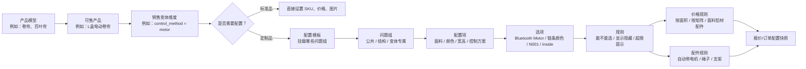
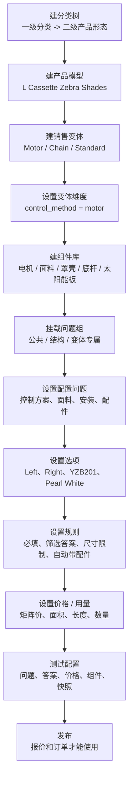

# 配置中心 DM（业务可读版）

生成日期：2026-06-04  
关联总文档：[产品配置中心设计.md](./产品配置中心设计.md)  
开发功能拆分清单：[配置中心功能拆分清单.md](./配置中心功能拆分清单.md)  
价格中心专项设计：[价格中心设计.md](./价格中心设计.md)  
后续 Agent 助手设计：[业务Agent体系设计.md](./业务Agent体系设计.md)

> 这份文档不是数据库建表说明。  
> 这份文档先讲清楚：配置中心到底管什么、后台怎么设置、客户下单时怎么用、规则怎么自动带出价格和配件。  
> 后期如果要落数据库，再从这里拆表，不是一开始就让开发面对一堆抽象实体。
>
> 当前项目已经有后台管理基础能力：登录、权限、菜单、字典、文件上传、i18n、审计、前端布局和后端通用 CRUD 结构。所以下面的设计不是让项目从零搭一个新后台，而是在现有 `base-boot` 里先补齐共享产品能力：产品基础信息、配置、价格、组件、资料、发布和快照。H5 原型只用来讲业务，不要求按它的样式实现正式页面。
>
> 当前订单系统只是第一阶段宿主和第一个消费者。后期 ERP、MES、报价、售后、客户门户也会使用这套能力，所以这些数据不能被设计成订单系统私有数据。

## 1. 一句话说明

配置中心所在的“产品中心”就是把以前靠人工记、靠 Excel、靠代码、靠备注维护的产品资料、规则、价格、组件和说明，统一放到一个共享能力里。

它要回答五个问题：

```text
卖什么产品？
客户下单要选什么？
哪些选项能不能一起选？
价格怎么算？
选完以后需要哪些配件/组件？
```

比如客户下单卷帘：

```text
选择：卷帘
选择：电动
选择：L Cassette
选择：面料 YS180002
输入：宽 120 inch，高 90 inch
系统自动：
  1. 只显示电动能用的选项
  2. 自动计算价格
  3. 自动带出电机、轨道、底杆、安装件
  4. 如果宽度太长，提示或自动改成两个电机
```

这就是配置中心，也是未来 ERP、MES、报价、订单、售后都要读取的产品能力来源。

## 1.1 这些中心分别管什么

不要把所有功能都塞进配置中心。第一版按下面分工：

| 模块 | 负责什么 | 不负责什么 |
| --- | --- | --- |
| 产品基础信息 | 分类、产品模型、销售变体、物料、组件、资料等共享主数据 | 不处理具体订单行 |
| 配置中心 | 产品怎么配置、下单问什么、选项怎么筛选、规则怎么判断、组件怎么带出 | 不维护完整价格，不处理订单组合，不做库存采购财务 |
| 价格中心 | 销售价格、价格版本、矩阵价、工艺价、固定组件价、运费、汇率和价格审批 | 不定义配置问题，不维护采购成本 |
| 资料资产库 | 产品说明、问题帮助、答案说明、色卡图、组件图、安装/测量说明、规则提示 | 不做新品研发立项 |
| 组件库 | 面料、电机、遥控、Hub、太阳能板、型材、辅料、标准品等可复用基础资料 | 不按单扣库存，不做采购审批 |
| 报价/订单 | Room Name、Line Item、订单行分组、客户备注、多通道遥控器分组 | 不直接改产品配置模板 |
| ERP 后续系统 | 生产任务、库存、采购、领料、成本、财务核算 | 不反向改配置规则 |

前五项属于共享产品能力。报价、订单、ERP、MES 是消费者。当前可以先在订单系统里实现，但要保证边界清楚，后续能拆成独立服务或独立数据库。

## 2. 核心概念

配置中心里有几个固定概念：

| 中文名 | 通俗解释 | 例子 |
| --- | --- | --- |
| 产品模型 | 一类产品 | 卷帘、百叶帘、蜂巢帘 |
| 销售变体 / 可售入口 | 同一个产品模型下面，客户能选择的入口 | L盒电动柔纱帘、L盒拉珠柔纱帘、太阳能板 |
| 变体维度 | 这个入口为什么使用不同问题 | control_method = motor、market = US、grade = premium |
| 问题组 | 一组可复用的问题 | 公共问题、结构问题、电机问题、拉珠问题 |
| 配置模板 | 这个入口最终要加载哪些问题组 | 公共问题 + L盒结构问题 + 电机问题 |
| 配置项 | 一个问题 | 控制方式、面料、颜色、宽度、高度 |
| 选项 | 问题的答案 | 电动、手拉、Inside、Outside、N001 |
| 规则 | 选了某些答案以后发生什么 | 电动才显示电机；太宽要两个电机 |
| 价格规则 | 怎么算钱 | 矩阵价、面积价、面料价、铝材价、配件价 |
| 配件规则 | 选完后自动带什么 | 电机、绳子、支架、底杆、太阳能板 |
| 配置快照 | 下单时保存当时选了什么 | 以后查订单能还原 |

## 3. 中文关系图



再换成业务语言：

```text
产品模型：这是什么东西
销售变体：客户能点哪个入口，以及它适用什么维度
问题组：这个入口要加载哪些公共问题和专属问题
配置模板：把问题组、规则、价格方案引用、组件绑定成一个可发布版本
规则：客户选完以后系统要判断什么
价格中心：多少钱，价格从哪里来
配件规则：生产/采购要带什么
快照：下单时把结果保存下来
```

## 4. 标准产品也要进配置中心

配置中心不是只管定制窗帘。

标准产品也要进来，比如：

- 遥控器
- 太阳能板
- 充电器
- 配件包
- 色卡
- 样品
- 固定规格成品

区别是：标准品不需要复杂配置模板。

| 产品类型 | 怎么设置 | 例子 |
| --- | --- | --- |
| 标准品 | 设置 SKU、名称、价格、图片、说明 | 遥控器、充电器 |
| 标准品带简单选项 | 设置少量配置项 | 色卡选择颜色、配件选择规格 |
| 定制品 | 设置完整配置模板、规则、价格、配件 | 卷帘、百叶帘、蜂巢帘 |

标准品下单流程：

```text
选择遥控器
  -> 输入数量
  -> 系统读取固定价格
  -> 加入订单
```

定制品下单流程：

```text
选择卷帘
  -> 加载配置模板
  -> 选择控制方式、面料、颜色、安装方式
  -> 输入宽高
  -> 系统校验规则
  -> 系统算价
  -> 系统带配件
  -> 加入订单
```

## 5. 后台设置流程

配置中心后台不要一开始做得复杂。第一版可以按这个流程做。

落到当前项目时，这里的“后台设置”要复用现有管理端：

```text
菜单权限：走现有系统菜单和角色授权
页面样式：走 admin-ui 现有 Element Plus 管理端风格
文案：走 i18n/locales/en_US.json 单源
文件：走现有 OSS / 文件管理
状态、类型、单位：优先走现有字典/标准数据
操作记录：走现有审计字段和业务日志
```

所以第一版要做的是“产品配置业务页面和规则能力”，不是重做一套后台框架。

```text
1. 建产品分类树
2. 建产品模型
3. 建销售变体 / 可售入口
4. 设置变体维度
5. 建组件库
6. 建问题组
7. 设置配置问题
8. 设置每个问题有哪些选项
9. 设置规则
10. 设置价格 / 用量
11. 测试
12. 发布
```

但界面不要把 1-9 全部铺成一个产品页面。更合理的原型结构是：

```text
产品工作台：
  Step 1 产品基础：产品分类、产品形态/系列、产品模型、销售变体、变体维度
  公共模块入口链接
  Step 5 配置问题 / 配置选项：公共问题组、结构问题组、变体专属问题组
  Step 6 发布检查

公共基础模块：
  标准品基础
  组件库
  价格 / 用量模型
  规则库
```

也就是说，只有产品基础和问题/选项真正跟着左侧当前产品走。组件库、标准品、价格模型、规则库是公共模块，最多在产品页放一个入口和当前产品引用摘要，需要时点进去查看或维护。

产品手册里的分类不要照旧做成五级树。我们只保留前两级做分类树：

```text
一级类目 = 产品分类
二级类目 = 产品形态 / 系列
```

例如：

```text
卷帘
  -> 标准卷帘

蜂巢帘
  -> 标准蜂巢帘
  -> 上下开合蜂巢帘
  -> 日夜蜂巢帘
```

后面几级要换位置：

| 产品手册原层级 | 不再当分类的原因 | 新位置 |
| --- | --- | --- |
| 三级类目：系统 | 电动、无拉、拉珠会决定问题组，不是分类 | 销售变体维度 |
| 四级类目：罩壳 | 罩壳、平轨、开放式是结构选择 | 产品模型维度、结构问题组或配置问题 |
| 五级类目：面料特性 | 遮光、遮阳、28、38、45 是面料属性 | 面料属性、配置问题或选项范围 |

分类树一张表就够，用 `parentId` 表达父子关系。第一版业务上限制只用两级，避免把配置问题又塞回分类里。

这里不要把“控制方式”做成写死的一层。控制方式只是销售变体维度的一种：

```text
L Cassette Zebra Shades 产品模型
  -> Motor 销售变体
     维度：control_method = motor
     问题组：公共问题 + L盒结构问题 + 电机控制问题
  -> Chain 销售变体
     维度：control_method = chain
     问题组：公共问题 + L盒结构问题 + 拉珠控制问题
```

以后如果不是控制方式，也用同一个办法：

```text
market = US
grade = premium
production_mode = quick_ship
package_type = project_bulk
```

判断方法：

```text
如果它决定进入哪套问题，就做销售变体维度。
如果它只是某个问题的答案，就留在问题/选项里。
如果它处理一张订单里多个产品怎么组合，就不进配置中心。
```

为了让录入人员真的愿意用，第一版不能从空白表单开始录。目标是：

```text
相似产品 10 分钟内生成草稿
复杂新产品 30 分钟内生成第一版草稿
```

所以后台要支持这些快捷操作：

| 快捷操作 | 业务作用 |
| --- | --- |
| 从相似产品克隆 | 复制产品基础、销售变体、问题组、规则、价格设置、组件绑定草稿 |
| 从产品蓝图创建 | 选择“卷帘-电动”“卷帘-拉珠”“蜂巢帘-无拉”“标准配件”等预设 |
| 一键挂载问题组 | 直接选公共尺寸、安装方式、结构、Motor、Chain、面料问题组 |
| 从已有问题另存为问题组 | 把成熟产品里的一组问题沉淀成模板，后面复用 |
| 批量粘贴/小工具 | 面料和颜色很多时，不让人逐个手录；完整资料包导入后置 |
| 自动匹配组件 | 按编码、中文名、英文名、供应商编号自动绑定物料 |
| 批量设置适用范围 | 一次设置 80 个面料答案适用于哪个分类、产品模型、销售变体 |
| 发布缺口清单 | 系统告诉你还缺什么，不让人自己翻页面找 |
| 差异对比 | 克隆后清楚知道当前草稿和来源产品差异在哪里 |

问题组必须单独出来，不能只是产品表单里的一个字段。产品模板应该像搭积木：

```text
当前产品模板
  = 公共尺寸问题组
  + 安装方式问题组
  + L盒结构问题组
  + Motor控制问题组
  + Zebra面料问题组
  + 产品专属问题
```

问题组也要有版本概念：

```text
Motor 控制问题组 v1：控制方向、电机方案、太阳能板
Motor 控制问题组 v2：控制方向、电机方案、太阳能板、静音模式
```

已发布产品继续用旧版本。新产品或升级产品经过测试后再切换新版本。

配置中心要稳定，扩展边界必须先定死：

| 可以放进配置中心的扩展 | 不放进配置中心的扩展 |
| --- | --- |
| 新产品分类、新产品形态、新可售入口 | 客户订单怎么拆分、怎么合并 |
| 新销售变体维度、新问题组挂载 | 客户临时备注解析和人工处理 |
| 新配置问题、新答案、新图片/帮助说明 | 多个订单行之间怎么分组控制 |
| 新组件、新物料口径、新答案到组件绑定 | 采购审批、库存扣减、财务核算 |
| 新尺寸限制、电机能力阈值、禁止组合、默认值 | 安装排班、发货路线、售后处理 |
| 新价格/用量算法参数、发布测试用例 | 客户临时备注解析和人工处理 |

判断方法很简单：

```text
如果是在定义“一个产品本身能怎么配”，进配置中心。
如果是在处理“一张订单里多个产品怎么组合”，不进配置中心。
如果是库存、采购、生产、财务的执行动作，不进配置中心，只读取配置结果。
```

所有可共用的东西都要抽离出来，不要埋在某一个产品表单里：

| 共用资产 | 例子 | 修改方式 |
| --- | --- | --- |
| 问题组 | 公共尺寸、安装方式、电机控制、面料问题组 | 修改时生成新版本，选择哪些产品同步 |
| 组件库 | 电机、遥控、Hub、太阳能板、面料、型材 | 修改时列出受影响产品，保存草稿后审批 |
| 资料资产 | 色卡图、组件图、安装说明、问题帮助 | 更新资料要版本化，订单保存当时版本 |
| 规则库 | 尺寸限制、电机能力、自动带组件 | 修改后重跑引用产品测试 |
| 价格方案 | 矩阵价、工艺价、固定组件价 | 走价格中心审批 |

修改共用资产时的闭环：

```text
修改组件/颜色/问题组/资料
  -> 系统显示影响哪些产品
  -> 用户选择同步哪些产品
  -> 保存成变更草稿
  -> 指派负责人补缺口
  -> 测试
  -> 审批发布
```

中文流程图：



### 5.1 原型里怎么评审一个真实产品

现在 H5 原型第一屏是单独的“配置中心”模块。它不是让你先看销售怎么下单，而是让你看后台怎么把一个产品配置出来。

正式系统实现时不要照搬 H5 视觉。原型只回答“业务对象和流程是否对”，正式页面要按当前 `admin-ui` 的列表、表单、抽屉、表格、分页、上传和权限风格落地。

评审时按这个顺序看：

| 顺序 | 你要检查什么 | 看懂以后说明什么 |
| ---: | --- | --- |
| 1 | 分类树是否正确 | 这个产品归到哪个一级分类、哪个二级产品形态 |
| 2 | 产品模型是否清楚 | 同一结构和通用逻辑有没有统一到一个模型 |
| 3 | 销售变体是否清楚 | Motor、Chain、Standard 或未来市场/等级等入口是否挂对维度 |
| 4 | 组件库是否够用 | 电机、面料、罩壳、底杆、太阳能板等组件是否能被后面引用 |
| 5 | 问题组是否挂对 | 公共问题、结构问题、变体专属问题是否组合正确 |
| 6 | 配置问题是否完整 | 下单要问客户的 12 个问题是否都在 |
| 7 | 配置选项是否完整 | 柔纱帘 108 个答案是否按问题分组存好 |
| 8 | 规则是否合理 | 必填、尺寸限制、筛选答案、自动带配件是否符合业务 |
| 9 | 价格 / 用量是否能算 | 是否能根据尺寸、系列、销售变体维度算价和组件数量 |
| 10 | 测试上线是否通过 | 发布后报价、订单、生产能不能读取同一套配置 |

当前原型至少用 3 个复杂产品做对照：

| 产品 | 配置问题 | 可选答案 | 组件绑定 | 价格样本 |
| --- | ---: | ---: | ---: | ---: |
| L Cassette Motor Zebra Shades | 12 | 108 | 96 | 240 |
| Flat rail Motor Screen View Shades | 12 | 89 | 69 | 240 |
| L Cassette Chain Blackout shades | 12 | 84 | 53 | 240 |
| Solar Panel | 1 | 39 | 39 | 240 |

其中 `Solar Panel` 是标准产品例子：它可以作为固定 SKU 单独卖，也可以被定制窗帘在选择太阳能板时自动带出。

“禁止组合”只是一种规则类型，不是每个产品必须设置的步骤。它的意思是：两个答案不能同时选。例如某面料不能配某罩壳颜色时才设置。没有这种业务冲突时，不需要先维护“禁止组合”。

## 6. 前端下单流程

客户或销售看到的不是“配置中心”，而是一个干净的下单界面。

```text
第一步：选择产品
第二步：选择产品类型/系列/控制方式
第三步：选择材料/面料/颜色
第四步：输入尺寸
第五步：选择安装和配件选项
第六步：系统显示价格、提示、不能选的原因
第七步：保存为报价或订单
```

系统背后做的事：

```text
前端选择产品
  -> 后端读取配置模板
  -> 返回要显示的配置项
  -> 用户每选一次，后端重新判断规则
  -> 隐藏不支持的选项
  -> 提示超限或冲突
  -> 计算价格
  -> 生成配件清单
```

### 6.1 从后台录入到客户下单的完整例子

用你们以前系统最熟悉的方式说：

```text
以前：
  先录产品
  再录这个产品有哪些配件
  电动产品有电机
  手拉产品有绳子/链条
  前端选好以后，系统自动带出来

以后：
  这些关系统一放到配置中心
  前端、报价、订单都从配置中心读取
```

比如录一个卷帘产品，后台人员要做的是：

```text
1. 新建产品模型：L盒卷帘
2. 新建销售变体：Motor 入口、Chain 入口
3. 设置变体维度：control_method = motor / chain
4. 新建或选择配件：Bluetooth Motor、链条、Solar Panel、支架
5. 挂载问题组：公共问题、L盒结构问题、电机问题或拉珠问题
6. 设置客户下单要选什么：面料、颜色、宽、高、安装方式、控制方案
7. 设置规则：
   - 选电动，就显示电机类型
   - 选电动，就自动带电机
   - 选手拉，就显示链条颜色
   - 选手拉，就自动带链条/绳子
   - 宽度超过某个值，就自动带两个电机或提示双电机方案
6. 设置价格：按宽高、面积、矩阵或选项加价
7. 测试：模拟客户选一遍，看价格和配件对不对
8. 发布：发布后报价和订单才能使用
```

老系统下单截图里很多字段以前堆在一个页面，新系统要拆开：

| 老页面看到的字段 | 新配置中心怎么放 |
| --- | --- |
| 产品大类 | 产品分类树一级/二级，用来筛选和报表 |
| 产品 | 产品模型 + 销售变体 |
| 控制系统：拉珠/电动/无拉 | 销售变体维度，决定加载拉珠问题组还是电机问题组 |
| 安装方式、控制方向、铝材颜色、下杆类型 | 配置问题和答案 |
| 遥控器数量、遥控器编号、频率、电源、通道 | 电机销售变体专属问题；拉珠时隐藏或禁用 |
| 面料名称、样册编号、颜色、面料方向、面料位置 | 面料组件/原材料 + 当前订单选择 |
| 导入备注、备注 | 订单备注、生产备注或配置快照备注 |

这样做的目的不是把老页面字段删掉，而是把它们放回正确位置：分类负责找产品，变体负责切换问题组，问题负责下单选择，组件负责后期物料，备注留给订单。

客户下单时看到的是：

```text
客户选择 L盒卷帘
客户选择 电动
系统显示 电机类型
客户输入 宽高
系统判断是否超限
系统计算价格
系统自动带出 Bluetooth Motor、支架等配件
客户保存报价或订单
```

这就是配置中心第一版最重要的业务流程。

### 6.2 配置录入工作台怎么看

H5 里新增了单独的配置录入工作台：[config-center-prototype/config-center.html](./config-center-prototype/config-center.html)。

这个页面不是销售下单页，它是 ERP 操作员维护配置的后台原型：

```text
左侧：产品列表
右侧上方：产品分类、产品形态、产品模型、销售变体、模板版本、状态
右侧中间：配置问题序号列表
右侧详情：问题字段 + 答案录入 + 组件绑定预览
右侧底部：发布后给报价、订单、生产的输出结果
```

问题列表里同时显示两个值：

| 名称 | 用途 |
| --- | --- |
| 序号 | 第 1、2、3 个配置问题，给 ERP 操作员看 |
| 排序值 | 后台排序用，如 20、30、40，给系统控制显示顺序 |

配置员可以在原型里操作：

- 编辑问题中文名、英文名、填写方式、必填、分组。
- 编辑答案序号、排序、中文名、英文名、状态。
- 新增问题草稿。
- 新增答案草稿。
- 保存当前产品本地草稿。
- 查看某个答案选中后自动绑定哪个组件。

### 6.3 销售只读总览怎么看

销售不应该直接看录入工作台。录入工作台里有很多后台字段，销售真正需要的是“这个产品到底怎么卖、下单会问什么、系统会自动做什么”。

所以原型新增了只读总览：[config-center-prototype/config-overview.html](./config-center-prototype/config-overview.html)。

这个页面不允许编辑配置，只展示配置结果：

```text
左侧：产品配置说明书列表
主区上方：当前产品身份、分类、产品形态、产品模型、销售变体
主区中间：下单问题、自动规则、价格和物料说明
右侧：销售检查、下单模拟入口、录入工作台入口
```

销售看这个页面时，要能回答：

| 销售问题 | 页面怎么回答 |
| --- | --- |
| 这个产品属于哪类？ | 显示一级分类、二级产品形态 |
| 这个产品有哪些销售入口？ | 显示销售变体和变体维度，如 system = motor |
| 下单会问客户什么？ | 展示问题清单、必填、问题用途 |
| 系统会自动做什么？ | 展示显示隐藏、必填、答案范围、自动带组件、尺寸/能力规则 |
| 价格和物料怎么来？ | 展示矩阵价、选配加价、用量价格、组件绑定 |
| 这个配置能不能给客户用？ | 展示发布检查：分类、变体、问题、答案、组件、价格 |

三种视图的关系：

```text
录入视图：给配置员设置
销售总览：给销售看懂
下单模拟：给销售/客服试选
```

它们读取同一套配置，不是三套数据。销售总览应该由发布配置自动生成，不要让销售手工维护说明书。

## 7. 例子一：卷帘，电动自动带电机

业务描述：

```text
同样是卷帘，手拉和电动需要的配件不一样。
客户选择电动时，要自动带电机。
客户选择手拉时，要自动带链条/绳子。
```

后台设置：

### 7.1 产品

```text
产品模型：卷帘
可售产品：L Cassette Roller Shade
```

### 7.2 配置项

| 配置项 | 类型 | 是否必填 | 例子 |
| --- | --- | --- | --- |
| 控制方式 | 单选 | 是 | 手拉 / 电动 |
| 电机类型 | 单选 | 电动时必填 | Bluetooth Motor / Remote Motor |
| 链条颜色 | 单选 | 手拉时必填 | White / Black / Grey |
| 面料 | 单选 | 是 | YS180002 |
| 颜色 | 单选 | 是 | White |
| 宽度 | 数字 | 是 | 80 inch |
| 高度 | 数字 | 是 | 90 inch |
| 安装方式 | 单选 | 是 | Inside / Outside |
| 外壳颜色 | 单选 | 可选 | Pearl White / Night Black |
| 是否太阳能板 | 是/否 | 可选 | Yes / No |

### 7.3 显示规则

```text
如果 控制方式 = 电动
  显示：电机类型、是否太阳能板
  隐藏：链条颜色

如果 控制方式 = 手拉
  显示：链条颜色
  隐藏：电机类型、是否太阳能板
```

### 7.4 配件规则

```text
如果 控制方式 = 电动 且 电机类型 = Bluetooth Motor
  自动带出：Bluetooth Motor × 1

如果 控制方式 = 电动 且 电机类型 = Remote Motor
  自动带出：Remote Motor × 1

如果 控制方式 = 手拉
  自动带出：链条/拉绳 × 1

如果 是否太阳能板 = Yes
  自动带出：Solar Panel × 1
```

### 7.5 尺寸触发规则

```text
如果 宽度 > 157 inch
  自动带出：电机 × 2
  提示：该宽度需要双电机方案
```

这里的 157 inch 只是示例，真实阈值以后按产品资料设置。

## 8. 例子二：百叶帘，材料决定颜色和价格

你给的 Excel 对应的是这个逻辑：

```text
百叶帘
  -> 经典
  -> 双拉绳
  -> 宽布梯带式
  -> 材料：椴木 / 楠竹 / 桐木 / PVC-PS
  -> 颜色根据材料变化
  -> 价格按宽高面积计算
```

### 8.1 后台设置产品

```text
产品模型：百叶帘
可售产品：经典双拉绳宽布梯带式百叶帘
```

### 8.2 配置项

| 配置项 | 类型 | 是否必填 | 例子 |
| --- | --- | --- | --- |
| 材料 | 单选 | 是 | 椴木 / 楠竹 / 桐木 / PVC-PS |
| 颜色 | 单选 | 是 | J01 / N001 / B-1004 |
| 宽度 | 数字 | 是 | 60 inch |
| 高度 | 数字 | 是 | 80 inch |
| 安装方式 | 单选 | 是 | Inside / Outside |
| 控制方向 | 单选 | 是 | Left / Right |
| 梯带类型 | 单选 | 是 | 宽布梯带 |

### 8.3 颜色规则

```text
如果 材料 = 椴木
  颜色只能选择椴木颜色组：
    J01 White
    J02 Gream
    J06 Natural
    ...

如果 材料 = WPS
  颜色只能选择 WPS 颜色组：
    N001 Pure White
    N002 Light Oak
    N003 Yellow Oak
    ...

如果 材料 = 竹
  颜色只能选择竹颜色组：
    B-1004 Natural
    B-1007 Cherry
```

### 8.4 价格规则

```text
宽厘米 = 宽英寸 × 2.54
高厘米 = 高英寸 × 2.54
计价面积 = 向上取整(宽厘米 × 高厘米 / 10000)
价格 = 计价面积 × 材料平方价
```

材料平方价：

| 材料 | 平方价 |
| --- | ---: |
| 椴木 | 22.01 |
| 楠竹 | 22.01 |
| 桐木 | 20.95 |
| PVC-PS | 16.72 |

### 8.5 尺寸规则

```text
宽度范围：12 到 118 inch
高度范围：12 到 160 inch
```

客户输入超出范围时：

```text
如果宽度 > 118
  提示：该材料当前最大宽度为 118 inch
  阻止下单
```

## 9. 例子三：标准配件，不需要复杂配置

比如太阳能板、遥控器、充电器。

后台设置：

```text
产品模型：太阳能板
可售产品：Solar Panel
产品类型：标准品
是否需要配置：否
价格：固定价格
图片：上传主图
说明：上传说明书
```

下单流程：

```text
选择 Solar Panel
输入数量
加入报价/订单
```

它也可以被定制产品自动带出：

```text
如果卷帘配置里 是否太阳能板 = Yes
  自动带出 Solar Panel × 1
```

所以一个配件可以有两种用法：

```text
可以单独卖
也可以由定制产品规则自动带出来
```

## 9.1 成品、原材料、组件到底怎么区分

配置中心虽然不是完整 ERP，但必须提前把后期库存、采购、生产、成本要用的物料口径分清楚。

第一版建议这样分：

| 类型 | 是什么 | 例子 | 后期怎么用 |
| --- | --- | --- | --- |
| 可售成品 | 可以直接卖的固定 SKU | 遥控器、太阳能板、充电器、样品 | 成品库存、固定价格、直接下单 |
| 定制成品 | 客户配置后按单生产的结果 | L Cassette Motor Zebra Shades | 不预先库存成品，订单生成 BOM 和生产任务 |
| 原材料：布匹/面料 | 生产用布料、面料卷、颜色面料 | YZB201、YB180002、XL241501 | 面料库存、采购、裁剪、面积用量、成本 |
| 原材料：铝杆/型材 | 底杆、罩壳、侧轨、轨道等长料 | Bottom Rail、Cassette、Side Channel | 型材库存、切割、长度用量、成本 |
| 采购组件 | 买回来直接装配的组件 | 电机、遥控器、Zigbee、Matter、太阳能板 | 采购、库存、BOM、领料、成本 |
| 辅料/包装 | 安装件、支架、螺丝、包装物 | bracket、screw、package | 可按固定数量或规则带出 |
| 服务项 | 非实物 | 安装、测量、加急 | 不进物料库存，但可进报价/订单 |

所以“原材料基本就是布匹和组件”这个说法要再细一点：

```text
原材料：布匹/面料 + 铝杆/型材 + 可能按长度/面积消耗的材料
采购组件：电机、遥控、太阳能板、支架、链条等买来装配的东西
定制成品：客户最终买的窗帘，不一定作为库存成品提前存在
可售成品：遥控器、太阳能板、样品这类可以固定 SKU 直接卖
```

配置中心要做的是：

```text
可售产品负责“卖什么”
配置问题/答案负责“客户选什么”
组件库负责“选完后用什么物料”
用量模型负责“用多少”
价格中心负责“多少钱”，配置中心提供产品、尺寸、选项、组件和用量输入
BOM/快照负责“后期生产和历史追溯”
```

### 9.2 超宽双电机、超宽禁选怎么配置

这类能力应该放在配置中心的动态规则里，不需要手工维护一套固定 BOM。

这次按三类来源重新盘点规则：

```text
1. 当前抽样数据库已经体现的规则
2. 窗帘/遮阳行业平台常见配置器规则
3. 后期库存、采购、生产、成本需要的衔接规则
```

常见规则：

| 业务规则 | 配置方式 | 系统输出 |
| --- | --- | --- |
| 宽度超过 2m 自动两个电机 | `when width_cm > 200 then MOTOR_QTY = 2` | 动态物料清单里电机数量变成 2 |
| 超宽不支持某些选配 | `when width_cm > 200 then disable options` | 当前配置下禁用不支持超宽的答案 |
| 超出最大宽高不能下单 | `when width/height out of limit then BLOCKER` | 阻止提交，并显示原因 |
| 超出建议范围但可复核 | `when width/height near limit then WARNING` | 允许保存草稿，但提示人工复核 |
| 选择太阳能板自动带组件 | `when Solar Panel = Yes then add component Solar Panel x 1` | 动态物料清单加入太阳能板 |

还需要覆盖这些规则能力：

| 规则能力 | 为什么需要 | 来源 |
| --- | --- | --- |
| 必填规则 | 当前产品 4-12 个配置问题里大量字段必填 | 当前数据库 |
| 显示/隐藏规则 | 电动、手拉、标准品不应看到同一套问题 | HD/HB 配置器范式 + 销售变体维度 |
| 选项域规则 | 面料答案很多，不同产品可选范围不同 | 当前数据库 |
| 默认值规则 | 常见答案可以自动默认，减少录入成本 | 配置中心要求 |
| 禁止组合规则 | 面料、结构、安装、配件之间会有不兼容关系 | 综合规则 |
| 答案到组件绑定 | 选项会映射到面料、电机、太阳能板、伸缩杆等组件 | 当前数据库 |
| 价格矩阵规则 | 宽高、系列、销售变体维度影响价格 | 当前数据库 |
| 选配加价规则 | 矩阵基础价之外会有电机、太阳能板、服务、辅料加价 | 当前数据库 + 后期报价 |
| 尺寸限制规则 | 最大宽高不能只藏在价格表里 | 当前数据库 + 行业资料 |
| 测量精度规则 | 宽高需要按 inch/cm、1/8 inch 等精度处理 | 行业资料 |
| 安装扣减规则 | Inside/Outside Mount 会影响成品宽、布宽、型材长度 | 行业资料 |
| 成品尺寸/布宽差异 | 订单宽、成品整体宽、布料宽不一定相同 | 行业资料 |
| 派生尺寸规则 | 报价、BOM、裁剪、生产要读取同一套尺寸结果 | 配置中心要求 |
| 电机/管径能力 | 电机型号、管径、面料重量会影响最大尺寸和数量 | 行业资料 |
| 超宽禁用选配 | 超宽时某些侧轨、罩壳、安装方式、配件不支持 | 综合规则 |
| 标准品复用 | 标准品既能单独卖，也能作为组件被带出 | 当前数据库 |
| 下单备注提示 | 多樘窗帘共用多通道遥控器时提示客户备注分组 | 订单组合场景 |
| 发布回归测试 | 修改规则后不能悄悄影响报价/生产 | 配置中心要求 |

规则执行顺序建议固定：

```text
可见性
  -> 选项域
  -> 默认值
  -> 必填
  -> 兼容 / 尺寸 / 测量
  -> 派生尺寸和用量
  -> 价格
  -> 动态 BOM
  -> 发布测试
```

这里的 `width_cm > 200` 只是演示阈值，不建议生产系统写死。正式配置应该按产品资料维护阈值，并结合：

- 当前数据库里的产品最大宽高、价格矩阵、组件绑定。
- HD/HB 参考流程里的动态配置体验。
- 公开行业资料里的测量精度、Inside/Outside Mount、面料重量、管径、电机扭矩和最大宽度限制。

因此“超宽自动双电机”在系统里更准确的表达是：

```text
when width_cm / height_cm / fabric_weight / tube_size / motor_model 命中能力阈值
  then MOTOR_QTY = 2
  or require higher_torque_motor
  or disable unsupported option
  or BLOCKER
```

原型里已经把这条做成了“电机能力规则模拟”：

| 输入 | 来自哪里 | 作用 |
| --- | --- | --- |
| width_cm / height_cm | 当前客户配置尺寸 | 算面积、判断是否超宽超高 |
| fabric_weight_gsm | 面料组件资料 | 判断面料是否超过当前电机建议克重 |
| tube_size_mm | 管径/型材组件资料 | 判断电机是否能装进当前管径 |
| motor_model | 电机组件资料 | 读取最大宽、高、负载、建议克重 |

模拟器输出不是备注，而是明确动作：

| 输出 | 业务含义 |
| --- | --- |
| 通过 | `MOTOR_QTY = 1` |
| 自动双电机 | `MOTOR_QTY = 2`，动态 BOM 输出两个电机 |
| 换高扭矩 | 禁用当前电机答案，要求选择更高扭矩电机 |
| 禁用选项 | 当前管径或组件不匹配，禁用该答案 |
| BLOCKER | 当前产品没有可用电机方案，禁止发布或下单 |

### 9.3 多通道遥控器这种需求放哪里

多通道遥控器不是单樘窗帘自己的固定 BOM，也不应该让配置中心多一套操作。它是订单备注或订单扩展字段问题：

```text
订单里 10 樘电动窗帘
  -> 客户备注：1-5 用遥控器 A，6-10 用遥控器 B
  -> 订单员按备注处理遥控器数量和分组
```

配置中心只管产品能力：

| 配置中心字段/能力 | 含义 |
| --- | --- |
| 电机是否支持遥控 | 这个电机方案能不能配遥控器 |
| 遥控器是否默认带出 | 默认带一个，还是让客户自行选择 |
| 遥控器可选项 | 单通道、多通道、App、Zigbee、Matter 等 |
| 下单提示 | 如需多个窗帘共用多通道遥控器，请备注控制分组 |

不在配置中心做：

```text
不维护 1-5 / 6-10 这种分组
不按订单行汇总遥控器数量
不让配置中心变成订单系统
```

所以第一版只需要在下单页面展示提示文案：

```text
如需多个窗帘共用多通道遥控器，请备注控制分组。
例如：1-5 一组，6-10 一组。
```

所以流程是：

```text
客户输入宽高 / 选择答案
  -> 配置中心规则求值
  -> 输出可选答案、禁用答案、提醒/blocker、动态组件数量
  -> 再生成生产用料输出
```

## 10. 规则到底管什么

规则不要一开始做成程序员才能懂的东西。

后台可以先做成这种中文表单：

```text
当 [控制方式] [等于] [电动]
那么 [显示] [电机类型]

当 [控制方式] [等于] [手拉]
那么 [隐藏] [电机类型]

当 [宽度] [大于] [157 inch]
那么 [配件数量] [电机] [= 2]

当 [材料] [等于] [椴木]
那么 [颜色选项组] [= 椴木颜色]
```

第一版规则类型可以只做这些：

| 规则类型 | 业务含义 |
| --- | --- |
| 显示/隐藏 | 选了电动才显示电机 |
| 可选/不可选 | 某材料不能选某颜色 |
| 必填 | 选电动后电机类型必填 |
| 尺寸限制 | 超过最大宽高不能下单 |
| 价格 | 按面积或矩阵算钱 |
| 配件 | 自动带出组件 |
| 提醒 | 需要人工确认但不阻止 |

## 11. 后台页面应该怎么做

第一版后台建议做 7 类业务页面，不要一上来做太复杂。这里说的页面是业务入口，不是新建独立前端应用；正式实现应挂到现有管理端菜单和路由里。

### 11.1 产品列表

用来管理能卖的东西。

字段：

```text
产品名称
产品类型：标准品 / 定制品 / 配件
状态：草稿 / 已发布 / 停用
是否需要配置
是否需要算尺寸
```

### 11.2 产品基础信息

设置：

```text
中文名
英文名
产品图片
产品说明
内部备注
客户可见说明
```

### 11.3 下单配置项

设置这个产品下单时要让客户选什么。

比如：

```text
材料
颜色
宽度
高度
控制方式
安装方式
```

### 11.4 选项库

维护每个配置项有哪些选项。

比如：

```text
材料：椴木、楠竹、桐木、PVC-PS
安装方式：Inside、Outside
控制方式：手拉、电动
```

### 11.5 规则设置

设置：

```text
显示隐藏规则
尺寸限制规则
选项兼容规则
配件带出规则
```

### 11.6 价格设置

价格设置不再放在配置中心里完整维护，而是进入独立的价格中心。详细设计见：[价格中心设计.md](./价格中心设计.md)。

配置中心只做三件事：

| 配置中心页面显示 | 用途 |
| --- | --- |
| 当前产品引用的价格方案 | 知道这个产品上线后用哪套销售定价 |
| 价格方案状态 | 草稿、待审、已发布、停用 |
| 价格测试结果 | 发布前检查典型尺寸是否能算价、是否缺价、是否超限 |

价格中心负责维护：

| 价格内容 | 说明 |
| --- | --- |
| 固定组件价 | 电机、遥控器、太阳能板、充电器、样品等 |
| 矩阵价 | 老系统已有宽高矩阵价格 |
| 工艺价 | 布帘、罗马帘、穿杆、无拉、电动、韩褶、蛇形帘等销售报价口径 |
| 面料销售价 | 面料在销售报价里的参考价，不等于采购成本 |
| 运费 | 国内/国外、渠道、实重/抛重、包裹限制 |
| 汇率和版本 | 生效日期、币种、审批、价格快照 |

### 11.6.1 卷帘价格例子

```text
客户选择：L盒卷帘
控制方式：电动
面料：YS180002
宽：120 inch
高：90 inch

价格组成：
  配置中心输出：产品、面料、控制方式、尺寸、选中的组件
  价格中心计算：矩阵价或工艺价、固定组件价、选配加价、运费
```

如果宽度超过规则阈值：

```text
宽度 > 157 inch
  配置中心规则输出：需要双电机方案
  价格中心按双电机和对应价格方案重新计算
```

### 11.6.2 手拉产品价格例子

```text
客户选择：手拉卷帘
控制方式：手拉

价格组成：
  配置中心输出：手拉控制方式、链条/拉绳选项、尺寸和组件
  价格中心计算：矩阵价或工艺价、固定组件价、选配加价、运费
```

手拉不应该带出电机，电动不应该带出链条/拉绳，这个由规则控制。

### 11.7 测试和发布

模拟客户下单：

```text
选产品
选配置
输入尺寸
看价格
看配件
看提示
确认没问题后发布
```

第一版必须有联合发布检查，不能只看配置表单保存成功：

```text
配置已发布
+ 价格方案已发布
+ 客户可见资料齐全
+ 组件绑定齐全
+ 测试用例通过
= 商品可销售
```

还要有三个闭环：

| 闭环 | 为什么需要 |
| --- | --- |
| 缺口待办 | 缺图片、缺价格、缺组件、缺中英文说明时，要能指派负责人、跟状态、复核完成 |
| 变更影响分析 | 修改问题组、组件、颜色图、价格方案前，要知道影响哪些产品 |
| 资料版本留档 | 图片、说明文字、安装说明更新后，老订单还能看到当时版本 |

## 12. 备注、图片、帮助说明要放哪里

这些不是后期可有可无的东西。

客户下单时会需要：

```text
这个选项是什么意思？
Inside 和 Outside 怎么选？
怎么量尺寸？
这个颜色长什么样？
这个配件有什么用？
为什么这个选项不能选？
```

所以配置中心要支持：

| 内容 | 放在哪里 | 例子 |
| --- | --- | --- |
| 产品主图 | 产品基础信息 | 卷帘产品图 |
| 色卡图 | 颜色选项 | N001 Pure White 图片 |
| 面料图 | 面料组件或面料答案 | YS180002 White 图片 |
| 配件图 | 组件库 | 电机、遥控器、Mini bridge、充电线 |
| 安装说明 | 产品或安装方式选项 | Inside Mount 安装说明 |
| 测量说明 | 宽高配置项 | 如何测量窗框内宽 |
| 包装/运输图 | 产品或物流规则 | 包装尺寸和限制说明 |
| 帮助提示 | 配置项或选项 | Solar Panel 说明 |
| 内部备注 | 产品/规则/选项 | 只给内部看 |
| 客户说明 | 产品/选项 | 出现在报价单 |

注意：

```text
备注要分清楚给谁看。
客户看的、内部看的、生产看的不能混在一个 remark 里。
```

第一版可以先做简单：

```text
内部备注
客户说明
生产备注
帮助说明
产品主图
颜色/面料图
组件图片
安装/测量说明文件
```

图片不要直接塞在备注里，要先进资料资产库：

| 资料资产 | 绑定到哪里 | 业务意义 |
| --- | --- | --- |
| 产品主图 | 产品 | 销售选品和客户确认能看到产品长什么样 |
| 颜色/色卡图 | 颜色答案 | 客户选颜色时不只看文字 |
| 面料图 | 面料组件 | 面料库存、采购复核、生产识别共用 |
| 组件图 | 组件库 | 电机、遥控、Mini bridge 等配件可解释、可复核 |
| 安装/测量图 | 问题或答案 | 减少销售填错尺寸或安装方式 |

也就是说，不是只有颜色和图片需要资料。下面这些都应该能维护说明：

| 对象 | 需要什么说明 | 例子 |
| --- | --- | --- |
| 产品 | 产品说明、适用场景、客户说明 | 这个产品适合什么窗型 |
| 配置问题 | 这个问题为什么要填、怎么填 | Inside/Outside 怎么选 |
| 配置答案 | 选这个答案代表什么、有什么影响 | Solar Panel 是否需要额外安装 |
| 组件 | 这个配件是什么、怎么安装、是否包含 | Hub、遥控器、Mini bridge、电机、充电线 |
| 动态规则 | 为什么禁选、为什么自动带出、为什么改方案 | 超宽为什么需要双电机 |
| 标准品 | 规格、适用范围、使用说明 | 遥控器、太阳能板、色卡 |

发布前要检查：

- 客户会看到的颜色/面料答案有没有图片。
- 组件被答案绑定后，组件库有没有图片和说明。
- 客户会看到的问题和答案有没有帮助说明。
- 自动带出的组件有没有解释“为什么带出、是否包含、怎么安装”。
- 动态规则命中时有没有客户提示和内部原因。
- 文件名能不能按产品编码、颜色编码、面料编码或组件编码自动匹配。
- 历史订单保存当时图片版本，后面换图不能影响老订单。

客户反馈也可以进入资料库，但只收和提示、文字说明、图片说明有关的内容。

从 `客户反馈260603.xlsx` 看，有些反馈确实应该沉淀为公共资料：

| 反馈 | 进入哪里 | 处理方式 |
| --- | --- | --- |
| 电动产品缺 Hub 提示 | 组件资料 / 下单帮助 | 给 Hub 建说明、图片、使用场景和客户提示 |
| 遥控器型号、频道、是否包含不清楚 | 组件资料 / 下单选项 / 价格中心 | 组件资料解释用途，价格归价格中心，是否包含归配置或订单 |
| 太阳能板走线、蜂巢帘充电口位置不清楚 | 安装学习资料 | 绑定安装照片、视频、接线示意图 |

有些反馈虽然和系统有关，但不放进公共资料：

| 反馈 | 应该去哪里 | 原因 |
| --- | --- | --- |
| Room Name 必填 | 订单/报价行 | 用来区分客户房间，不是产品资料 |
| Line Item 固定编号 | 订单、生产、售后 | 用来追踪订单行，不是配置项 |
| 遥控器分组和预编程 | 订单组合/备注扩展 | 多个窗帘之间的控制关系，不是单个产品属性 |

## 13. 配置快照为什么重要

客户下单时，系统必须保存当时的选择结果。

比如：

```text
产品：经典双拉绳宽布梯带式百叶帘
材料：椴木
颜色：J01 White
宽：60 inch
高：80 inch
安装方式：Inside
价格：xxx
自动配件：xxx
当时规则版本：2026.06
```

为什么要保存？

```text
以后产品价格改了，老订单不能变。
以后颜色停用了，老订单还能看懂。
以后规则改了，老订单还能复原。
生产和售后能查当时到底怎么选的。
```

## 14. 第一版最小可做范围

不要一开始就做成大平台，也不要重复建设当前项目已经有的基础平台能力。

第一版只要能完成这件事：

```text
后台能配置一个产品
前端能按配置下单
系统能自动判断选项
系统能自动算价
系统能自动带配件
订单能保存配置快照
```

最小功能：

| 模块 | 第一版要做什么 |
| --- | --- |
| 产品管理 | 标准品/定制品都能建 |
| 配置项管理 | 能给产品加字段 |
| 选项管理 | 能维护颜色、材料、控制方式 |
| 规则管理 | 能做显示隐藏、尺寸限制、配件带出 |
| 价格管理 | 固定价、面积价、矩阵价 |
| 配件管理 | 根据规则自动带配件 |
| 测试发布 | 后台模拟下单后发布 |
| 订单快照 | 保存客户选择结果 |

## 15. 本文和开发的关系

开发不要直接从“实体数量”理解工作量。

后续如果做配置中心助手、下单助手、价格助手，不要让 Agent 绕过这些模块直接改正式数据。Agent 的详细边界、知识沉淀、意图识别和熔断方案见：[业务Agent体系设计.md](./业务Agent体系设计.md)。

可以按业务模块拆：

```text
产品基础信息
配置模板
配置项和选项
规则
价格
配件
测试发布
下单读取配置
保存快照
```

数据库怎么拆表，是下一步技术设计。

当前最重要的是先把业务讲清楚：

```text
以前：产品、配件、价格、限制到处散。
以后：统一从配置中心读取。
```

## 16. 结论

配置中心不是为了“配置产品给后台看”。

配置中心是为了让客户以后可以按规则下单：

```text
客户选产品
客户选控制方式、材料、颜色、尺寸
系统自动判断能不能选
系统自动算价格
系统自动带配件
系统保存配置快照
```

这样产品资料、价格、规则、配件都集中在一个地方，后面报价、订单、生产、售后再慢慢统一接过来，系统就会清爽很多。
